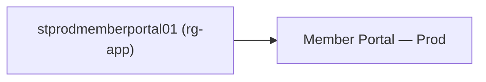

# DIC-01 — Compare a drawing to an inventory capture without a sealed review

**Model:** GPT-5.6 Luna. Paste this file as the whole task. Do not implement DIC-02 or DIC-03 in this session.

**Repo:** `c:\ArchLucid`

**Wave:** Diagram import comparison (**DIC**). **Depends on:** current `master`.

## Goal

On SecureNow **Diagram reconciliation** (`/infrastructure/diagram-reconcile`), an operator uploads a structured drawing, selects an Azure inventory capture, and gets correspondence rows. The Sealed Review Record ID stays empty. The page says this is advisory documentation accuracy.

## Why

`DiagramInfrastructureReconciliationService.ReconcileAsync` loads the diagram by `runId` and calls `DiagramInfrastructureReconciliationSealedManifestHashGuard` before `DiagramInfrastructureMatcher.Match`. The workbench readiness copy is “Needs a valid sealed review record ID.” SecureNow does not create that review. Optum week 3 needs the drawing compared to last week’s capture.

The matcher, the label parser, and structured ingest already exist. This session adds a path beside them.

## Read first

- `docs/optum/WEEK_03_DOCUMENTATION_ACCURACY_GOALS.md` (item 1, supported intake, match taxonomy)
- `docs/library/INFRA_EVIDENCE_PLANE.md` (AI cannot mint Exact; no apply)
- `ArchLucid.Application/InfraEvidence/DiagramInfrastructureReconciliationService.cs`
- `ArchLucid.Application/InfraEvidence/DiagramReconciliation/DiagramInfrastructureMatcher.cs`
- `ArchLucid.Api/Controllers/InfraEvidence/ArchitectureDiagramReconciliationController.cs`
- `ArchLucid.ContextIngestion/SupportedContextDocumentContentTypes.cs`
- `archlucid-ui/src/app/(operator)/governance/infrastructure/diagram-reconcile/DiagramReconcileWorkbenchClient.tsx`
- `archlucid-ui/src/lib/infra-evidence/diagram-reconcile-readiness.ts`
- `archlucid-ui/src/lib/infra-evidence/infra-evidence-diagram-reconcile-api.ts`

## What to build

1. Branch `cursor/dic-01-snapshot-reconcile` from current `master`.
2. Add an advisory comparison that takes a snapshot id plus the same structured diagram body ingest already accepts (Mermaid `text/vnd.mermaid`, Visio `.vsdx`, draw.io `application/vnd.jgraph.mxfile`, sanitized SVG `application/vnd.archlucid.diagram+svg`, diagram JSON `application/vnd.archlucid.diagram+json`). Persist it on a new table keyed by tenant and comparison id. Do not require `RunId`. Use the next unused numeric prefix under `ArchLucid.Persistence/Migrations/` (406 is taken; 405 is duplicated).
3. Parse with the existing structured ingest service. Call `DiagramInfrastructureMatcher.Match`. Do not call the sealed-manifest guard on this path.
4. Expose the advisory compare and fetch on a route that is not under `v1/architecture/runs/{runId}/diagrams`. Suggested: `POST /v1/infrastructure/diagram-comparisons` and `GET /v1/infrastructure/diagram-comparisons/{comparisonId}`. Same tenant scope and execute policy as the existing reconcile post.
5. Leave `ArchitectureDiagramReconciliationController` and `EnsureRunSealedManifestHashOrThrowAsync` on the run-linked route unchanged. A test still returns 409 when that route is called for a review that is not sealed.
6. On `DiagramReconcileWorkbenchClient`, an empty sealed-review id no longer blocks upload, snapshot choice, or Compare. When the advisory path runs, the page states **Advisory documentation accuracy. This is not a sealed review record.** Sentence case. The sealed-review field can stay for the old path. It is not required.
7. Reject PNG, JPEG, PowerPoint, and legacy `.vsd` with the existing unsupported-source honesty. Do not add a parser for them.
8. Tests: advisory compare of a two-node Mermaid document against a snapshot returns Exact or DiagramOnly rows and does not touch the sealed guard; the run-linked route still 409s when the manifest is unsealed; workbench readiness allows Compare when a snapshot and a diagram draft exist and the review id is blank.

## Acceptance criteria

- Blank sealed-review id, a structured drawing, and a selected capture produce a saved comparison and a correspondence table.
- The run-linked reconcile route still refuses an unsealed review.
- Match kinds stay Exact, Probable, Possible, DiagramOnly, InfrastructureOnly, Conflict, Unknown. This session does not add Confirmed and does not read `diagram.Edges`.
- Unmatched inventory resources still appear as InfrastructureOnly rows. Grouping them is DIC-04.

## Constraints

- Before editing any tracked file, run `pwsh -NoProfile -File scripts/agent/check-working-tree-path.ps1 -Path '<path>'`. If it exits 2, stop and report the blocked path.
- Do not weaken or delete the sealed-manifest guard.
- Do not promote a diagram node to ObservedFact. Do not call vision or OCR.
- Do not hide desktop review workspace tabs behind **More**.
- Working-tree safety. Stage only the advisory path, its migration, tests, and the workbench change. **No `git add -A`.**
- **Do not commit.**
- No GTM **M-90 / M-44 / M-91 / M-92**. No reopen **TB-135 / TB-136**.

## Verification

```powershell
dotnet test ArchLucid.Application.Tests/ArchLucid.Application.Tests.csproj --filter FullyQualifiedName~DiagramInfrastructureMatcher
```

Add the new API and workbench tests to that command or a second scoped filter. One `scripts/ci/agent-compile-check.ps1` on the API project you touch, plus one retry if it exits 1. Heartbeat every 8s.

## How to check

Restart the API and the UI. Hard-refresh **Diagram reconciliation**.

1. Leave **Sealed Review Record ID** empty. The page must not say a sealed review record is required before Compare can run.
2. Paste this Mermaid draft, or upload a `.vsdx` / draw.io file that uses the same names:



3. Select an inventory capture that contains `stprodmemberportal01` and does not contain a resource named Member Portal — Prod.
4. Run Compare.
5. The table has a row for `stprodmemberportal01` (Exact or Probable) and a Diagram only row for Member Portal — Prod. Inventory resources that were not in the drawing are Infrastructure only.
6. The page says advisory documentation accuracy and that this is not a sealed review record.
7. A sealed review is still required on the old run-linked API. Do not remove that field’s behavior when an id is entered.

Wait for that look before any commit.
