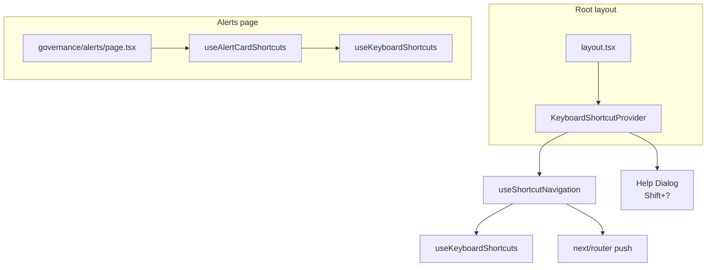

# ArchLucid architect workspace — keyboard shortcuts

**Audience:** Operators using `archlucid-ui` and developers extending the shell.  
**Tests:** `src/integration/keyboard-shortcuts-*.test.tsx`

## Overview

The shell exposes **fast navigation** and **page actions** via the keyboard. Design choices:

| Principle | Rationale |
|-----------|-----------|
| **Alt + letter / number** | Avoids most browser chrome conflicts (Ctrl/Cmd+N/T/W, copy/paste, etc.). |
| **Input guard** | Shortcuts do not fire while focus is in `<input>`, `<textarea>`, `<select>`, or `contenteditable` (see [`useKeyboardShortcuts`](../src/hooks/useKeyboardShortcuts.ts)). |
| **Progressive discoverability** | Help overlay (**Shift+?**), nav `title` + `aria-keyshortcuts`, command palette (**Ctrl+K**), and footer hint text—operators learn without reading this doc first. |

Global shortcuts register on `window` via [`AppShellSyncKeyboardShortcutListener`](../src/components/shell/AppShellSyncKeyboardShortcutListener.tsx) in [`AppShellClient`](../src/components/AppShellClient.tsx). Alt+letter navigation works from anywhere in the shell, including when focus is on the header or sidebar — you do **not** need to Tab into main content first.

The deferred **Shift+?** help overlay still mounts from [`KeyboardShortcutProvider`](../src/components/KeyboardShortcutProvider.tsx) in [`layout.tsx`](../src/app/layout.tsx); that wrapper does not gate Alt navigation.

## Command palette (Ctrl+K)

| Surface | Behavior | Visible label |
|---------|----------|----------------|
| Header trigger ([`CommandPalette.tsx`](../src/components/CommandPalette.tsx)) | **Ctrl+K** and **⌘K** (macOS `metaKey`) both open/close the palette | Always **`Ctrl+K`** in chips and tooltips — never the ⌘ glyph ([`keyboard-shortcut-display.ts`](../src/lib/keyboard-shortcut-display.ts)) |
| Palette **work** actions (LI-07 / LD-09 / IS-10) | On draft routes: **Save changes**. On review-detail when finalize is ready: **Finalize review**. On review finding inspect with dirty guarded fields: **Save changes**. On findings / review-detail: next / previous / Alt+1–3 dispositions; **Open checklist band** on review-detail. On alerts: next / previous / Alt+1–3 triage. **Undo last reversible change** appears only while a reversible Undo control is on the page — not as a dead Home row. **Compare this review** appears in the This review group when a run id is in scope. | Same labels as [`command-palette-handler-actions.ts`](../src/lib/command-palette-handler-actions.ts) |
| Global search ([`GlobalSearchBar.tsx`](../src/components/GlobalSearchBar.tsx)) | **`/`** focuses the header search input when focus is not in a text field ([`useSearchShortcut`](../src/hooks/useSearchShortcut.ts)) | Not shown as a chip; documented here |
| Sidebar footer | *(removed)* | No duplicate “Search pages” hint in the nav column |

`aria-keyshortcuts` uses `Control+K`; `aria-label` omits the combo so native browser tooltips do not substitute ⌘ on macOS.

## Global shortcuts (`SHORTCUTS`)

| Combo | Action | Navigates to |
|-------|--------|--------------|
| **Alt+N** | Start review / draft editor | `/architecture/architectures/new` (Working); Guided intake wizard at `/architecture/reviews/new` |
| **Alt+R** | Packages list | `/architecture/reviews` |
| **Alt+C** | Compare | `/insights/compare-two-reviews` (Working review-detail scopes base run to the open review) |
| **Alt+A** | Ask (Q&A) | `/insights/ask-review-questions` |
| **Alt+G** | Governance findings | `/governance/findings` |
| **Alt+Y** | Graph | `/insights/evidence-graph` |
| **Alt+L** | Alerts | `/governance/alerts` |
| **Alt+H** | Overview | `/` |
| **Shift+?** | Open / close help (Escape closes) | *(dialog only)* |

Registry: [`src/lib/shortcut-registry.ts`](../src/lib/shortcut-registry.ts) (`SHORTCUTS`). Help dialog also lists **Alerts page** combos from `ALERTS_PAGE_SHORTCUTS`, **Findings page** combos from `FINDINGS_PAGE_SHORTCUTS`, and **Review page** combos from `REVIEW_DETAIL_PAGE_SHORTCUTS`.

## Page-specific: Alerts (`/alerts`)

Focus an alert card (`role="article"`, `tabIndex={0}`, `data-alert-id`) or a control inside it. Implemented in [`useAlertCardShortcuts`](../src/hooks/useAlertCardShortcuts.ts) on [`governance/alerts/page.tsx`](../src/app/%28operator%29/governance/alerts/page.tsx). **Alt+1–3 register only when** the same **`useOperateCapability()`** gate used for triage **Confirm** is true (Execute+ rank in the shell); read-tier callers keep **Alt+J / Alt+K** only.

| Combo | Action |
|-------|--------|
| **Alt+1** | Acknowledge focused alert (Execute+ shell rank) |
| **Alt+2** | Resolve focused alert (Execute+ shell rank) |
| **Alt+3** | Suppress focused alert (Execute+ shell rank) |
| **Alt+J** | Focus next card (wraps from last → first) |
| **Alt+K** | Focus previous card (stays on first) |

At Execute+, shortcuts call the same path as the triage buttons (then **Confirm** applies the write).

## Page-specific: Findings (`/governance/findings` and review findings lists)

Focus a finding card or row (`data-finding-id`, typically `role="article"` / `tabIndex={0}`) or a control inside it. Implemented in [`useFindingCardShortcuts`](../src/hooks/useFindingCardShortcuts.ts) via [`FindingKeyboardTriageHost`](../src/components/governance/findings/FindingKeyboardTriageHost.tsx). **Alt+1-3 register only when** the same **`useOperateCapability()`** gate used for disposition confirm is true (Execute+ rank in the shell); read-tier callers keep **Alt+J / Alt+K** only.

| Shortcut | Action |
|----------|--------|
| **Alt+1** | Accept focused finding (Execute+ shell rank) |
| **Alt+2** | Mark focused finding remediated (Execute+ shell rank) |
| **Alt+3** | Reject focused finding as not applicable (Execute+ shell rank) |
| **Alt+J** | Focus next finding (wraps from last to first) |
| **Alt+K** | Focus previous finding (stays on first) |

## Page-specific: Review detail (`/architecture/reviews/[reviewId]`)

Focus a finding card on the Findings tab (or governance findings lists). **Alt+J/K** and **Alt+1–3** respect the visible classification band in Working mode (IS-07 / IS-10). Implemented via [`FindingKeyboardTriageHost`](../src/components/governance/findings/FindingKeyboardTriageHost.tsx).

| Combo | Action |
|-------|--------|
| **Alt+C** | Compare this review (Working mode only — prefills base run) |
| **Ctrl+Shift+S** | Save architecture draft from the review workbench when the draft editor is open |
| **Alt+J** | Focus next finding in the visible band |
| **Alt+K** | Focus previous finding in the visible band |
| **Alt+1** | Accept focused finding (Execute+ shell rank) |
| **Alt+2** | Mark focused finding remediated (Execute+ shell rank) |
| **Alt+3** | Reject focused finding as not applicable (Execute+ shell rank) |

Palette **Finalize review**, **Save changes**, and **Open checklist band** mirror the visible controls on the open review surface (LD-09 / IS-10). **Shift+?** lists desk work shortcuts before navigation when Working mode is active.

## Discoverability

1. **Shift+?** — Full table in the Radix/shadcn dialog ([`KeyboardShortcutProvider`](../src/components/KeyboardShortcutProvider.tsx)).
2. **Shell nav** — [`SidebarNav.tsx`](../src/components/SidebarNav.tsx): extended `title` text includes `(Alt+…)`; `aria-keyshortcuts` matches [`registryKeyToAriaKeyShortcuts`](../src/lib/shortcut-registry.ts). No inline `<kbd>` in the nav (compact layout).
3. **`<ShortcutHint>`** — [`ShortcutHint.tsx`](../src/components/ShortcutHint.tsx): optional visible `kbd` chip for glossary/reference surfaces; **not** used on primary page-header CTAs (nav tooltips + **Shift+?** carry discoverability).
4. **Footer** — Shell hint: “Press Shift+? for keyboard shortcuts.” Alerts page: operator line lists Alt+1–3; read-tier line documents J/K only plus when Alt+1–3 register (`enterprise-controls-context-copy` / page).

## Technical architecture (developers)

**`useKeyboardShortcuts(map)`** ([`useKeyboardShortcuts.ts`](../src/hooks/useKeyboardShortcuts.ts)) — Registers one `window` `keydown` listener; map keys are combo strings (`alt+n`, `shift+?`). Each entry: `{ handler, description, allowInInput? }`. Parses combos with `parseKeyCombo`; skips handlers when `isEditableTarget(event.target)` unless `allowInInput`.

**Global wiring** — `useShortcutNavigation` builds a map from `SHORTCUTS` → `router.push(route)` plus optional `onHelpRequested` for Shift+?. Used inside `KeyboardShortcutProvider` only.

**Add a global shortcut**

1. Add an entry to `SHORTCUTS` in [`shortcut-registry.ts`](../src/lib/shortcut-registry.ts) (`key`, `label`, `description`, `route` or help-only).
2. If it navigates, `useShortcutNavigation` already binds any entry with `route`; no change unless you need custom behavior.
3. Update [`SidebarNav.tsx`](../src/components/SidebarNav.tsx) if the destination has a nav link (title + `aria-keyshortcuts`).
4. Extend [`KeyboardShortcutProvider`](../src/components/KeyboardShortcutProvider.tsx) / registry if the help dialog should show a new section.
5. Add or extend [`src/integration/keyboard-shortcuts-global.test.tsx`](../src/integration/keyboard-shortcuts-global.test.tsx).

**Add page-specific shortcuts**

1. Add `PAGE_SHORTCUTS` or extend `ALERTS_PAGE_SHORTCUTS`-style lists in [`shortcut-registry.ts`](../src/lib/shortcut-registry.ts) for documentation.
2. Create `useYourPageShortcuts({ ... })` calling `useKeyboardShortcuts` with a focused-element strategy (see [`useAlertCardShortcuts.ts`](../src/hooks/useAlertCardShortcuts.ts)).
3. Mount the hook from the page client component.
4. Add integration tests alongside [`keyboard-shortcuts-alerts.test.tsx`](../src/integration/keyboard-shortcuts-alerts.test.tsx) / [`keyboard-shortcuts-findings.test.tsx`](../src/integration/keyboard-shortcuts-findings.test.tsx).

**Skip link** — “Skip to main content” targets `#main-content` inside `KeyboardShortcutProvider`; shortcuts apply after focus lands in main.

## Accessibility

- **`aria-keyshortcuts`** on shell nav links matches registry combos (e.g. `Alt+N`). Exposes shortcuts to supporting AT; primary instructions remain titles and the help dialog.
- **Dialog** — Radix Dialog provides focus trap, `DialogTitle` / `DialogDescription`, visible close control, Escape to dismiss.
- **WCAG 2.1.4 Character Key Shortcuts** — No bare single-letter shortcuts: every shortcut requires **Alt**, **Shift** (for `?`), or **Alt+digit** / **Alt+J/K** on Alerts. Users are not forced to use single printable keys alone.

## Component wiring

## See also

- [OPERATOR_SHELL_TUTORIAL.md](./OPERATOR_SHELL_TUTORIAL.md) — Next.js / shell orientation.
- Repo onboarding: [CANONICAL_FIRST_RUN_PATH.md#first-architecture-review-walkthrough](../../docs/library/CANONICAL_FIRST_RUN_PATH.md#first-architecture-review-walkthrough) — getting oriented in the wider codebase.

## Local development only

These shortcuts are active only when `NODE_ENV=development` (for example `npm run dev`). They are not registered in production bundles.

| Combo | Action |
|-------|--------|
| **Alt+Shift+D** | Cycle shell density override (`buyer-polished` → `full-operator` → build default) and reload |
| **Ctrl+Shift+H** | Hide or show the home-page **Dev testing quick switch** panel (persists in `localStorage`) |

The quick-switch panel also exposes shell-density and dev-role override buttons on the workspace overview (`/`). **Internal Operations** appears in the sidebar when the full architect workspace is active (`NEXT_PUBLIC_OPERATOR_EXPERIENCE=operator` in `archlucid-ui/.env.development`, or choose **Full operator** in the quick-switch panel).
