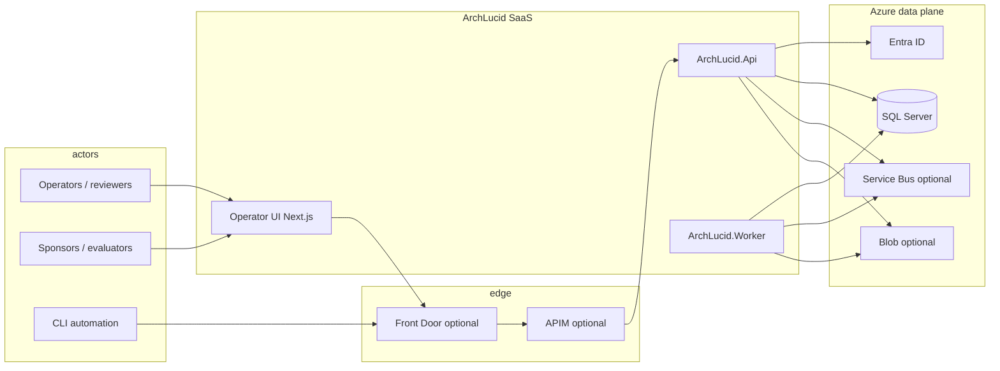
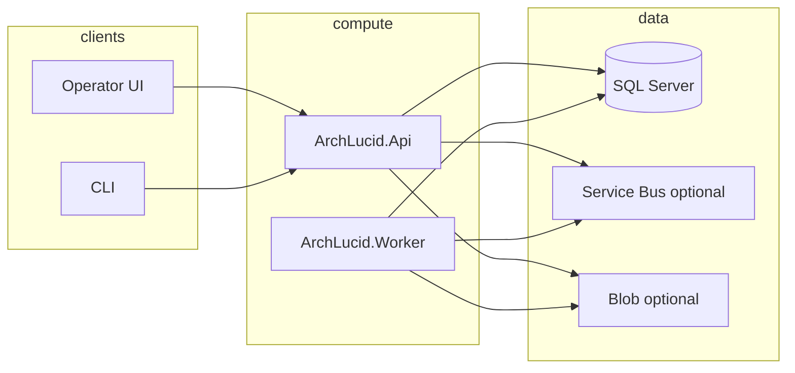

> **Scope:** Canonical architecture poster — C4-style map, ownership, and happy-path trace; defers playbooks to linked library docs.

> **Spine doc:** [`START_HERE.md`](START_HERE.md).

# Architecture on one page

**Audience:** Evaluators, operators, and engineers who need the **system boundary, main containers, and trust edges** before opening ADRs or runbooks.

**Pair with:** [`library/OPERATOR_ATLAS.md`](library/OPERATOR_ATLAS.md) (route → API → CLI map) · [`library/V1_SCOPE.md`](library/V1_SCOPE.md) (product boundary)

---

## 1. Objective

Provide a **single page** that can be redrawn as C4 context/container views or a sequence diagram **without** re-walking the whole repository.

## 2. Assumptions

- **Azure-first** hosting (Container Apps, SQL, private networking) unless a pilot explicitly diverges.
- **Incomplete requirements** and **imperfect rollout** are normal; backlogs stay **observable** (outboxes, health, metrics) instead of failing silently.

## 3. Constraints

- **No public SMB (port 445)**; storage and queues use private endpoints and managed identity where possible.
- **Single DDL source per database** — master SQL script plus forward-only migrations for new work.
- **Configuration bridge:** `ArchLucid*` keys remain authoritative with `ArchiForge*` overrides until sunset (see [`library/CONFIG_BRIDGE_SUNSET.md`](library/CONFIG_BRIDGE_SUNSET.md)).

## 4. Architecture overview

### 4.1 System context (who touches what)

### 4.2 Containers (internal responsibilities)

**Orchestration:** HTTP API coordinates **authority runs**, **governance**, and **retrieval**; **Worker** drains queues, outboxes, and long-running jobs. **Interfaces** live in Contracts/Application; **services** implement use cases; **data models** map to SQL and DTOs.

### 4.3 Governance Engine & Policy Packs

The governance model uses **Policy Packs** as its adaptive "brain", completely decoupling the core evaluation engine from domain-specific knowledge (compliance frameworks, cloud provider rules, AI standards).
- **Future-proofing:** Rules, alerts, and advisory defaults are injected as JSON/YAML, allowing rapid adaptation to new technologies without binary updates.
- **Hierarchical Merging:** Packs are assigned at Tenant, Workspace, or Project scopes and merged dynamically. This allows a central security team to enforce global baselines while squads layer on project-specific rules.

## 5. Component breakdown

| Node | Responsibility |
|------|----------------|
| **ArchLucid.Api** | REST surface, auth, OpenAPI, telemetry scrape endpoints, admin diagnostics |
| **ArchLucid.Worker** | Outbox publishers, integration consumers, advisory and indexing workloads |
| **ArchLucid.Host.Composition** | DI graphs (`AddArchLucidStorage`, agents, retrieval wiring) |
| **ArchLucid.Persistence** | Dapper data access, outbox tables, integration dead-letter paths |
| **archlucid-ui** | Operator shell; server **proxy** to API with scope + correlation headers |

**Code map:** [`library/CODE_MAP.md`](library/CODE_MAP.md)

## 6. Data flow

1. **Run commit:** Client → API → SQL transactional write → post-commit **retrieval indexing outbox**.
2. **Integration events:** SQL **integration outbox** → Worker → Service Bus → downstream (with **dead-letter** and admin retry paths).
3. **Authority pipeline:** async work tracked via outboxes; operational metrics exposed as **observable gauges** (see `ArchLucidInstrumentation`).

**Deeper flows:** [`library/ARCHITECTURE_FLOWS.md`](library/ARCHITECTURE_FLOWS.md)

## 7. Security model

- **Default deny** on API controllers; anonymous only where explicitly marked (`/health/*`, `/version`, and similar).
- **Entra ID / JWT** or **API keys** per environment; **development bypass** only outside production with guardrails.
- **Secrets** in Key Vault or CI; UI proxy accepts **`ARCHLUCID_API_KEY`** with **`ARCHIFORGE_API_KEY`** fallback.
- **Multi-tenant RLS** and session context for SQL (see [`security/MULTI_TENANT_RLS.md`](security/MULTI_TENANT_RLS.md)).

## 8. Operational considerations

- **Post-deploy checks:** CD can run [`scripts/ci/cd-post-deploy-verify.sh`](../scripts/ci/cd-post-deploy-verify.sh) — `/health/live`, `/health/ready` (JSON `.status` must be `Healthy`), `/openapi/v1.json`, `/version`, plus synthetic smoke when configured (see [`library/DEPLOYMENT_CD_PIPELINE.md`](library/DEPLOYMENT_CD_PIPELINE.md)).
- **Rollback:** Container Apps revision deactivation for API and worker when smoke fails and rollback flags are set (see `.github/workflows/cd.yml`).
- **Alerts:** `infra/prometheus/archlucid-alerts.yml` complements in-process meter outboxes (fed by `OutboxOperationalMetricsHostedService`).
- **Cost / capacity:** [`library/CAPACITY_AND_COST_PLAYBOOK.md`](library/CAPACITY_AND_COST_PLAYBOOK.md)

---

## Happy path (read left to right)

| Step | What happens |
|------|----------------|
| 1 | Operator creates an **architecture request** (UI wizard, `POST /v1/architecture/request`, or CLI `run`). |
| 2 | **Coordinator / authority pipeline** executes the **review**; timeline updates on **review detail** (legacy **run detail** / `/runs/` routes). |
| 3 | Operator **commits** the manifest (`POST …/commit` or UI) — persists golden manifest and synthesized artifacts. |
| 4 | Reviewer consumes **manifest, artifacts, exports** from **review detail**; optional sponsor package and trace replay. |

**Pilot narrative:** [`CORE_PILOT.md`](CORE_PILOT.md)

---

## Further reading

| Need | Doc |
|------|-----|
| UI route → API → CLI | [`library/OPERATOR_ATLAS.md`](library/OPERATOR_ATLAS.md) |
| Bounded contexts + ADRs | [`architecture/README.md`](architecture/README.md) |
| API contracts | [`library/API_CONTRACTS.md`](library/API_CONTRACTS.md) |
| Structured narrative + legacy flowchart | [`library/ARCHITECTURE_ON_A_PAGE.md`](library/ARCHITECTURE_ON_A_PAGE.md) |
