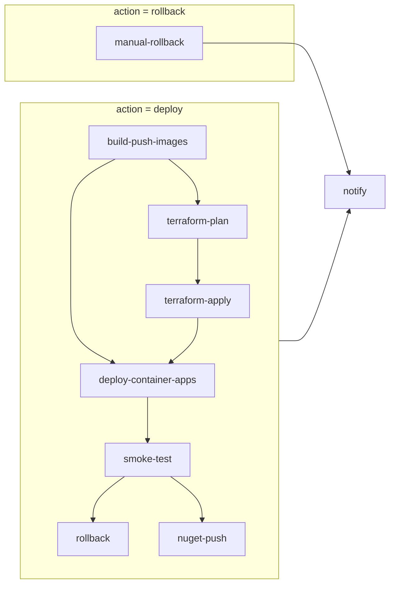

# CD pipeline (manual `workflow_dispatch`)

This document describes the multi-job **CD** workflow (`.github/workflows/cd.yml`). It complements [DEPLOYMENT.md](./DEPLOYMENT.md) and [DEPLOYMENT_TERRAFORM.md](./DEPLOYMENT_TERRAFORM.md).

## Objective

Provide staged deployment automation: build and push container images, optional Terraform plan/apply, Azure Container Apps updates, smoke checks, optional automatic rollback, optional NuGet publish, and notifications—using **Azure OIDC** only (no long-lived service principal secrets in GitHub).

## Assumptions

- GitHub **Environments** `staging` and `production` exist with **required reviewers** for manual gates where you need human approval before jobs that reference those environments run.
- Azure Federated Credentials map each environment (or the workflow) to Entra app registration(s) used by `azure/login@v2`.
- Operators copy `terraform.tfvars.example` → `terraform.tfvars` and `production.tfvars.example` → `production.tfvars` inside `infra/terraform-container-apps/` (or your `TF_WORKING_DIRECTORY`) when using Terraform; committed `.example` files are templates only.

## Architecture overview (nodes and flow)

- **Edges**: `needs` relationships in GitHub Actions; `deploy-container-apps` uses `always()`-style conditions so it still runs when `terraform-apply` is **skipped** (apply is optional).
- **Rollback path**: only `manual-rollback` and `notify` run when `action = rollback`.

## Job breakdown

| Job | Purpose |
|-----|---------|
| `build-push-images` | Checkout, OIDC login, Docker Buildx, push API (`ArchLucid.Api/Dockerfile`) and UI (`archlucid-ui/Dockerfile`) to ACR. Tags: `${IMAGE_TAG}` (defaults to `github.sha`), plus `latest-staging` or `latest-production` per target. BuildKit cache scopes: `api-docker-smoke`, `ui-docker-smoke` (aligned with CI / merge-to-staging CD). |
| `terraform-plan` | OIDC, `terraform init`, `terraform plan` (saved as `tfplan`), upload artifact `tfplan-<target>`, plan summary in step summary. **Skipped** when secret `TF_WORKING_DIRECTORY` is unset (job succeeds with no plan artifact). Production adds `-var-file=production.tfvars` when the file exists; staging adds `-var-file=terraform.tfvars` when present (otherwise default `terraform.tfvars` auto-load applies if present). |
| `terraform-apply` | Runs only when `run_terraform_apply` is true and a plan was produced. Downloads the plan artifact and runs `terraform apply tfplan`. Uses the same environment as the target (reviewer gate). |
| `deploy-container-apps` | OIDC, records API revision **before** update, `az containerapp update` for API (and UI when configured), records revision **after**. Skips update when ACR / RG / app name secrets are incomplete (same behavior as the legacy single job). |
| `smoke-test` | Optional when `SMOKE_TEST_BASE_URL` unset. Otherwise: `GET /health/ready`, `GET /health/live`, `GET /openapi/v1.json` (expects HTTP 200), then synthetic path (`SMOKE_SYNTHETIC_PATH`, default `/version`). |
| `rollback` | On **smoke failure** only: if repo variable `CD_ROLLBACK_ON_SMOKE_FAILURE` is `true`, deactivates the new API revision (same before/after revision pattern as before). |
| `manual-rollback` | `workflow_dispatch` with `action = rollback`: deactivates the current latest API revision and verifies a different revision became active. |
| `nuget-push` | Production only, after successful smoke: packs and pushes `ArchLucid.Api.Client` when `NUGET_API_KEY` is set. |
| `notify` | `if: always()` webhook (optional) + consolidated step summary. |

## Security model

- **OIDC**: `permissions: id-token: write` and `azure/login@v2` with `AZURE_CLIENT_ID` / `AZURE_TENANT_ID` / `AZURE_SUBSCRIPTION_ID` from the environment. Do not store `AZURE_CREDENTIALS` JSON or client secrets for this flow.
- **Storage / SMB**: The pipeline does not expose SMB (port 445). Application storage patterns remain private-endpoint-oriented as described in deployment docs; nothing in this workflow publishes file shares publicly.

## Traceability

- Default image tag is the **git SHA** (`github.sha`), overridable via repository variable `IMAGE_TAG`.
- Terraform plan is stored as a run artifact named with the target environment for audit and optional `terraform apply` in a later job in the same run.

## Operational considerations

- **Environment protection**: Use `required_reviewers` on `staging` and `production` so `terraform-apply` and image deploy jobs respect your change-management process.
- **Failure behavior**: If `terraform-plan` fails, downstream deploy jobs do not run. If smoke fails, enable `CD_ROLLBACK_ON_SMOKE_FAILURE` to let the workflow deactivate the bad revision automatically.
- **Terraform variables**: There is no `api_image_tag` variable in `infra/terraform-container-apps/variables.tf`; image references remain full `api_container_image` / `ui_container_image` values in tfvars or remote state as you configure today.

## Related workflows

- **CI** (`.github/workflows/ci.yml`): validation, tests, Docker smoke caches.
- **CD staging on merge** (`.github/workflows/cd-staging-on-merge.yml`): optional automatic staging deploy after green CI; unchanged by the manual CD refactor.
