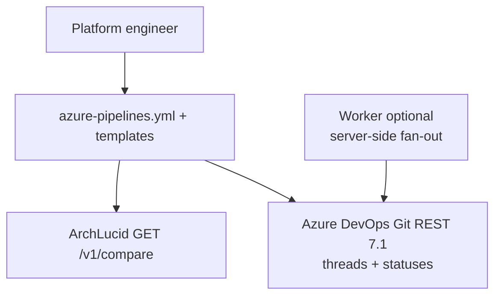

> **Scope:** ADR — Azure DevOps pipeline YAML parity with GitHub Actions for manifest-delta PR surfaces.

> **Spine doc:** [Five-document onboarding spine](../FIRST_5_DOCS.md). Read this file only if you have a specific reason beyond those five entry documents.

# ADR 0024 — Azure DevOps pipeline task parity with GitHub Action (manifest delta)

**Status:** Accepted  
**Date:** 2026-04-21

## 1. Objective

Give **Azure DevOps Repos** pilots the **same buyer journey** GitHub pilots already have: paste a **single YAML snippet** into CI that fetches **`GET /v1/compare`** and surfaces the Markdown on either the **pipeline run summary** or a **sticky pull-request thread** plus an **informational PR status**, without requiring a Marketplace extension or the `az` CLI.

## 2. Assumptions

- Buyer agents run **Node.js ≥ 20** (templates pin **22.x** via `NodeTool@0`).
- Azure DevOps **Git REST 7.1** for PR threads and statuses remains stable for the contract shapes we serialize (`thread` create + `status` create + comment **PATCH**).
- For **Mode A** (`System.AccessToken`), the **Project Collection Build Service** identity is granted **Contribute to pull requests** on the target repository.
- Buyers who need **strict compare failures** keep the default fetch behaviour; buyers who want **transient-safe** pipelines may set **`ARCHLUCID_COMPARE_WARN_ONLY=1`** for **404** responses only.

## 3. Constraints

- **No new Node/npm dependencies** — `fetch`, `node:test`, and core modules only.
- **No `az` CLI** in templates (greenfield agents may not have it).
- **No Azure DevOps Marketplace extension** packaging in this ADR (discoverability + publisher ceremony deferred).
- **No new ArchLucid API** — reuse **`GET /v1/compare`** exclusively.
- **No SMB (port 445)** — all traffic is **HTTPS** to ArchLucid and `dev.azure.com` (workspace security alignment).

## 4. Architecture Overview

Two **complementary** integrations:

| Path | Trigger | Who configures |
| --- | --- | --- |
| **Pipeline templates** (this ADR) | Buyer YAML in their ADO project | Buyer |
| **Server-side handler** | `com.archlucid.authority.run.completed` | ArchLucid operator (`AzureDevOps` section) |

## 5. Component Breakdown

| Area | Files |
| --- | --- |
| Job summary | [`integrations/azure-devops-task-manifest-delta/task.yml`](../../integrations/azure-devops-task-manifest-delta/task.yml), [`job-summary.mjs`](../../integrations/azure-devops-task-manifest-delta/job-summary.mjs) |
| PR comment + status | [`integrations/azure-devops-task-manifest-delta-pr-comment/task.yml`](../../integrations/azure-devops-task-manifest-delta-pr-comment/task.yml), [`post-pr-thread.mjs`](../../integrations/azure-devops-task-manifest-delta-pr-comment/post-pr-thread.mjs), [`post-pr-thread-wire.mjs`](../../integrations/azure-devops-task-manifest-delta-pr-comment/post-pr-thread-wire.mjs) |
| Shared Markdown | [`integrations/github-action-manifest-delta/fetch-manifest-delta.mjs`](../../integrations/github-action-manifest-delta/fetch-manifest-delta.mjs) |
| Wire-format parity (C#) | `AzureDevOpsPullRequestWireFormat` in `ArchLucid.Integrations.AzureDevOps` |
| Tests | `integrations/azure-devops-task-manifest-delta-pr-comment/post-pr-thread.test.mjs`, `integrations/azure-devops-task-manifest-delta/job-summary.test.mjs`, `ArchLucid.Integrations.AzureDevOps.Tests/AzureDevOpsRequestBodyParityWithPipelineTaskTests.cs` |

## 6. Data Flow

1. Pipeline step exports **`ARCHLUCID_*`** env vars (same semantic names as GitHub Actions).
2. `fetch-manifest-delta.mjs` performs **`GET /v1/compare`** and prints Markdown to **stdout**.
3. **Job-summary** path: capture stdout → temp file → `##vso[task.uploadsummary]` for the run summary page.
4. **PR-comment** path: prepend sticky **marker** → list PR threads (paginated) → **PATCH** existing comment or **POST** new thread → **POST** PR status with truncated description + optional `targetUrl`.

## 7. Security Model

| Topic | Decision |
| --- | --- |
| ArchLucid API key | `X-Api-Key` — store in ADO secret / variable group; never echo in logs. |
| Azure DevOps auth | **Mode A:** `Bearer $(System.AccessToken)` — least privilege when scopes are tight. **Mode B:** PAT **Code (Read & write)** — `Basic` encoding `:pat` only in the Authorization header (same as server-side C# decorator). |
| Logs | Script emits **mode only** (`Bearer` vs `Basic`), never token bytes. |
| Egress | HTTPS to `dev.azure.com` and the ArchLucid API origin — **no SMB**. |

## 8. Operational Considerations

| Topic | Behaviour |
| --- | --- |
| Compare **404** | Optional **`ARCHLUCID_COMPARE_WARN_ONLY=1`**: exit **0**, emit Markdown stub + **WARNING** (does not red-build for transient “target not committed yet”). |
| PR already merged | Azure DevOps may reject thread updates — operators see REST failure; retry semantics are standard pipeline retries. |
| Duplicate markers | **PATCH** the **most recent** thread (warn with thread ids). |
| Marketplace | **Out of scope** — ship templates by repo path / pipeline resource for now. |

### Out of scope (explicit)

- **Marketplace extension** packaging and publisher registration.
- **SQL-backed run→PR mapping** for the server-side handler (still fixed `(RepositoryId, PullRequestId)` in config).
- **Bitbucket / GitLab** parity.
- **Mandatory merge gating** on the informational status (tenant branch policies only).
- **Backfill** of sticky comments on historical PRs without a new pipeline run.
