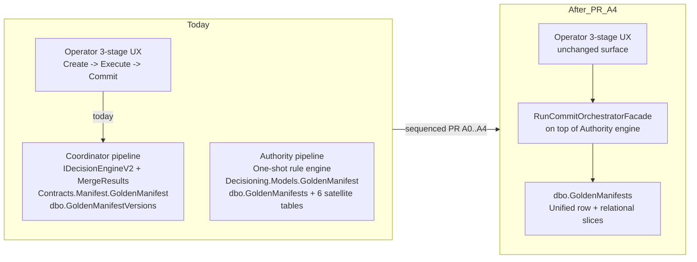

> **Scope:** ADR 0030 — Coordinator → Authority pipeline unification, sequenced over multiple PRs. Replaces the optimistic single-PR-A framing in [ADR 0021](0021-coordinator-pipeline-strangler-plan.md) § Phase 3 mechanism (a) once the dual-data-model and dual-SQL-table reality is acknowledged.

# ADR 0030: Coordinator → Authority pipeline unification — sequenced multi-PR plan

- **Status:** Accepted
- **Date:** 2026-04-21
- **Supersedes:** *(none — see § Lifecycle)*
- **Superseded by:** *(none yet)*
- **Amends:** [ADR 0021 — Coordinator pipeline strangler plan](0021-coordinator-pipeline-strangler-plan.md) (Phase 3 mechanism (a) is re-scoped from "single PR A deletion" into the sequenced PR list below); [ADR 0022 — Coordinator interface family retirement blocked](0022-coordinator-phase3-deferred.md) (the gate-evidence framing now applies per-sub-PR, not to a single PR A); [ADR 0029 — Coordinator strangler acceleration to 2026-05-15](0029-coordinator-strangler-acceleration-2026-05-15.md) (the 2026-05-15 Sunset deadline now applies to **PR B — audit-constant retirement** only; the original "PR A: deletion" milestone is replaced by the **PR A0 → A4** sequence below).

## Objective

Record **why** [ADR 0021](0021-coordinator-pipeline-strangler-plan.md) § Phase 3 mechanism (a) cannot be executed as a single deletion PR, **what** sequenced PRs are required to actually unify the Coordinator and Authority pipelines, and **which** owner decisions are now blocking each sub-PR. The intent is to keep the strangler initiative honest with the code state instead of letting an optimistic ADR shape the next session's scope when the underlying pipelines diverge in domain model, SQL storage, and decision-engine implementation.

## Assumptions

- **Pre-release.** Same as [ADR 0029](0029-coordinator-strangler-acceleration-2026-05-15.md) § Assumptions — ArchLucid V1 is not yet shipped to a paying customer; soak-time gates (i) and parity-row gates (iv) from [ADR 0021](0021-coordinator-pipeline-strangler-plan.md) § Phase 3 stay waived per ADR 0029 across every sub-PR below until V1 ships.
- **Owner Q&A 2026-04-21** (`docs/PENDING_QUESTIONS.md` item **16** sub-bullet "Phase 3 PR A authorship"): the owner authorized "no-rollback sign-off" for the original single PR A scope; that authorization carries over to the sub-PRs **A0 → A4** below, but the **per-sub-PR gates (ii) + (iii)** still must clear inside each sub-PR's own CI run.
- **The 2026-04-21 grounding read** (this ADR) is the authoritative finding that the two pipelines persist incompatible domain models to incompatible SQL tables. See § Component breakdown for the evidence.

## Constraints

- **Two `GoldenManifest` types exist today.** `ArchLucid.Contracts.Manifest.GoldenManifest` (Coordinator pipeline; string `RunId`; services + datastores + relationships + governance + metadata) and `ArchLucid.Decisioning.Models.GoldenManifest` (Authority pipeline; Guid `ManifestId` + Guid `RunId` + Guid scope triple; section objects: Topology / Security / Compliance / Cost / Constraints / UnresolvedIssues / Decisions / Provenance / Policy). They are **not** the same type and one cannot be substituted for the other without a wider refactor.
- **Two SQL tables coexist** in the master DDL today (`ArchLucid.Persistence/Scripts/ArchLucid.sql`):
  - `dbo.GoldenManifestVersions` (Coordinator side; line 105 of the master DDL) — single JSON blob keyed by string `ManifestVersion`.
  - `dbo.GoldenManifests` + six phase-1 relational satellite tables (`GoldenManifestAssumptions`, `GoldenManifestWarnings`, `GoldenManifestProvenanceSourceFindings`, `GoldenManifestProvenanceSourceGraphNodes`, `GoldenManifestProvenanceAppliedRules`, `GoldenManifestDecisions` + `…DecisionEvidenceLinks` + `…DecisionNodeLinks`) — Authority side; line 987 of the master DDL — keyed by Guid `ManifestId` + scope triple.
- **Two decision engines exist today.** Coordinator pipeline uses `IDecisionEngineService.MergeResults` + `IDecisionEngineV2.ResolveAsync`; Authority pipeline uses its own one-shot rule-engine path. The Authority engine does **not** today produce a `Contracts.Manifest.GoldenManifest` shape.
- **`RunCommitOrchestratorFacade` is a 12-line thin pass-through today** to `ArchitectureRunCommitOrchestrator`. It does not bridge the two pipelines; the introduction notes in [ADR 0022](0022-coordinator-phase3-deferred.md) § Component breakdown overstate its role.
- **Historical SQL migrations 001–028 must not be re-edited.** Any schema move ships as a new migration plus the master DDL update.
- **No edits to the Authority engine's Decisioning.Models contract surface without an ADR amendment.** That surface is consumed by the operator UI's run / manifest views and by the AsyncAPI emitter; widening the manifest-row producer is an in-scope change but breaking the consumer surface is out of scope for this initiative without a separate ADR.

## Architecture overview

## Component breakdown — the four sub-PRs

Each sub-PR ships independently and can be verified against gates **(ii)** + **(iii)** on its own CI run before the next one starts. Each sub-PR is reversible by `git revert` until the PR after it merges. The **only** PR that is irreversible without restoring deleted code from history is **PR A4** (the legacy `dbo.GoldenManifestVersions` table drop), and that one is gated on owner sign-off again at the time of merge.

| Sub-PR | What ships | What is blocked on (owner / evidence) |
|--------|------------|---------------------------------------|
| **PR A0 — Authority engine output reshaping (additive).** | Authority engine grows the ability to emit a `Contracts.Manifest.GoldenManifest`-shape projection from the same one-shot run. New code path: `IAuthorityCommitProjectionBuilder.BuildContractsManifestAsync(...)`. No deletion. No SQL change. New unit tests under `ArchLucid.Decisioning.Tests` covering shape parity (every Coordinator-shape field reachable from Authority-shape source data). | Owner sign-off on the **shape parity invariants** (which Coordinator-shape fields are derivable, which require new Authority-side data). Pending question item **34a**. |
| **PR A1 — Authority repository accepts Contracts manifests (additive write port).** | `ArchLucid.Decisioning.Interfaces.IGoldenManifestRepository` grows a second `SaveAsync(Contracts.Manifest.GoldenManifest, ...)` overload (per the 2026-04-21 owner Q&A `q_pra_authority_writes` decision: extend Authority interface, do not split into separate writer port). `SqlGoldenManifestRepository` learns to map a Contracts-shape input into the existing `dbo.GoldenManifests` schema using PR A0's projection builder in reverse where needed. Coordinator interface untouched. | Owner sign-off on the **single-interface-with-overload** shape (already chosen 2026-04-21). Pending question item **34b** confirms whether the write overload returns the produced `Decisioning.Models.GoldenManifest` so the caller can keep its idempotency-key reasoning. |
| **PR A2 — RunCommitOrchestratorFacade swaps target.** | `RunCommitOrchestratorFacade` stops delegating to `ArchitectureRunCommitOrchestrator` and instead drives the Authority engine + the new Authority write port from PR A1. The legacy `ArchitectureRunCommitOrchestrator` stays in place behind a `legacy:true` feature flag for rollback. The 9 mocking test files start being migrated to mock the Authority interfaces; the 4 Coordinator contract tests stay green because the Coordinator concrete is still wired. **Critical:** OpenAPI snapshot must be unchanged (route shape stable). | Gate **(ii)** + gate **(iii)** green on PR A2 branch. Owner sign-off on the **legacy feature flag default** (off vs on by environment). Pending question item **34c**. |
| **PR A3 — Coordinator concretes + interfaces deletion.** | After PR A2 has been on `main` long enough to verify the façade flip works (per pre-release this collapses to "the next CI run is green"; per V1-shipped this restores ADR 0021 gate (i) 30-day soak), delete `ICoordinatorGoldenManifestRepository` + `ICoordinatorDecisionTraceRepository` + their concretes (`InMemoryCoordinator*`, `Coordinator` branches in Dapper repos), the 6 contract test files, `ArchLucid.Architecture.Tests/DualPipelineInternalReadPathTests.cs`, `ArchLucid.Application.Tests/Orchestration/CoordinatorAuditDurableTests.cs`, and the legacy feature flag. Rewrite `DualPipelineRegistrationDisciplineTests` to assert the opposite invariant. Flip ADR 0022 to `Superseded by ADR 0030`. | Same gate (ii) + (iii) inside PR A3's CI. **No** new owner sign-off needed beyond the 2026-04-21 sign-off, because PR A3 is the actual "deletion" the original PR A scope asked for, and the rest of the unification is now visible in PRs A0–A2. |
| **PR A4 — `dbo.GoldenManifestVersions` table drop.** | New SQL migration drops the legacy table. Master DDL updated. **Irreversible.** Backfill / archival of historical rows handled by a separate migration script that exports to blob storage before dropping. | Explicit owner sign-off **at merge time** on (a) the backfill script's destination and (b) the no-rollback acknowledgement. Pending question item **34d**. |

(Phase 3 **PR B — audit-constant retirement** as described in [ADR 0029](0029-coordinator-strangler-acceleration-2026-05-15.md) § Lifecycle is unchanged: it ships after the **2026-05-15** Sunset and removes `AuditEventTypes.CoordinatorRun*`. The 2026-05-15 calendar deadline now applies to **PR B**, not to "PR A" — see § Operational considerations below.)

## Data flow

No runtime data-flow change in PR A0 (additive code only). PR A1 introduces a new write target without enabling it. PR A2 flips the runtime write path behind a feature flag; the operator-visible 3-stage Create / Execute / Commit semantics are preserved by `RunCommitOrchestratorFacade` and the unchanged HTTP route shape on `RunsController`. PR A3 collapses the dual-write to single-write Authority-side. PR A4 drops the now-empty legacy storage.

The OpenAPI / AsyncAPI **public** surface does not change in any of A0 → A4 — every public route on `RunsController` keeps its request/response shape. The internal `CommitRunResult.Manifest` continues to be `Contracts.Manifest.GoldenManifest`, populated by either pipeline depending on the feature flag in PR A2 and the deletion in PR A3.

## Security model

Unchanged across A0 → A4. RLS policies on `dbo.GoldenManifests` already enforce scope boundaries; the legacy `dbo.GoldenManifestVersions` table predates RLS but has no scope leak risk because it is keyed by globally unique `ManifestVersion` strings that callers never enumerate cross-tenant (the operator UI scopes at the run level upstream). PR A4's drop must include a security-review sign-off confirming no other code reaches the legacy table.

## Operational considerations

- **2026-05-15 deadline reassignment.** [ADR 0029](0029-coordinator-strangler-acceleration-2026-05-15.md) accelerated the Sunset header from 2026-07-20 to 2026-05-15 expecting a single PR A to merge by then. With the unification re-scoped, the **calendar deadline applies to PR B (audit-constant retirement)** — which can ship independently after 2026-05-15 because `AuditEventTypes.CoordinatorRun*` constants are decoupled from the storage / decision-engine work in A0 → A4. The Sunset header on `CoordinatorPipelineDeprecationFilter` stays at `Fri, 15 May 2026 00:00:00 GMT` because that header advertises the **route family**'s sunset, and the route family (`POST /v1/architecture/*`) does NOT shrink in any of A0 → A4 — only the implementation under it swaps. The route family itself retires in a future ADR (0021's Phase-3-style deletion of the operator-facing routes was always a separate question; this ADR does not retire it).
- **PR A2 risk.** Swapping the façade behind a feature flag is the highest-risk single sub-PR because it is the moment runtime behaviour changes. Run the `tests/golden-cohort/cohort.json` deterministic simulator end-to-end against both flags before merging A2; capture the SHA-equality evidence in `artifacts/phase3/pr-a2-cohort-parity.md` so reviewers can verify the swap produced bit-identical committed manifests.
- **PR A4 backfill.** The backfill of historical `dbo.GoldenManifestVersions` rows to blob storage is an owner-decision: keep forever, keep N years, or drop without backfill. Pending question item **34d** captures this.
- **What stays from ADR 0029 and ADR 0022.** Both ADRs remain `Accepted` / `Proposed` respectively. ADR 0022 flips to `Superseded by ADR 0030` only when **PR A3** merges (not before — PR A0–A2 do not delete any Coordinator code, so the "interface family retirement blocked" record from ADR 0022 stays accurate until A3). ADR 0029 stays `Accepted` and its acceleration-to-2026-05-15 framing is amended (in this ADR) to reassign the deadline to PR B.

### Lifecycle

| Event | Action |
|-------|--------|
| PR A0 merges | This ADR stays Accepted; component-breakdown row for A0 marked shipped. |
| PR A1 merges | Same. |
| PR A2 merges | Same. Pre-release: this is the moment runtime behaviour changes; capture cohort-parity evidence in the PR. |
| PR A3 merges | ADR 0022 flips to `Superseded by ADR 0030` inside PR A3; `DualPipelineRegistrationDisciplineTests` asserts the opposite invariant; `DUAL_PIPELINE_NAVIGATOR.md` collapses to a single-pipeline page. |
| PR A4 merges | This ADR stays Accepted; legacy `dbo.GoldenManifestVersions` table is gone; `ArchLucid.sql` master DDL no longer creates it. |
| PR B merges (after 2026-05-15) | Per ADR 0029 § Lifecycle, unchanged. `AuditEventTypes.CoordinatorRun*` constants are removed. |
| ArchLucid ships V1 to a paying customer **before any of A0–A4 merge** | This ADR is **amended** to restore [ADR 0021](0021-coordinator-pipeline-strangler-plan.md) gate (i) (30-day soak between PR A2 and PR A3) and gate (iv) (14 contiguous parity rows). PR A4 is held until both restored gates clear. |
| Owner reverses the unification plan | This ADR is **superseded** by a new ADR. |

## Related

- [ADR 0010 — Dual manifest and decision-trace repository contracts](0010-dual-manifest-trace-repository-contracts.md) (the boundary the strangler initiative is trying to retire).
- [ADR 0021 — Coordinator pipeline strangler plan](0021-coordinator-pipeline-strangler-plan.md) (whose Phase 3 mechanism (a) is amended here).
- [ADR 0022 — Coordinator interface family retirement blocked](0022-coordinator-phase3-deferred.md) (whose gate framing is per-sub-PR after this amendment).
- [ADR 0029 — Coordinator strangler acceleration to 2026-05-15](0029-coordinator-strangler-acceleration-2026-05-15.md) (whose 2026-05-15 calendar deadline now applies to PR B).
- [`docs/architecture/COORDINATOR_STRANGLER_INVENTORY.md`](../architecture/COORDINATOR_STRANGLER_INVENTORY.md) (living inventory; per-sub-PR rows added by this ADR).
- [`docs/DUAL_PIPELINE_NAVIGATOR.md`](../DUAL_PIPELINE_NAVIGATOR.md) (decision tree; collapses to single-pipeline page when PR A3 merges).
- [`docs/PENDING_QUESTIONS.md`](../PENDING_QUESTIONS.md) item **16** sub-bullets and new item **34** (sub-bullets a–d).
- [`docs/CHANGELOG.md`](../CHANGELOG.md) 2026-04-21 entry recording this ADR + the amendments to 0021 / 0022 / 0029.
