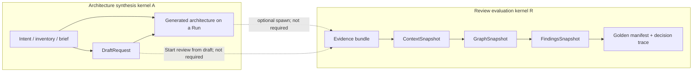

---
title: "ArchLucid architecture and review engines"
subtitle: "Formal specification, critique, and remediation prompts"
---

# ArchLucid architecture and review engines

**Date:** 2026-08-17  
**Version:** 2026.08.17a  
**Audience:** Owner, principal architects, coding agents  
**Canonical living copy:** `docs/architecture/architecture_handbook/75-architecture-and-review-engines.md`  
**Remediation prompts:** `docs/architecture/ENGINE_KERNEL_REMEDIATION_PROMPTS.md`

This Word file is a packaged export of (1) the typed specification of the architecture-synthesis kernel and the review-evaluation kernel, (2) the critique of flaws, incompleteness, unsatisfied boundary conditions, and simplifications, and (3) a sequenced set of copy-paste agent prompts that close those gaps.

It is **platform documentation**, not a customer architecture-review package. It does not authorize new APIs by itself. Prompts EK-09 and EK-10 require an owner decision before generation is split from the agent-task loop.

## How to read

1. **Naming collisions** — four different things are called “engine.” Do not skip this.
2. **Kernels** — synthesis (create) vs evaluation (review) vs the misnamed `IReviewEngine` alias vs finding engines vs the LLM catalog.
3. **Algebra** — which maps are functions, which merges are not joins, what the manifest hash actually commits to.
4. **§11–§14** — boundary table, open problems, flaws, simplifications.
5. **Part II (prompts)** — run one prompt per chat, in the wave order at the end of the prompt set.

## Product signature (one screen)

| Job (ADR 0067) | Kernel | Durable output |
|----------------|--------|----------------|
| Create architecture | Synthesis — drafts and optional generation | Mutable draft; a `Run` with origin `Created` is not a sealed record |
| Review | Evaluation — authority pipeline | Findings, decision trace, golden manifest, exports |

Both jobs may persist through `dbo.Runs` after spawn. That shared table is a persistence spine, not proof that the jobs are sequential lifecycle steps.

There is **no** `IArchitectureEngine` type. `IReviewEngine` is an empty alias of `IAgentExecutor` (prompt EK-01 deletes it).

---

# Part I — Formal specification

# 75. Architecture and review engines — formal specification

**Status:** Normative for platform documentation. Grounded in shipped types as of 2026-08-17.  
**Does not authorize:** new APIs, schema, or product copy.  
**Companion ADRs:** 0030 (authority unification), 0037 (catalog isolation), 0039/0045 (seal immutability), 0042 (canonical write surface), 0063 (cross-review finding identity), 0065 (model catalog), 0067 (co-equal entry points).

This chapter is the specification of the two product kernels the handbook previously described only by pipeline stage names. It is written as a typed system: objects, morphisms, state machines, algebraic properties, and boundary conditions. Where the code does not satisfy a property, that is stated as a **counterexample**, not as a wish.

---

## 0. Naming collisions (read first)

Four distinct constructions are called “engine” in this repository. They are **not** interchangeable.

| Name in code or copy | Actual type | Domain → codomain | Kernel? |
|----------------------|-------------|-------------------|---------|
| Product **Create architecture** | Intake + draft + optional LLM synthesis | Intent / evidence → mutable architecture representation | **Architecture synthesis kernel** A |
| Product **Review** | Authority pipeline + finding engines + decisioning + seal | Evidence → findings + golden manifest | **Review evaluation kernel** R |
| `IReviewEngine` | Empty alias of `IAgentExecutor` | `(runId, request, evidence, tasks)` → `AgentResult[]` | **No.** Agent-task batch executor. |
| `IFindingEngine` | Graph analyzer plugin | `GraphSnapshot` → `Finding[]` | Stage of R, not R itself |
| `IDecisionEngine` | Authority decisioning | `(run, context, graph, findings)` → `(ManifestDocument, DecisionTrace)` | Stage of R |
| `IDecisionEngineV2` | Agent-result merger | `(request, tasks, results, evaluations)` → `DecisionNode[]` | Stage of the **agent-task loop**, not R |
| `IArchitectureRecommendationEngine` | Deterministic recommender | `(knowledge model, specialist findings, priorities)` → recommendations | Side path of A, not a generation LLM |
| LLM / model **catalog engine** (ADR 0065) | Completion provider row | Prompt → tokens | Advisory content only; forbidden to alter authority |

**Convention used below.** “Architecture engine” means A. “Review engine” means R. The C# identifier `IReviewEngine` is treated as a **misnomer** and is never used as a synonym for R.

---

## 1. Product signature

ArchLucid exposes two jobs of equal standing (ADR 0067) that produce **unequal** artifacts.

Let Intent be the persisted workflow label:

- `ArchitectureWorkflowIntent.CreateArchitecture` = `"create-architecture"`
- `ArchitectureWorkflowIntent.StartReview` = `"start-review"`

The origin resolver is a total function on `ArchitectureRequest`:


origin: Request \to {Created,Reviewed}


implemented by `ArchitecturePackageOriginResolver`: explicit create intent maps to `Created`; every other observed source (`start-review`, `wizard`, `recurrence`, `cli`, default) maps to `Reviewed`.

**Axiom A1 (co-equal entry).** Neither job is a required prefix of the other in navigation, CTA weight, or copy.  
**Axiom A2 (unequal artifacts).** A draft is mutable and unsealed. A golden manifest is sealed, hashed, and export-bearing. No morphism of A may be presented as a governed record.

These axioms are **UI/governance** constraints. They are not theorems about the persistence model: both jobs, once they leave the draft table, hang off `dbo.Runs`.



The dashed arrows are **optional couplings**, not the definition of either kernel. That is the content of ADR 0067.

---

## 2. Type universe

### 2.1 Scope

A **paying-client boundary** is a tenant catalog \mathcal{C}(tau), not a row filter (ADR 0037). Inside a catalog, organizational coordinates are a triple


sigma = (tenantId, workspaceId, projectId)


Workspace and project are **not** isolation domains for a different paying client. Queries that omit sigma on tenant tables are undefined behaviour.

### 2.2 Snapshots (immutable-once-written)

| Object | Symbol | Code | Meaning |
|--------|--------|------|---------|
| Evidence bundle | E | evidence bundle id on the run | Bytes and citations admitted to the run |
| Context snapshot | kappa | `ContextSnapshot` | Normalized intake |
| Graph snapshot | Gamma = (V, \mathcal{E}, W) | `GraphSnapshot` | Typed nodes V, edges \mathcal{E}, warnings W |
| Findings snapshot | F | `FindingsSnapshot` | Validated, gated, deduplicated findings plus engine failures |
| Decision trace | T | `DecisionTraceDto` | Why decisions were taken |
| Manifest | M | `ManifestDocument` / `dbo.GoldenManifests` | Sealed architecture package |
| Hash | h(M) | `ManifestHashService.ComputeHash` | SHA-256 of a canonical JSON projection |

Schema of Gamma is versioned (`GraphSnapshot.SchemaVersion`, currently 1). Breaking changes require a new schema version plus a migration path — an explicit **backward-compatibility partial order**.

### 2.3 Mutable pre-authority objects

| Object | Code | Mutability |
|--------|------|------------|
| Draft | `dbo.DraftRequests` (`DraftId`) | Freely mutable; `SpawnedRunId` optional |
| Run header | `dbo.Runs` (`RunId`) | Mutable until commit-freeze of sealed fields |
| Agent tasks / results | `AgentTask` / `AgentResult` | Agent-task loop only |

There is **no** `Architecture` table and **no** `ArchitectureId`. “Architecture” as a customer noun is either draft content or a view over a run.

### 2.4 Run as the persistence spine

Define a run as a tuple


R = (id, sigma, status, origin, kappa^\ast, Gamma^\ast, F^\ast, M^\ast, \ldots)


where starred fields are optional pointers. Both kernels write through R. This is an engineering convenience, not a proof that generation and review are the same functor.

---

## 3. Review evaluation kernel R

### 3.1 Definition

R is the **authority pipeline**. After `POST /v1/architecture/request` persists R, `AuthorityPipelineStagesExecutor.ExecuteAfterRunPersistedAsync` applies a fixed sequence of stages. Queued (`AsyncAuthorityPipeline`) and inline paths share this executor.

**Stage object** (order is part of the definition):


Seq = (iota,\; Gamma,\; Phi,\; Delta,\; alpha)


| Step | Span / internal name | Map | Implementation |
|------|----------------------|-----|----------------|
| 1 | `authority.context_ingestion` / `context_ingestion` | iota: Request \to kappa | `IContextIngestionService.IngestAsync` |
| 2 | `authority.graph` / `graph` | Gamma: kappa \to Gamma | `IKnowledgeGraphService.BuildSnapshotAsync`, with committed reuse |
| 3 | `authority.findings` / `findings` | Phi: Gamma \to F | `IFindingsOrchestrator.GenerateFindingsSnapshotAsync` |
| 4 | `authority.decisioning` / `decisioning` | Delta: (kappa,Gamma,F) \to (M,T) | `IDecisionEngine.DecideAsync` |
| 5 | `authority.artifacts` / `artifacts` | alpha: (M,T) \to Bundle | `IArtifactSynthesisService` |

Each stage is wrapped in an OpenTelemetry span tagged `archlucid.stage.name` and a `dbo.RunStageOutcomes` row.

**Invariant R1 (shared executor).** Queued and inline execution are the same morphism with different scheduling. They must not diverge in stage set or order.

### 3.2 Graph reuse (conditional identity)

Before Gamma rebuilds, the executor asks whether a committed Gamma already exists for the current kappa:


Gamma_{reuse}(sigma, R, kappa) =

Gamma_{committed} & if a committed snapshot is valid for this context \\
Gamma_{build}(kappa) & otherwise


This is an **optimization that is required to be observationally equal** to a rebuild: reuse is legal only when the graph is a function of the admitted context, not of wall-clock. If that observational equality fails, replay and comparison are undefined.

### 3.3 Finding engines as a family of maps

Let E be the registered set of `IFindingEngine` instances. Each engine is


Phi_i: GraphSnapshot  x  Cancel \to Finding^\ast


with labels (EngineType_i, Category_i).

**Signature gap (normative observation).** The interface does **not** take policy packs, evidence bytes, prior runs, or sigma. Any such information must already be encoded in Gamma (nodes, edges, warnings) or the engine is blind to it. Cross-run engines (`requirement-cross-run-diff`, `topology-cross-run-diff`) recover “prior” only from metadata already present on the current graph. That is a **deliberate domain restriction**, and it is incomplete relative to ADR 0063’s comparison story (see §12).

#### 3.3.1 Orchestration Phi = mu  o  ||_i Phi_i

`FindingsOrchestrator.GenerateFindingsSnapshotAsync`:

1. Invokes all Phi_i **in parallel**.
2. On engine exception: records `FindingEngineFailure`, continues.
3. If **every** engine throws: throws `AggregateException`. (Fail-closed on total failure.)
4. If **some** engines succeed: returns a snapshot plus failure rows. (Fail-open on partial failure.)
5. Rejects findings whose payload fails `IFindingPayloadValidator`.
6. Throws if `finding.Category ≠ engine.Category` (after filling empty category from the engine).
7. Deduplicates by the string key FindingType \mid Title (case-insensitive), **keeping the first**.
8. Applies the insight-density gate and human-review options.

**Merge operator mu.** First-wins on (FindingType, Title) after an unordered parallel join.

**Proposition (not a theorem in code).** mu is **not commutative** and **not confluent**. If Phi_a and Phi_b emit the same type/title with different payloads, the survivor depends on task completion order. Parallelism plus `GroupBy(...).First()` is a race on the equivalence class, not a join in a lattice.

**Corollary.** Finding identity for orchestration is **not** `FindingId` and **not** the ADR 0063 fingerprint {policyRuleId:fingerprint}. Three different equality relations are in play; they do not coincide.

#### 3.3.2 Registered engines vs plugin deny-list

**Plugin skip set** `FindingEnginePluginDiscovery.BuiltInEngineTypeIds` (plugins with these ids are ignored):

`requirement`, `topology-coverage`, `topology-structure`, `topology-cross-run-diff`, `topology-anti-pattern`, `security-baseline`, `security-coverage`, `policy-applicability`, `policy-coverage`, `requirement-coverage`, `requirement-cross-run-diff`, `compliance`, `cost-constraint`.

**Actually registered** in `ServiceCollectionExtensions.Decisioning` (non-exhaustive vs the skip set):

| EngineType | Category (typical) | Assembly |
|------------|--------------------|----------|
| `requirement`, `requirement-expectation`, `requirement-gap`, `requirement-cross-run-diff`, `requirement-coverage` | Requirement | Decisioning |
| `topology-coverage`, `topology-structure`, `topology-cross-run-diff`, `topology-anti-pattern` | Topology | Decisioning |
| `security-baseline`, `security-baseline-expectation`, `security-baseline-completeness`, `security-gap`, `security-coverage` | Security | Decisioning |
| `policy-applicability`, `policy-coverage` | Policy | Decisioning |
| `compliance` | Compliance | Decisioning |
| `cost-constraint`, `cost-breach` | Cost | Capabilities.Cost |
| `orphaned-azure-resource`, `orphaned-aws-resource`, `orphaned-gcp-resource` | Inventory | Application |
| `azure-inventory-reconciliation`, `aws-inventory-reconciliation`, `gcp-inventory-reconciliation` | Inventory | Application |
| `azure-inventory-security-baseline`, `aws-inventory-security-baseline`, `gcp-inventory-security-baseline` | Security | Application |
| `advisor-cost-recommendation` | Cost | Application |

`TechnologyConsistencyFindingEngine` implements **`ITechnologyConsistencyFindingEngine`**, not `IFindingEngine`. It is not a member of E.

**Boundary failure B-plugin.** The skip set is a **proper subset** of registered `EngineType` values. A third-party DLL can register `security-gap` or `cost-breach` and be loaded alongside the product engine. Distinctness is not enforced for the full E.

### 3.4 Decisioning

Authority decisioning:


Delta: (runId, kappa, Gamma, F) \to (M, T)


`IDecisionEngine.DecideAsync`. This is the only Delta on the authority path.

A **second** decisioning morphism exists for the agent-task loop:


Delta_2: (request, tasks, results, evaluations) \to DecisionNode^\ast


`IDecisionEngineV2.ResolveAsync`. Domain is agent results, not (Gamma, F). These maps are **not** interchangeable and **do not commute** with Phi.

### 3.5 Seal, hash, commit

Let h be SHA-256 over the canonical projection defined by `ManifestHashService` (schema `HasherSchemaVersion = "v1"`). The projection includes structural sections and effective governance at commit. It **excludes** `CreatedUtc` and, by ADR 0065 D5′, **engine identity**.

**Invariant R2 (commitment).** After commit, h(M) is frozen. Recomputing h on the stored canonical image must match.  
**Invariant R3 (producer excluded).** Changing the LLM catalog engine without changing structural sections does not change h(M). Authority is independent of inference (ADR 0065 D10).  
**Invariant R4 (SoD).** Manifest commit requires the separation-of-duties rules in chapter 67; a single actor must not both author and commit where SoD is enabled.

Commit-allowed statuses for the **agent-task** machine are not the authority machine. `RunStateTransitionService.ValidateCommitAllowed` permits commit only from `ReadyForCommit`. `Failed`, `FailedPartial`, `PartiallyCompleted`, `ExecutionCompletedQualityRejected`, `TasksGenerated` are denied. Authority finalization has its own lock in `ManifestFinalizationService` / `AuthorityDrivenArchitectureRunCommitOrchestrator`.

**Invariant R5 (one-way seal).** `Committed` is terminal for the golden-manifest image of that version. Later versions are new rows, not edits in place (ADR 0039 / 0045).

---

## 4. Architecture synthesis kernel A

### 4.1 Definition

There is **no** `IArchitectureEngine` type. A is the coproduct of three constructions that share a customer job (“produce an architecture”) and **do not** share a single morphism.


A = A_{draft} \;U\; A_{generate} \;U\; A_{recommend}


| Summand | Entry | Output | Deterministic? |
|---------|-------|--------|----------------|
| A_{draft} | `IArchitectureRequestDraftService.DraftAsync`; UI `/architecture/architectures` | `DraftRequests` row | Yes (persistence) |
| A_{generate} | Create-architecture intent on `POST /v1/architecture/request`; agent execute tagged `AiUsageFeature.ArchitectureGeneration` | Run with origin `Created`; topology/cost/compliance/critic `AgentResult`s | No, unless simulator |
| A_{recommend} | `IArchitectureRecommendationEngine.BuildRecommendations` | `ArchitectureRecommendation[]` | **Intended** yes; **fails** because `RecommendationId = Guid.NewGuid()` |

### 4.2 Drafts

A draft D is a mutable architecture description that **does not** start a review. Spawning a run is a separate operation (`SpawnedRunId`). There is no version lattice on drafts beyond “current row.” There is no independent permission algebra: drafts inherit sigma of the actor, not an `Architecture` ACL.

**Invariant A3.** Saving D must not create M.  
**Invariant A4.** Copy must not call D a sealed or governed artifact (ADR 0067 point 5).

### 4.3 Generation via the agent-task loop

When origin is `Created`, synthesis currently **reuses** the four-agent loop rather than Seq:


{Topology, Cost, Compliance, Critic}


`IAgentExecutor.ExecuteAsync` (production handlers or `DeterministicReviewEngine` → `DeterministicAgentSimulator`). LLM spend is attributed to `AiUsageFeature.ArchitectureGeneration`.

This is the deepest structural entanglement: **creating an architecture is implemented as a review-shaped agent batch.** A_{generate} and the legacy coordinator are the same code path with a different origin label.

### 4.4 Recommendation engine

`ArchitectureRecommendationEngine` is a pure-looking map from specialist findings with conclusion `Fail` or `Indeterminate` into recommendations, then applies trade-off annotations.

**Counterexample to functionality.** `RecommendationId = Guid.NewGuid().ToString("N")` makes two invocations on identical inputs unequal. A_{recommend} is a **random-id process**, not a function. Replay and golden-cohort comparison cannot treat recommendation identity as stable.

---

## 5. Agent-task loop (live, non-canonical for new surfaces)

ADR 0030 / TB-1007: **canonical finish path for new surfaces is R**. The agent-task loop remains for task-driven agents, external result push, trial/QuickStart, and selective re-execute.

### 5.1 Status labelled transition system

States S =  `ArchitectureRunStatus` (integer tags 1–10):

`Created` → `TasksGenerated` → `WaitingForResults` → `ReadyForCommit` → `Committed`

Side states: `Failed`, `Retrying`, `ExecutionCompletedQualityRejected`, `PartiallyCompleted`, `FailedPartial`.

Required agents for commit:


A_{req} = {Topology, Cost, Compliance, Critic}


`HasCommitReadyAgentResults` is a predicate on `AgentResult[]`. Commit is the partial function


commit: { R \mid status(R)=ReadyForCommit  AND  ready(A_{req}) } -> R_{Committed}


**Mismatch.** R does not use this four-agent gate as its definition of completeness; it uses stage outcomes and a findings snapshot. The **same enum** S is overloaded onto both kernels. Authority-complete runs must not be driven with `execute`/`result` (chapter 4). That rule is an operational exclusion, not a type distinction: nothing in the type system prevents calling `IArchitectureRunExecuteOrchestrator` on an authority-finalized run except runtime checks.

### 5.2 `IReviewEngine`

```csharp
public interface IReviewEngine : IAgentExecutor;
```

This is a **documentation alias**. `DeterministicReviewEngine` is a test/simulator adapter. It is not R. Treating it as the review kernel is a category error that has already appeared in planning docs.

---

## 6. LLM catalog (not a kernel)

ADR 0065: completions are catalog-selected; embeddings remain Azure OpenAI. Fail-closed controls are **capability** (structured-output ladder) and **data boundary**, not measured quality.

**Invariant L1.** Engine selection must not alter authorization, tenant isolation, evidence identifiers, citation linkage, finalization, audit, policy-gate calculation, scoring, retention, export completeness, or billing enforcement.  
**Invariant L2.** No silent cross-engine failover.  
**Invariant L3.** Workspace admin bounds the allowed set; the user chooses inside it.

These invariants place the catalog **outside** R’s authority image. They belong in chapter 45, which previously stated the contradictory claim that non-Azure providers are scaffold-only.

---

## 7. Algebraic properties (what holds, what does not)

### 7.1 Idempotent create

HTTP create with an idempotency key is serialized (`sp_getapplock` or in-process semaphore) and uniqueness-constrained on `dbo.ArchitectureRunIdempotency`.

**Intended:** create_k  o  create_k = create_k.  
**Caveat:** uniqueness is on the key, not on request body equality. The same key with a different body is a conflict, not a merge.

### 7.2 Graph build as a function of context

If Gamma_{build} is deterministic in simulator mode, then Gamma_{reuse} = Gamma_{build} on the committed subset. Live LLM-influenced graph construction is **not** claimed to be a function; the product instead seals Gamma and hashes M.

### 7.3 Findings snapshot

Let || Phi_i be the parallel family. The implemented mu is:

- associative on disjoint type/title keys;
- **not** associative/commutative when keys collide;
- fail-closed on the empty success set;
- fail-open on a nonempty success set.

There is **no soundness theorem** of the form “if policy pack P requires control c and Gamma lacks c, then F contains a finding.” Coverage is empirical per engine, not a derivation in a policy calculus.

### 7.4 Manifest hash as a commitment scheme

h is a **content commitment** for the canonical projection, not a cryptographic binding of:

- which finding engines ran;
- which LLM catalog row produced advisory text;
- wall-clock;
- actor identity (that lives in audit, not in h).

Collision resistance of SHA-256 is assumed; **canonicalization completeness** is the real risk: any field omitted from the anonymous projection can change without moving h. Engine identity is omitted **intentionally**. Finding mute flags, human-review notes, and some envelope fields on `Finding` are not obviously in M’s hashed sections — do not treat h as a hash of the findings snapshot.

### 7.5 Isolation


data(tau)  intersect  data(tau') = empty   (tau != tau')


is implemented by **separate catalogs**, not by sigma predicates inside one database. `SingleCatalog` is fail-fast on production-like hosts. RLS is not the paying-client boundary (ADR 0037). Defense in depth still requires sigma on queries inside a catalog so that workspace/project mix-ups cannot leak across organizational units **of the same tenant**.

### 7.6 Replay

End-to-end replay compares sealed images. ADR 0065 requires engine-identity diff as the leading interpretation of advisory drift. Because h excludes engine identity, **hash equality does not imply engine equality**. Replay must consult `Runs.EngineProvenanceJson` / `AgentExecutionTrace`, not only h(M).

---

## 8. Shared infrastructure vs kernel membership

| Mechanism | In A? | In R? | Notes |
|-----------|---------------------|---------------------|-------|
| `POST /v1/architecture/request` | Yes (create intent) | Yes (review intent) | Same write surface (ADR 0042) |
| `dbo.Runs` | Yes once spawned | Yes | Spine, not identity of the job |
| Context ingestion / graph | Optional | Required in Seq | |
| `IFindingEngine` family | No | Yes | |
| Four-agent execute | Yes (A_{generate}) | Legacy only | |
| Policy packs / focused pilot mode | Indirect (scope of later review) | Yes | Pilot mode may narrow E’s effective rules |
| Golden manifest | No (forbidden by A2) | Yes | |
| Draft table | Yes | No | |
| Model catalog | Advisory in generate | Advisory in specialist/critic | Never authority |

---

## 9. HTTP and UI edges (non-exhaustive)

| Job | UI | HTTP |
|-----|----|------|
| Create architecture | `/architecture/architectures`, `/architecture/architectures/new` | Draft APIs + `POST /v1/architecture/request` with `WorkflowIntent=create-architecture` |
| Review | `/architecture/reviews`, `/architecture/reviews/new` | `POST /v1/architecture/request` with `WorkflowIntent=start-review` |
| Inspect authority stages | Run detail pipeline section | `GET /v1/architecture/run/{runId}/stage-timeline` |
| Inspect review | `GET /v1/architecture/review/{runId}` | Must be read before `execute`/`result`/`finalize` on mixed-path runs |

---

## 10. Configuration that changes kernel behaviour

| Knob | Effect on R or A |
|------|-----------------------------------------------|
| `FeatureManagement:FeatureFlags:AsyncAuthorityPipeline` | Schedule Seq on Worker vs inline. Default enabled on SQL; InMemory never queues. |
| `ArchLucid:AuthorityPipeline:OrchestratorBackend` | `DurableTask` vs SQL outbox seam (DTF not required for V1). |
| `ArchLucid:FindingEngines:PluginDirectory` | Extra Phi_i from non-`ArchLucid.*` DLLs. |
| Focused pilot mode | Restricts effective policy evaluation to Security + Cost pack names; does not delete the other 39 seeded packs. |
| Simulator vs Real execution | INV-002 aggregation: Real / Simulator / Fallback / Mixed. Absence of mode is invalid. |
| Hosting role Api / Worker / Combined | Who runs Seq drain loops (chapter 64). |

---

## 11. Boundary conditions — satisfied vs not

| ID | Condition | Status |
|----|-----------|--------|
| B1 | Paying-client isolation = catalog, not RLS | **Satisfied** in production-like hosts (ADR 0037) |
| B2 | Draft is not a sealed record | **Satisfied** in data model; copy must keep A4 |
| B3 | Authority-complete ⇒ do not `execute`/`result` | **Satisfied** as operational contract; **not** a type boundary |
| B4 | Seq order fixed and shared queued/inline | **Satisfied** in `PipelineStageSequence` |
| B5 | Total finding-engine failure fails the snapshot | **Satisfied** (`AggregateException`) |
| B6 | Partial finding-engine failure still yields F | **Satisfied** (and is a product choice, not an accident) |
| B7 | Finding equality used by mu = ADR 0063 identity | **Not satisfied** (three equalities) |
| B8 | Plugin ids cannot collide with any registered engine | **Not satisfied** (skip set ⊂ E) |
| B9 | h(M) binds producer (LLM engine) | **Not satisfied by design** (D5′) |
| B10 | A_{recommend} is a function | **Not satisfied** (`Guid.NewGuid`) |
| B11 | `IReviewEngine` denotes R | **Not satisfied** (alias of executor) |
| B12 | Single decision morphism | **Not satisfied** (Delta and Delta_2) |
| B13 | `IFindingEngine` sees policy packs | **Not satisfied** (graph-only domain) |
| B14 | Co-equal UI entry | **Satisfied** by ADR 0067; older handbook/operator docs still funnel |
| B15 | Status LTS describes R | **Not satisfied** (enum is agent-task-shaped) |
| B16 | Generation kernel has a single interface | **Not satisfied** (coproduct, no `IArchitectureEngine`) |

---

## 12. Open problems (incompleteness)

These are gaps in the **specification of the shipped system**, not a backlog shopping list.

1. **No policy calculus.** Packs are JSON documents with a string `pack.category`. There is no entailment relation P |- c, so Phi cannot be proven complete or sound relative to P.
2. **No architecture object.** Reuse of “the same architecture” across reviews is a social convention over drafts and runs, not a first-class identity with a version poset.
3. **Domain of Phi_i is too small** for inventory, freshness, and cross-run identity. Application-layer engines compensate by reading repositories **other than** `GraphSnapshot` while still implementing `IFindingEngine` — a signature lie: the interface says graph-only; several implementations close over SQL options and extractors.
4. **Two completeness predicates.** Authority: stages + snapshot. Agent-task: four successful agent types. A run can be complete in one sense and incomplete in the other.
5. **Focused pilot mode vs seeded catalog.** Thirty-nine packs exist but two names dominate first-run evaluation. Historical reviews do not, by themselves, record a proof of “which theory was in force” except via `EffectiveGovernanceAtCommit` on M when commit happened. Draft-time scope is weaker.
6. **Specialist intelligence path.** `SpecialistReviewFinding` / `ArchitectureKnowledgeModel` is a parallel vocabulary to `Finding` / `GraphSnapshot`. The recommendation engine consumes the former; R consumes the latter. No adjoint or embedding is defined.
7. **Hash projection vs finding envelope.** Human-review, mute, treatment, insight-density, and model alias live on `Finding`. Whether each is in h(M) is not specified here; assume **not**, unless a field is in the canonical anonymous object.

---

## 13. Code index

| Concern | Path |
|---------|------|
| Authority stages | `ArchLucid.Application/Runs/Orchestration/Pipeline/AuthorityPipelineStagesExecutor.cs` |
| Create run | `ArchLucid.Application/Runs/Orchestration/ArchitectureRunCreateOrchestrator.cs` |
| Origin | `ArchLucid.Application/Runs/ArchitecturePackageOriginResolver.cs` |
| Findings fold | `ArchLucid.Decisioning/Services/FindingsOrchestrator.cs` |
| Finding contract | `ArchLucid.Decisioning/Interfaces/IFindingEngine.cs` |
| Plugin skip set | `ArchLucid.Decisioning/Plugins/FindingEnginePluginDiscovery.cs` |
| DI registration | `ArchLucid.Host.Composition/Startup/ServiceCollectionExtensions.Decisioning.cs` |
| Authority Delta | `ArchLucid.Core/Persistence/Ports/IDecisionEngine.cs` |
| Agent Delta_2 | `ArchLucid.Decisioning/Merge/IDecisionEngineV2.cs` |
| Executor alias | `ArchLucid.Contracts/Abstractions/Agents/IReviewEngine.cs` |
| Simulator | `ArchLucid.AgentSimulator/Services/DeterministicReviewEngine.cs` |
| Recommendations | `ArchLucid.Application/ArchitectureIntelligence/ArchitectureRecommendationEngine.cs` |
| Hash | `ArchLucid.Decisioning/Services/ManifestHashService.cs` |
| Status LTS | `ArchLucid.Contracts/Common/ArchitectureRunStatus.cs`, `RunStateTransitionService.cs` |
| Finding output notes | `docs/library/FINDING_ENGINE_OUTPUT_REFERENCE.md` |

---

## 14. Critique — flaws, unsatisfied boundaries, simplifications

This section is the review of the **system as specified above**, not of this chapter’s wording.

### 14.1 Flaws (structural, not cosmetic)

**F1. Four “engines,” one word.** The type system does not distinguish A, R, `IReviewEngine`, `IFindingEngine`, and catalog rows. Humans already mis-plan against `IReviewEngine` (it is an executor). This is a specification bug with implementation consequences.

**F2. Generation is a review loop in costume.** A_{generate} is the four-agent coordinator with `PackageOrigin=Created`. Co-equal *jobs* were declared (ADR 0067) without co-equal *kernels*. The cheaper interpretation — one pipeline, two labels — is what the code implements. The handbook must not pretend otherwise.

**F3. Overloaded status machine.** `ArchitectureRunStatus` is a labelled transition system for agent tasks. Authority stages have a parallel timeline (`RunStageOutcomes`). Completeness is therefore a pair of predicates on one object. That is how mixed-path incidents happen.

**F4. Non-confluent finding merge.** Parallel engines + first-wins on a coarse key is not a well-defined join. Two engines can “win” on different replicas or different clocks. ADR 0063’s correlation key is not this key.

**F5. Dual decision engines with disjoint domains.** Delta sees the graph. Delta_2 sees agent results. Nothing states the relationship. Merge of Delta_2 nodes into M is a third implicit map.

**F6. `IFindingEngine` is an incomplete signature.** Several Application engines need inventory freshness and SQL. Pretending the domain is only Gamma hides effects and makes plugin authors copy the lie.

### 14.2 Incompleteness

See §12. The missing pieces that actually hurt operators:

- no first-class Architecture identity (so “review this architecture again” is a heuristic);
- no proof that enabled packs were evaluated (except commit-time effective-governance blob);
- recommendation ids are random, so A_{recommend} cannot be golden-tested as a function;
- plugin deny-list lag;
- specialist findings vs authority findings remain two theories of the same English word “finding.”

### 14.3 Boundary conditions not satisfied

B7, B8, B10, B11, B12, B13, B15, B16 in §11. The important operational ones: **plugin collision**, **status/type confusion**, **hash not binding producer** (intentional, but then provenance UI must carry the load), **draft/run noun collision** for buyers.

### 14.4 Ways to make it simpler (ordered by leverage)

1. **Delete the `IReviewEngine` alias.** Use `IAgentExecutor` only. One word reclaimed.
2. **Name the kernels in code:** `IReviewEvaluationKernel` = authority `Seq`; `IArchitectureSynthesisKernel` = draft + generate. Stop registering generation as “review execute.”
3. **Split the status LTS** or stop writing authority runs into agent-task statuses. Two small machines beat one overloaded enum.
4. **Retire the agent-task finish path** for product surfaces (already the ADR 0030 intent). Keep simulator execute as a test double of *synthesis*, not of R.
5. **Make mu a lattice join keyed by ADR 0063 fingerprints**, with explicit conflict records instead of `First()`. Deterministic even under parallelism.
6. **Generate `BuiltInEngineTypeIds` from DI registration** so the plugin skip set cannot lag E.
7. **Widen `IFindingEngine` or split it:** graph-pure engines vs effectful inventory engines. Do not keep a dishonest arity.
8. **One decision morphism** whose domain is (Gamma, F) plus an optional agent-result appendix. Kill Delta_2 as a peer.
9. **`RecommendationId = H(findingId, proposedChange)`** so A_{recommend} becomes a function.
10. **One customer noun for `Run`.** Origin is a field, not a second object. Keep “draft” for `DraftRequests` only.

Items 1, 6, and 9 are local and do not change the product. Items 2–5, 7–8, 10 are the actual simplification of the architecture. They trade the current “everything is a Run with optional stages” convenience for two kernels that match ADR 0067.

### 14.5 What not to complicate

Do **not** introduce a third kernel for “policy engine,” “quality engine,” or `IReviewEngine` as an LLM gateway. Policy packs are data for Phi and Delta. Quality dimensions are pack metadata, not a new morphism (see `architecture_quality_policy_engine_assessment.md`). The LLM catalog is a parameterized effect inside synthesis and critic text, already isolated by L1.

Do **not** put engine identity into h(M) without a hasher baseline re-lock. Provenance already has a table. Mixing producer into the content hash collapses “same architecture” with “same model,” which is the opposite of D5′.

---

## 15. Security, scale, reliability, cost

| Concern | How the kernels address it | If not applicable |
|---------|----------------------------|-------------------|
| **Security** | Catalog isolation; sigma on rows; content-safety precheck on create; SoD on commit; catalog data-boundary gate (D11) | — |
| **Scalability** | Parallel Phi_i; graph reuse; async outbox for Seq; bounded batch parallelism on drains | Finding-engine fan-out is in-process `Task.WhenAll`, not a distributed join |
| **Reliability** | Stage outcomes; partial vs total engine failure distinction; commit lock; simulator path | Dual kernels share one status enum — reliability hazard (F3) |
| **Cost** | `AiUsageFeature.ArchitectureGeneration` vs review metering; focused pilot narrowing; catalog rates | Hash/replay CPU is negligible vs completions |

---

## 16. Decomposition (interfaces, services, data, orchestration)

| Layer | A | R |
|-------|-----------------|-----------------|
| **Interfaces** | `IArchitectureRequestDraftService`, `IArchitectureRecommendationEngine`, `IAgentExecutor` | `IContextIngestionService`, `IKnowledgeGraphService`, `IFindingsOrchestrator`, `IFindingEngine`, `IDecisionEngine`, `IArtifactSynthesisService`, `IAuthorityPipelineStagesExecutor` |
| **Services** | Draft service, recommendation engine, execute orchestrator, model catalog | Stage executor, findings orchestrator, decision engine, hash service, finalization |
| **Data** | `DraftRequests`, `Runs` (origin Created), agent traces | `Runs`, context/graph/findings snapshots, golden manifests, decision traces, stage outcomes |
| **Orchestration** | Create orchestrator + optional execute loop | `AuthorityPipelineStagesExecutor` ± Worker outbox |

This is the intended modular split. The flaw is that generation orchestration is still the review execute loop (F2).

# Part II — Remediation prompts

Copy one prompt per chat. Wave order is at the end of this part. Do not implement EK-10 until EK-09 records Option K.

> **Scope:** Copy-paste agent prompts that close the architecture-synthesis / review-evaluation kernel gaps in [`architecture_handbook/75-architecture-and-review-engines.md`](architecture_handbook/75-architecture-and-review-engines.md). Internal engineering only.
> **Spine:** [`START_HERE.md`](../START_HERE.md) · **ADRs:** 0030, 0037, 0039, 0042, 0045, 0063, 0065, 0067.

# Engine-kernel remediation prompts

Run **one prompt per chat**, in order. Name a git branch in any commit/push request. Do not implement EK-10 until EK-09 records an owner decision. Do not add a third kernel named “policy engine,” “quality engine,” or an LLM `IReviewEngine`.

**Spec IDs** referenced below (`F1`–`F7`, `B7`–`B16`) are defined in handbook chapter 75 §11 and §14.

**Global constraints (every prompt):**

- Tenant isolation remains database-per-tenant catalogs (ADR 0037). Do not introduce SQL RLS as the paying-client boundary.
- Deterministic authority must stay independent of LLM catalog choice (ADR 0065 D10). Do not put engine identity into `ManifestHash` (D5′).
- Create architecture and Review stay co-equal *entry points* (ADR 0067). Prompt EK-10 is about *kernels*, not about re-ranking CTAs.
- Each class in its own file. Prefer LINQ. Prefer concrete types over `var`. Blank line before `if`/`foreach` unless first line of method. Check nulls. No `ConfigureAwait(false)` in tests.
- Stage only files this prompt changes. No `git add -A`.
- Before editing tracked files, run `.\scripts\agent\check-working-tree-path.ps1` on those paths.

---

## EK-01 — Delete the `IReviewEngine` alias

**Closes:** F1, B11  
**Depends on:** none  
**Branch suggestion:** `docs/engine-kernel-ek01-drop-ireviewengine`

### Prompt (copy below)

```text
You are working in the ArchLucid repo. Goal: delete the misnamed type alias ArchLucid.Contracts.Abstractions.Agents.IReviewEngine (empty interface extending IAgentExecutor) and replace every use with IAgentExecutor.

Why: Handbook chapter 75 treats IReviewEngine as a category error. It is not the review evaluation kernel (authority pipeline). Planning docs have already mistaken it for an LLM/review gateway. Reclaim the word “review engine” for the authority sequence only.

Do not:
- Change IAgentExecutor, DeterministicAgentSimulator behaviour, or authority pipeline stages.
- Introduce a new IReviewEvaluationKernel in this prompt (that is later work).
- Rename DeterministicReviewEngine yet; keep the class name if callers are widespread, but make it implement IAgentExecutor only. If a rename is one-line and tests already use the class name, you may rename to DeterministicAgentExecutor only if it does not churn product copy.
- Put engine identity into ManifestHash.

Work:
1. Find all references to IReviewEngine (code, tests, XML docs, markdown).
2. Replace the interface with IAgentExecutor.
3. Delete IReviewEngine.cs.
4. Update docs that call IReviewEngine “the review engine” (especially docs/architecture/ai_model_chooser_plan_review_2026_07_18.md and handbook chapter 75 / 04 if they still say the alias exists — change them to past tense / “removed”).
5. Add an architecture test that fails if IReviewEngine is reintroduced under ArchLucid.Contracts.Abstractions.Agents.

Tests: existing DeterministicReviewEngineTests and any compile of AgentSimulator / Application. Add the architecture test in ArchLucid.Architecture.Tests.

Done when: `IReviewEngine` type is gone; solution compiles on the contracts/agent/architecture-test projects; grep for IReviewEngine returns only historical ADR/spec mentions that say it was removed.
```

---

## EK-02 — Plugin skip set = registered EngineType set

**Closes:** B8, F1 (catalog honesty)  
**Depends on:** none (can run parallel with EK-01)

### Prompt (copy below)

```text
You are working in the ArchLucid repo. Goal: make FindingEnginePluginDiscovery.BuiltInEngineTypeIds a complete, generated-or-tested set of every IFindingEngine.EngineType registered in ServiceCollectionExtensions.Decisioning.cs (including ArchLucid.Application inventory engines and ArchLucid.Capabilities.Cost engines).

Why: Chapter 75 boundary B8 — the skip set is a proper subset of registered engines. A third-party plugin can load EngineType values such as security-gap or cost-breach beside the product engine.

Do not:
- Change AnalyzeAsync signatures (that is EK-05).
- Include ITechnologyConsistencyFindingEngine in the IFindingEngine skip set; it is a different interface.
- Load ArchLucid.* assemblies from the plugin directory (keep that skip).

Work:
1. Collect EngineType from every services.AddScoped<IFindingEngine, …> registration.
2. Prefer a source-generated or test-enforced set over a hand-maintained HashSet. Minimum bar: an architecture or Decisioning test that reflects over the composition root (or a shared catalog type) and asserts BuiltInEngineTypeIds equals the registered EngineType set (ordinal, case-insensitive).
3. Update docs/library/FINDING_ENGINE_OUTPUT_REFERENCE.md last-reviewed date and tables to match registration. Cite chapter 75 §3.3.2.

Tests: new test that fails if a registered engine id is missing from the skip set or a skip id is not registered.

Done when: skip set == registered IFindingEngine EngineType values; FINDING_ENGINE_OUTPUT_REFERENCE.md lists Decisioning, Cost, and Application engines separately and notes effectful engines.
```

---

## EK-03 — Recommendation ids are a function of inputs

**Closes:** F7, B10  
**Depends on:** none

### Prompt (copy below)

```text
You are working in the ArchLucid repo. Goal: make ArchitectureRecommendationEngine.BuildRecommendations a deterministic function: identical (model, findings, declaredPriorities) must yield identical RecommendationId values.

Why: Chapter 75 F7 — RecommendationId = Guid.NewGuid() makes the synthesis recommendand a random process, so golden-cohort and replay cannot treat recommendation identity as stable.

Do not:
- Change recommendation prose builders except as needed to keep hashing stable.
- Hash wall-clock or random salts into the id.
- Touch ManifestHashService.

Work:
1. Replace Guid.NewGuid() in ArchitectureRecommendationEngine.CreateRecommendation with a stable id: SHA-256 (or existing repo hash helper) over a canonical tuple (finding identity, proposed-change string, dimension). Format as hex or “N” guid-shaped digest, documented in a one-line comment.
2. If two findings would collide, include FindingId (or title+engine+dimension) so the map stays injective on the input list order-independently. Sort inputs before hashing if the output list order is allowed to be sorted; if output order must match input order, hash per finding without sorting the list.
3. Unit tests: two calls with cloned inputs produce the same RecommendationId sequence; changing proposed change or finding identity changes the id.

Done when: ArchitectureRecommendationEngineTests (create if missing) prove functionality; no Guid.NewGuid in that class.
```

---

## EK-04 — Finding merge is a confluence-friendly join

**Closes:** F4, B7  
**Depends on:** EK-02 recommended (catalog known)  
**Risk:** behaviour change on colliding type|title pairs

### Prompt (copy below)

```text
You are working in the ArchLucid repo. Goal: replace FindingsOrchestrator’s parallel First-wins GroupBy(FindingType|Title) merge with a deterministic join keyed by ADR 0063 correlation identity, with explicit conflict records when payloads differ.

Why: Chapter 75 F4 — μ is not commutative/confluent. ADR 0063 uses {policyRuleId}:{normalizedFindingFingerprint} (fallback fuzzy fingerprint). Orchestration currently uses a third equality. Three keys do not commute.

Do not:
- Silently drop a colliding finding.
- Use task completion order.
- Auto-apply governance disposition across runs (ADR 0063 point 4).
- Change IFindingEngine.AnalyzeAsync in this prompt (EK-05).

Work:
1. Read ADR 0063 and any existing fingerprint helper (TB-2042 if present). Reuse; do not invent a fourth key.
2. After validation, partition findings by the ADR 0063 key (within the snapshot).
3. If all members of a partition are payload-equal under an explicit comparer, keep one (lowest EngineType ordinal for stability).
4. If they differ, keep a primary finding (document the tie-break) AND append a FindingEngineFailure or a dedicated conflict finding type that lists EngineType ids and FindingIds in the partition. Product must be able to see the conflict.
5. Sort engine invocation results by EngineType before merge so the fold is independent of Task.WhenAll order even before grouping.
6. Tests: two engines emitting the same type|title but different payloads no longer depend on scheduling; snapshot contains a conflict signal; disjoint keys still union; total engine failure still AggregateException; partial failure still returns snapshot.

Done when: FindingsOrchestratorTests cover confluence (run the two-engine collision test twice and assert identical surviving FindingId and conflict signal); docs/library/FINDING_ENGINE_OUTPUT_REFERENCE.md describes the join key.
```

---

## EK-05 — Honest finding-engine arity

**Closes:** F6, B13  
**Depends on:** EK-02  
**Risk:** plugin contract change — keep IFindingEngine as the graph-pure interface

### Prompt (copy below)

```text
You are working in the ArchLucid repo. Goal: stop lying about IFindingEngine’s domain. Keep IFindingEngine as GraphSnapshot → Finding[] for graph-pure Decisioning engines. Move or wrap Application inventory/cost engines that close over extractors, freshness options, or SQL onto an explicit effectful port.

Why: Chapter 75 F6/B13 — several Application engines implement AnalyzeAsync(GraphSnapshot) but read repositories the signature does not declare. Plugin authors copy the lie.

Do not:
- Cram policy packs into IFindingEngine in this prompt (no policy calculus yet).
- Break FindingsOrchestrator’s IEnumerable<IFindingEngine> fold without an adapter. An adapter from effectful → IFindingEngine that captures dependencies in the class constructor is acceptable only if the interface XML-doc states “graph-pure; implementations must not query I/O beyond GraphSnapshot.” Effectful engines must not implement IFindingEngine after this change unless the orchestrator has a second collection IEffectfulFindingEngine.

Work:
1. Inventory every IFindingEngine in ServiceCollectionExtensions.Decisioning.cs. Classify graph-pure vs effectful by reading the class (does it use IOptions freshness, extractor packages, SQL?).
2. Introduce IEffectfulFindingEngine (own file) with AnalyzeAsync that includes GraphSnapshot plus CancellationToken and whose implementing classes keep constructor-injected IO. Orchestrator invokes both families, still parallel, still same merge (EK-04 if already shipped).
3. XML-doc IFindingEngine as graph-pure. Add an architecture test: Decisioning.* IFindingEngine types must not reference ArchLucid.Persistence or extractor package repositories.
4. Update HOWTO_FINDING_ENGINE_PLUGINS.md: plugins remain graph-pure IFindingEngine.

Tests: orchestrator still returns a snapshot when only effectful engines emit findings; architecture test forbids Persistence usings in Decisioning finding engines.

Done when: Application inventory engines do not implement IFindingEngine; plugin docs match; chapter 75 B13 note can be marked remediated in a one-line changelog in 98-changelog.md.
```

---

## EK-06 — Doc and architecture-test guard for the word “review engine”

**Closes:** F1 (documentation recurrence)  
**Depends on:** EK-01

### Prompt (copy below)

```text
You are working in the ArchLucid repo. Goal: prevent reintroduction of the IReviewEngine alias and prevent new docs from calling the agent-task executor “the review engine.”

Why: Chapter 75 naming collisions. EK-01 deletes the type; without a guard, the next plan will recreate it.

Work:
1. Architecture test: Contracts assembly must not contain a type named IReviewEngine.
2. Optional markdown drift test only if the repo already has doc-guard tests; do not create a brittle corpus-wide ban on the phrase “review engine.” Instead add a short note to docs/architecture/architecture_handbook/04-authority-vs-coordinator.md and 75 that IReviewEngine was removed (EK-01) and the review evaluation kernel is AuthorityPipelineStagesExecutor.
3. Update docs/architecture/ai_model_chooser_plan_review_2026_07_18.md if it still says IReviewEngine is the boundary.

Done when: architecture test exists; chapter 04/75 wording matches shipped types after EK-01.
```

---

## EK-07 — Stop overloading ArchitectureRunStatus for both kernels

**Closes:** F3, B15  
**Depends on:** none  
**Risk:** API/status serialization — prefer additive fields over enum rewrite

### Prompt (copy below)

```text
You are working in the ArchLucid repo. Goal: make completeness of the review evaluation kernel (authority stages) and completeness of the agent-task loop two explicit predicates, instead of overloading ArchitectureRunStatus for both.

Why: Chapter 75 F3 — same enum, two completeness predicates. Mixed-path incidents (execute/result on authority-complete runs) are runtime checks on a type that cannot express the distinction.

Do not:
- Require Durable Task Framework.
- Break existing ArchitectureRunStatus numeric values (property tests pin them). Additive is required.
- Treat this as a UI copy change (ADR 0067).

Work:
1. Document the two predicates in code XML and in handbook chapter 75 §5.1:
   - Agent-task commit-ready: status ReadyForCommit AND HasCommitReadyAgentResults({Topology,Cost,Compliance,Critic}).
   - Authority-complete: all PipelineStageSequence stages succeeded (RunStageOutcomes) AND golden manifest pointer present as defined by existing GET /v1/architecture/review/{runId} rules.
2. Introduce a dedicated read model or flags on run detail (e.g. AuthorityPipelineComplete, AgentTaskLoopComplete) computed from existing tables — do not invent a second status enum unless you can migrate without breaking OpenAPI snapshot. Prefer computed DTO fields + tests.
3. Tighten execute/result/finalize guards to consult AuthorityPipelineComplete rather than only origin/manifest heuristics. Reuse AUTHORITY_VS_AGENTTASK_LOOP_CANONICAL_PATH_CONTRACT.md (TB-1007).
4. Tests: authority-finalized run cannot execute; agent-task ReadyForCommit without authority stages is still described as agent-task complete not authority-complete on the DTO.

Done when: run detail (API) exposes both flags; contract snapshot updated if the DTO changed; mixed-path tests fail closed.
```

---

## EK-08 — One decision morphism with an optional agent appendix

**Closes:** F5, B12  
**Depends on:** EK-07 helpful  
**Owner:** do not delete IDecisionEngineV2 until merge into M is specified and tested

### Prompt (copy below)

```text
You are working in the ArchLucid repo. Goal: specify and then implement a single decisioning entry used by the authority path whose domain is (context, graph, findings) with an optional agent-result appendix, so IDecisionEngineV2 is not a peer kernel.

Why: Chapter 75 F5 — Δ and Δ2 have disjoint domains and an implicit third merge into the manifest.

Do not:
- Change ManifestHash canonical fields except if a new structural section is deliberately added (then follow hasher baseline / TB-1157). Prefer not to change the hash projection in this prompt.
- Let LLM catalog choice alter Δ (ADR 0065 D10).

Work:
1. Write a short ADR or handbook subsection (prefer a new ADR only if behaviour changes) stating: authority DecideAsync is the only producer of ManifestDocument + DecisionTrace; IDecisionEngineV2.ResolveAsync may run as a pre-step that materializes DecisionNode[] which DecideAsync consumes when present; it must not write golden manifests itself.
2. Trace current merge (IDecisionEngineService.MergeResults, IDecisionEngineV2NodeMaterializer). If V2 nodes never reach authority DecideAsync, either wire them explicitly or stop calling V2 on the authority path.
3. Tests: authority pipeline tests still produce a manifest with V2 disabled; when agent results exist, nodes appear in the trace or a documented unused-appendix warning — pick one behaviour and test it. No silent drop.

Done when: there is one documented producer of M; V2 is a subroutine or is not invoked on authority Seq.
```

---

## EK-09 — Owner decision: two kernels or one pipeline with two labels

**Closes:** F2 (decision, not code)  
**Depends on:** none  
**Produces:** a written owner decision in docs/architecture/adrs/ (next number) — no product code unless the ADR says so

### Prompt (copy below)

```text
You are working in the ArchLucid repo in docs-only mode unless the owner already chose an option in this chat.

Problem (chapter 75 F2): ADR 0067 made Create architecture and Review co-equal jobs. Architecture generation is still implemented as the four-agent execute loop (IAgentExecutor) with PackageOrigin=Created. Either the ADR overclaims (one kernel, two labels) or the code under-implements (two kernels).

Write ADR 00xx (next free number per docs/architecture/adrs/README.md) that records exactly one owner choice:

Option L (labels): There is one evaluation/generation pipeline. Origin is a field on Run. Stop talking about a distinct synthesis kernel in code. Keep ADR 0067 for UI entry-point parity only.

Option K (kernels): Synthesis must not be IAgentExecutor execute. Introduce IArchitectureSynthesisKernel (draft + generate) whose generate path does not require Topology/Cost/Compliance/Critic AgentResult as the definition of an architecture. Review remains AuthorityPipelineStagesExecutor.

Constraints:
- Do not rewrite ADR 0067; this ADR amends implementation standing only.
- Unequal artifacts remain: draft is not a sealed record (A2).
- If Option K, EK-10 is unblocked. If Option L, EK-10 is cancelled and chapter 75 §4.3 is rewritten to say the entanglement is accepted.

Output: ADR file + one paragraph in handbook 75 §14.4 stating which option was chosen. No code in this prompt.
```

---

## EK-10 — Synthesis kernel is not review execute (only if EK-09 chose Option K)

**Closes:** F2, B16  
**Depends on:** EK-09 Option K  
**Cancel if:** EK-09 Option L

### Prompt (copy below)

```text
You are working in the ArchLucid repo. EK-09 must already record Option K (two kernels). Goal: introduce IArchitectureSynthesisKernel (own file) implemented by draft persistence + a generate path that does not define success as the four AgentType results.

Why: Chapter 75 §4.1 — A is a coproduct with no type. §4.3 — generate reuses the review-shaped agent batch.

Do not:
- Make a draft a golden manifest (A2, ADR 0067 point 5).
- Rank Create below Review in UI (ADR 0067).
- Put this kernel behind IReviewEngine (deleted in EK-01).
- Require DTF.

Work:
1. Interface: DraftAsync and GenerateAsync with explicit inputs (ArchitectureRequest / draft id) and outputs (DraftId and/or RunId with PackageOrigin Created). GenerateAsync may still call LLMs via IAgentCompletionClient for topology proposals, but commit-readiness for a *created architecture* must not be HasCommitReadyAgentResults of the four review agents.
2. Wire create-architecture intent on POST /v1/architecture/request to this kernel. Start-review intent stays on authority coordination.
3. Keep the four-agent loop available for the review/agent-task path only (TB-1007).
4. Tests: create-architecture does not require Critic AgentResult to persist a draft or Created-origin run; start-review still runs Seq. Architecture test: IArchitectureRunExecuteOrchestrator is not referenced from the synthesis implementation.

Done when: a Created-origin happy path test does not call EnsureCommitReadyAgentResults; review path tests unchanged.
```

---

## EK-11 — One customer noun for Run; draft stays DraftRequests

**Closes:** object-model noun collision (chapter 75 §2.3–2.4)  
**Depends on:** EK-09 (copy must match Option L or K)  
**Scope:** copy + guards, not a new Architecture table

### Prompt (copy below)

```text
You are working in the ArchLucid repo. Goal: customer-facing copy uses one noun for dbo.Runs (prefer “review” when origin is Reviewed and “architecture” only for DraftRequests and Created-origin generate output that is not sealed). Do not add an Architecture table.

Why: Chapter 75 — there is no ArchitectureId. Package/review/architecture nouns still collide on the same Run (see docs/architecture/architecture_review_object_model_assessment.md). Simplification 10 in chapter 75 §14.4.

Do not:
- Violate ADR 0067 co-equal CTAs.
- Call a draft a sealed or governed record.
- Mass-rename OpenAPI types in this prompt (ArchitectureRun stays the wire type unless a dedicated contract ADR exists).

Work:
1. Inventory operator-visible strings for package/review/architecture on /architecture/reviews and /architecture/architectures (i18n, hub copy, breadcrumbs). Propose a minimal table of changes in the PR description; implement only the hub/list/detail eyebrow inconsistencies that call the same object four names on one page.
2. Keep PackageOrigin as a field, not a second object.
3. Add or update a Vitest guard for the worst colliding strings on the reviews list H1 vs nav vs tab title if guards already exist (do not fight TB-738 if that test still pins “Architecture packages” — if it does, stop and record a conflict with this prompt in the PR; do not delete that guard without owner override).

Done when: either the colliding H1/nav/tab set is unified, or the PR documents the TB-738 conflict and does not ship a half-rename.
```

---

## EK-12 — Provenance must carry producer because the hash does not

**Closes:** §7.4 / §7.6 (hash vs replay) — not a hash change  
**Depends on:** none

### Prompt (copy below)

```text
You are working in the ArchLucid repo. Goal: run detail and replay comparison always surface catalog engine identity and NotEvaluated state from Runs.EngineProvenanceJson / AgentExecutionTrace, because ManifestHash excludes producer (ADR 0065 D5′).

Why: Chapter 75 — hash equality does not imply engine equality. Replay must not lead with “manifest hash match” as “same review.”

Do not:
- Add engine identity to ManifestHashService’s canonical projection.
- Silent cross-engine failover (ADR 0065 D12).

Work:
1. Verify EndToEndReplayComparisonService diffs engine identity (ADR 0065 D5′). If missing, add the field and tests.
2. Verify run detail API/UI shows catalog alias + NotEvaluated when that is the recorded state.
3. Tests: two runs with identical structural manifest sections and different engines report engine change as the leading interpretation.

Done when: replay tests exist; UI or API contract includes engine identity on comparison; hasher tests still exclude engine fields.
```

---

## Suggested execution order

| Wave | Prompts | Parallel? |
|------|---------|-----------|
| 0 | EK-09 (owner ADR) | No — blocks EK-10 and informs EK-11 |
| 1 | EK-01, EK-02, EK-03, EK-12 | Yes |
| 2 | EK-06 (after EK-01), EK-04, EK-05 (after EK-02) | EK-04/05 after EK-02 |
| 3 | EK-07, EK-08 | After wave 1 |
| 4 | EK-10 only if Option K; EK-11 after EK-09 | No |

Wave 1 is local and does not change the product contract surface except docs. Wave 4 is the actual architecture simplification.


