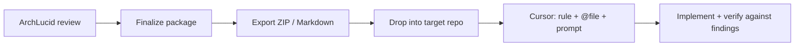

> **Scope:** Architecture — how to hand off a finalized ArchLucid architecture package to Cursor (or other coding agents) for implementation. Not a buyer document; not a shipped product integration.

# ArchLucid → Cursor: design-to-implementation handoff

**Audience:** Solution architects, platform engineers, and contributors who produce architecture packages in ArchLucid and want coding agents in Cursor to implement against them.

**Last reviewed:** 2026-08-09

**Related:** [`INTEGRATION_CATALOG.md`](../go-to-market/INTEGRATION_CATALOG.md) · [`V1_AUTOMATION_HANDOFF_PACK.md`](../library/V1_AUTOMATION_HANDOFF_PACK.md) · [`WORKFLOW_RECIPES_BY_PERSONA.md`](../library/customer-facing/WORKFLOW_RECIPES_BY_PERSONA.md) · [`MCP_AND_AGENT_ECOSYSTEM_BACKLOG.md`](../library/MCP_AND_AGENT_ECOSYSTEM_BACKLOG.md) · [`CI_CD_INTEGRATION_GUIDE.md`](../library/customer-facing/CI_CD_INTEGRATION_GUIDE.md)

---

There is **no first-party ArchLucid → Cursor connector today**, but you can already do design-in-ArchLucid / implement-in-Cursor with **exports + Cursor context**. This doc describes what is available now, recommended workflows, and what is on the roadmap.

## What ArchLucid produces today

ArchLucid's output is a **finalized architecture package** (sealed review record + synthesized artifacts), not a ticket or pull request by itself. After you **finalize** a review, you get machine-readable and human-readable design material:

| Output | How to get it | Good for Cursor because… |
|--------|---------------|---------------------------|
| **Export ZIP** | UI → Export, or `archlucid artifacts export <runId>` | Contains `manifest.json`, `decision-trace.json`, and `artifacts/` (reference architecture Markdown, architecture narrative, Mermaid diagrams, compliance matrix, Terraform advisory, etc.) |
| **First-value report (Markdown)** | `archlucid first-value-report <runId> --save` | Concise sponsor-style narrative — easy to `@`-mention in Cursor |
| **Structured manifest** | Inside export ZIP as `manifest.json` | Requirements, topology, security posture, findings — best for scripted handoff |

The workflow recipe in the docs is explicit: the architect produces the package, then **packages for engineering handoff** via exports ([`WORKFLOW_RECIPES_BY_PERSONA.md`](../library/customer-facing/WORKFLOW_RECIPES_BY_PERSONA.md)).

---

## Recommended workflow today



### 1. Produce and lock the design in ArchLucid

1. Create a review (`/architecture/reviews/new` or `POST /v1/architecture/request`).
2. Run the pipeline and **finalize** when governance is satisfied.
3. Export:

```powershell
# From a machine with ArchLucid CLI configured
archlucid artifacts export <runId> --out archlucid-design.zip
archlucid first-value-report <runId> --save
```

### 2. Put the design where Cursor can see it

In the **implementation repo** (not necessarily the ArchLucid monorepo):

```text
docs/
  design/
    archlucid/
      manifest.json              # from export ZIP
      reference-architecture.md  # from artifacts/
      architecture-narrative.md
      decision-trace.json
      findings-summary.md        # optional: curate from review UI
```

Unpack the ZIP, keep the Markdown artifacts, and optionally add a short `IMPLEMENTATION_SCOPE.md` you write by hand: "Build X; defer Y; must satisfy findings F-001, F-003."

### 3. Feed it to Cursor (three levels)

#### A. Chat context (fastest)

Open Cursor in the implementation repo and prompt with files attached:

> Implement the system described in `@docs/design/archlucid/reference-architecture.md` and `@docs/design/archlucid/architecture-narrative.md`. Treat `@docs/design/archlucid/manifest.json` as constraints. Do not contradict finalized findings in `@docs/design/archlucid/findings-summary.md`.

#### B. Persistent Cursor rule (best for multi-session work)

Add something like `.cursor/rules/archlucid-design-brief.mdc` that points at those files and states non-negotiables (security controls, topology patterns, compliance gaps to close). The ArchLucid repo already uses this pattern extensively for agent guidance.

#### C. Scripted handoff (CI or local script)

Use the [Cursor SDK](https://cursor.com/docs/sdk/typescript) to automate:

1. Call ArchLucid REST/CLI → download export.
2. Write artifacts into `docs/design/archlucid/`.
3. `Agent.prompt("Implement phase 1 per docs/design/archlucid/…", { local: { cwd: repo } })`.

That is custom glue, not shipped product — but it is the cleanest "design doc in ArchLucid → agent implements in repo" loop.

---

## What is not here yet (roadmap)

From [`INTEGRATION_CATALOG.md`](../go-to-market/INTEGRATION_CATALOG.md) and [`MCP_AND_AGENT_ECOSYSTEM_BACKLOG.md`](../library/MCP_AND_AGENT_ECOSYSTEM_BACKLOG.md):

| Integration | Status | Implication for design-to-code |
|-------------|--------|--------------------------------|
| **MCP server (ArchLucid as tools for agents)** | **V1.1** — read-only tools (`GetManifestSummary`, `ListArtifacts`, `CompareRuns`, etc.) | Cursor could *query* a finalized package, not drive implementation from a write API |
| **Outbound MCP (ArchLucid calls Cursor)** | **V2 default** | ArchLucid will not "push to Cursor" natively soon |
| **Purpose-built "implementation spec" artifact** | Not a named V1 deliverable | Today you use reference architecture + narrative + manifest; you may want a thin curated brief on top |

The product philosophy is also intentional: ArchLucid exposes **governance and signed packages**, not raw "findings without commitment" as a commodity API. The handoff point is naturally **after finalize + export**, not mid-draft.

---

## Reverse direction (pair with design-to-code)

ArchLucid already integrates the other way for **governance gates in CI**:

- GitHub Actions / Azure DevOps examples under [`examples/github-actions/`](../../examples/github-actions/archlucid-architecture-review.yml)
- Guide: [`CI_CD_INTEGRATION_GUIDE.md`](../library/customer-facing/CI_CD_INTEGRATION_GUIDE.md)

A strong end-to-end loop:

1. **Design** in ArchLucid → export → Cursor implements.
2. **PR** triggers ArchLucid review on changed `infra/**` or `docs/architecture/**`.
3. Compare pre/post packages to catch drift.

---

## Practical tips for good Cursor handoffs

1. **Finalize before export** — pre-finalize drafts are not stable implementation contracts.
2. **Curate one scope file** — agents do better with a 1–2 page `IMPLEMENTATION_SCOPE.md` than a 40-page export alone.
3. **Include findings with disposition** — "must fix in v1" vs "accepted risk" prevents Cursor from "fixing" waived items.
4. **Pin the manifest hash** in your rule or scope doc so you know which signed package the code implements.
5. **Use Mermaid from export** — diagram sources in `artifacts/` map cleanly to component boundaries in code.

---

## Summary

| Today | V1.1+ |
|-------|-------|
| Export ZIP / Markdown / JSON into the target repo | MCP read-only tools for querying finalized packages from agents |
| Cursor rules, `@` file references, optional Cursor SDK script | Outbound "push to Cursor" remains unpinned (V2 default) |
| CI governance gate on PRs (ArchLucid reviews code changes) | Purpose-built implementation-spec artifact not yet a named deliverable |

**Bottom line:** The integration is **export-based** today. Native MCP from ArchLucid to Cursor is planned as **read-only context lookup** in V1.1, not a full design-to-code pipeline.
