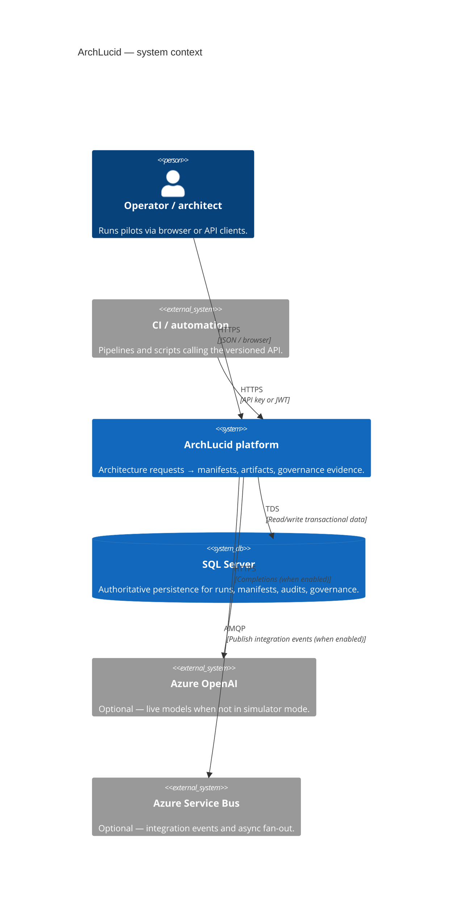
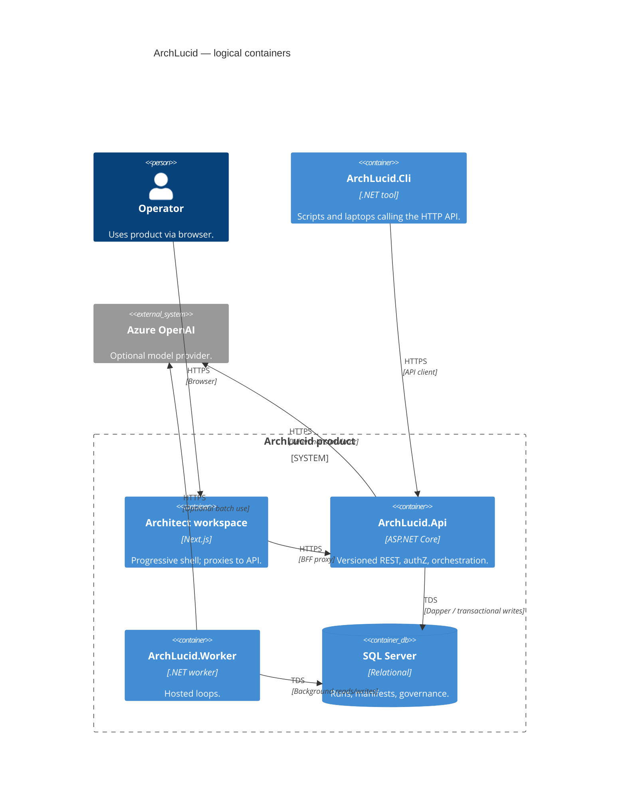

> **Scope:** Canonical architecture index, poster (C4 + ownership), and workspace documentation.
> **Spine doc:** [`START_HERE.md`](../START_HERE.md).

# ArchLucid Architecture

**Purpose:** One screen to redraw **ArchLucid** as C4, know **who owns each box**, and find the **documentation index** for deeper dives.

---

## 1. System context (C4)



### Context nodes → ownership

| Node | Owns runtime / code | Deep dive | Primary tests |
|------|---------------------|-----------|-----------------|
| Operator / architect | `archlucid-ui` (shell) | [operator-shell.md](../library/operator-shell.md) | `archlucid-ui` Vitest + Playwright |
| Automation | External repos / runners | [API_CONTRACTS.md](../library/API_CONTRACTS.md) | Consumer-owned |
| ArchLucid platform | `ArchLucid.Api`, `ArchLucid.Application`, `ArchLucid.Worker` | [ARCHITECTURE_CONTAINERS.md](../library/ARCHITECTURE_CONTAINERS.md) | `ArchLucid.Api.Tests`, release smoke |
| SQL Server | `ArchLucid.Persistence` + migrations | [DATA_MODEL.md](../library/DATA_MODEL.md) | SQL integration suites |
| Azure OpenAI | `ArchLucid.Api` agent execution mode | [BUILD.md](../engineering/BUILD.md) | Simulator-first unit tests |
| Service Bus | `ArchLucid.Worker` publishers | [INTEGRATION_EVENTS_AND_WEBHOOKS.md](../library/INTEGRATION_EVENTS_AND_WEBHOOKS.md) | Worker + contract tests |

---

## 2. Containers (C4)



## 3. C4 workspace (Structurizr DSL)

Use [Structurizr Lite](https://structurizr.com/help/lite) (Docker) or the Structurizr VS Code extension to render the `docs/c4/workspace.dsl` file:

```bash
docker run -it --rm -p 8080:8080 -v "%cd%":/usr/local/structurizr structurizr/lite
```
Open `http://localhost:8080` and load **`workspace.dsl`** from this directory.

---

## 4. Documentation Index

*(Former thin hub `ARCHITECTURE_INDEX.md` redirects here — see [`../redirects.md`](../redirects.md).)*

### Orientation
- **Saved Mermaid + SVG diagrams** — [`architecture_diagrams/README.md`](architecture_diagrams/README.md) (system overview + zoom-ins)
- **Platform architecture handbook** — [`architecture_handbook/README.md`](architecture_handbook/README.md) (Markdown spine → regenerable DOCX; buyer pack under `architecture_handbook/buyer/`)
- **Architecture and review engines (formal spec + Word pack)** — [`architecture_handbook/75-architecture-and-review-engines.md`](architecture_handbook/75-architecture-and-review-engines.md) · [`ARCHITECTURE_AND_REVIEW_ENGINES.docx`](ARCHITECTURE_AND_REVIEW_ENGINES.docx) · prompts [`ENGINE_KERNEL_REMEDIATION_PROMPTS.md`](ENGINE_KERNEL_REMEDIATION_PROMPTS.md)
- **Ingestion fit-gap Composer prompts** — [`INGESTION_FIT_GAP_COMPOSER_PROMPTS.md`](INGESTION_FIT_GAP_COMPOSER_PROMPTS.md) (simple-terraform attributes, Bicep/ARM, Kubernetes JSON, AWS/GCP honesty, declaration security findings)
- **Diagram gallery (static)** — [`architecture_handbook/site/index.html`](architecture_handbook/site/index.html)
- **Handbook vs product capabilities** — [`PLATFORM_HANDBOOK_VS_PRODUCT_CAPABILITIES.md`](PLATFORM_HANDBOOK_VS_PRODUCT_CAPABILITIES.md) (what ArchLucid exports vs repo meta-docs)
- **Platform self-description bridge** — [`PLATFORM_SELF_DESCRIPTION_BRIDGE.md`](PLATFORM_SELF_DESCRIPTION_BRIDGE.md) (product surfaces vs in-repo platform docs)
- **Diagram ↔ ADR overlay** — [`DIAGRAM_ADR_OVERLAY.md`](DIAGRAM_ADR_OVERLAY.md)
- **C4 ↔ Mermaid sync** — [`C4_MERMAID_SYNC.md`](C4_MERMAID_SYNC.md) (with [`../c4/workspace.dsl`](../c4/workspace.dsl))
- **V1 scope contract** — `../library/V1_SCOPE.md`
- **Developer Day-1** — `../onboarding/day-one-developer.md`
- **SRE / Platform Day-1** — `../onboarding/day-one-sre.md`
- **Security Day-1** — `../onboarding/day-one-security.md`

### Operator shell (front end)
- **Operator shell guide** — `../library/operator-shell.md`
- **UI Architecture** — `../../archlucid-ui/docs/ARCHITECTURE.md`

### Decisions and onboarding
- **Glossary** — `../GLOSSARY.md`
- **ADRs** — [`adrs/README.md`](adrs/README.md)
- **Onboarding narrative vs. platform mission (2026-06-15)** — evidence-first first-run realignment; **TB-337–344** in [`TECH_BACKLOG.md`](../library/TECH_BACKLOG.md) (archived snapshot removed; see [`docs/redirects.md`](../redirects.md))
- **UX implementation leakage audit (2026-06-15)** — [`PRODUCT_UX_IMPLEMENTATION_LEAKAGE_AUDIT_2026_06_15.md`](PRODUCT_UX_IMPLEMENTATION_LEAKAGE_AUDIT_2026_06_15.md) — product narrative, AI budget, ops chrome, and V1 correction priorities
- **Pilot UX backlog (2026-06-15)** — absorbed into [`TECH_BACKLOG.md`](../library/TECH_BACKLOG.md) (archived snapshot removed; see [`docs/redirects.md`](../redirects.md))
- **Overview page first-use IA audit (2026-07-05)** — [`OVERVIEW_PAGE_FIRST_USE_IA_AUDIT_2026_07_05.md`](OVERVIEW_PAGE_FIRST_USE_IA_AUDIT_2026_07_05.md) — decision memo on streamlining the Overview page's overlapping "first review" / onboarding elements to one dominant path; recommended IA, naming cleanup, and phased implementation plan (one-shot Composer prompts retired; see [`docs/redirects.md`](../redirects.md))
- **Grok top-20 external-skeptic Q&A + backlog (2026-07-27)** — [`GROK_TOP20_QUESTIONS_QA_BACKLOG_2026_07_27.md`](GROK_TOP20_QUESTIONS_QA_BACKLOG_2026_07_27.md) — 20 adversarial questions with grounded answers, existing-row dispositions, and proposed items **GQ-01**–**GQ-07** pending TB/M transcription
- **Grok Q21–40 external-skeptic Q&A + backlog (2026-07-27)** — [`GROK_Q21_40_QUESTIONS_QA_BACKLOG_2026_07_27.md`](GROK_Q21_40_QUESTIONS_QA_BACKLOG_2026_07_27.md) — second batch: unit economics, hyperscaler dependency, liability/IP, channels, agentic future, solo-vendor ops; proposed items **GQ-09**–**GQ-18** pending TB/M transcription

### API and contracts
- **HTTP contracts** — `../library/API_CONTRACTS.md`

### Build, CLI, and operations
- **Build and run** — `../engineering/BUILD.md`
- **CLI usage** — `../library/CLI_USAGE.md`

### Contributing and process
- **Test execution model** — `../library/TEST_EXECUTION_MODEL.md`
