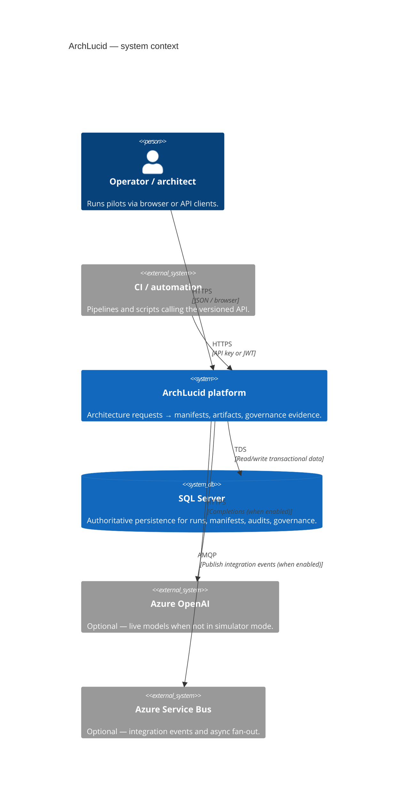
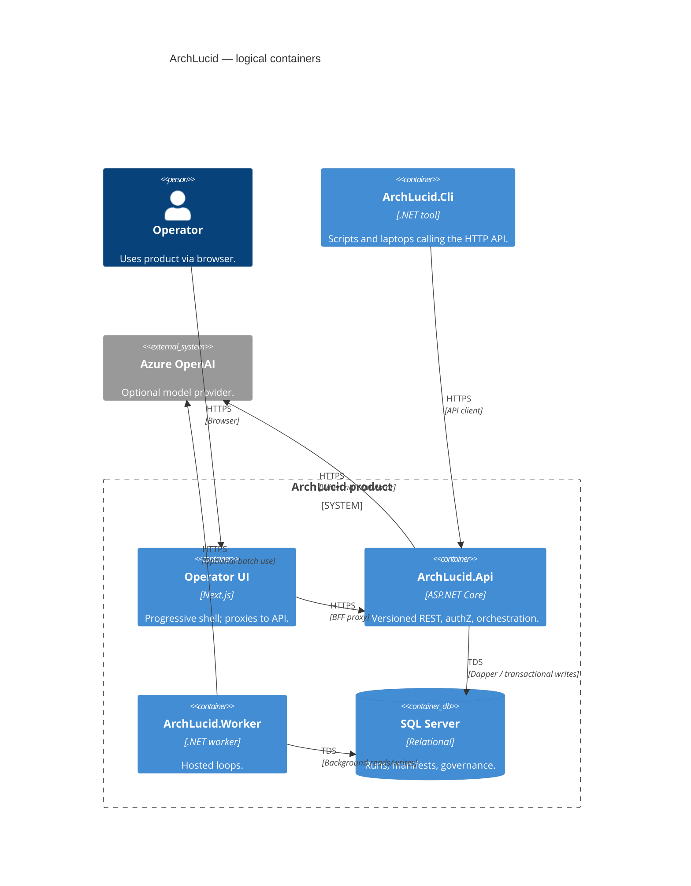

> **Scope:** Canonical architecture index, poster (C4 + ownership), and workspace documentation.
> **Spine doc:** [`START_HERE.md`](../START_HERE.md).

# ArchLucid Architecture

**Purpose:** One screen to redraw **ArchLucid** as C4, know **who owns each box**, and find the **documentation index** for deeper dives.

---

## 1. System context (C4)



### Context nodes → ownership

| Node | Owns runtime / code | Deep dive | Primary tests |
|------|---------------------|-----------|-----------------|
| Operator / architect | `archlucid-ui` (shell) | [operator-shell.md](../library/operator-shell.md) | `archlucid-ui` Vitest + Playwright |
| Automation | External repos / runners | [API_CONTRACTS.md](../library/API_CONTRACTS.md) | Consumer-owned |
| ArchLucid platform | `ArchLucid.Api`, `ArchLucid.Application`, `ArchLucid.Worker` | [ARCHITECTURE_CONTAINERS.md](../library/ARCHITECTURE_CONTAINERS.md) | `ArchLucid.Api.Tests`, release smoke |
| SQL Server | `ArchLucid.Persistence` + migrations | [DATA_MODEL.md](../library/DATA_MODEL.md) | SQL integration suites |
| Azure OpenAI | `ArchLucid.Api` agent execution mode | [BUILD.md](../library/BUILD.md) | Simulator-first unit tests |
| Service Bus | `ArchLucid.Worker` publishers | [INTEGRATION_EVENTS_AND_WEBHOOKS.md](../library/INTEGRATION_EVENTS_AND_WEBHOOKS.md) | Worker + contract tests |

---

## 2. Containers (C4)



## 3. C4 workspace (Structurizr DSL)

Use [Structurizr Lite](https://structurizr.com/help/lite) (Docker) or the Structurizr VS Code extension to render the `docs/c4/workspace.dsl` file:

```bash
docker run -it --rm -p 8080:8080 -v "%cd%":/usr/local/structurizr structurizr/lite
```
Open `http://localhost:8080` and load **`workspace.dsl`** from this directory.

---

## 4. Documentation Index

*(This replaces the former `ARCHITECTURE_INDEX.md`)*

### Orientation
- **V1 scope contract** — `../library/V1_SCOPE.md`
- **Developer Day-1** — `../onboarding/day-one-developer.md`
- **SRE / Platform Day-1** — `../onboarding/day-one-sre.md`
- **Security Day-1** — `../onboarding/day-one-security.md`

### Operator shell (front end)
- **Operator shell guide** — `../library/operator-shell.md`
- **UI Architecture** — `../../archlucid-ui/docs/ARCHITECTURE.md`

### Decisions and onboarding
- **Glossary** — `../GLOSSARY.md`
- **ADRs** — [`adrs/README.md`](adrs/README.md)

### API and contracts
- **HTTP contracts** — `../library/API_CONTRACTS.md`

### Build, CLI, and operations
- **Build and run** — `../library/BUILD.md`
- **CLI usage** — `../library/CLI_USAGE.md`

### Contributing and process
- **Test execution model** — `../library/TEST_EXECUTION_MODEL.md`
