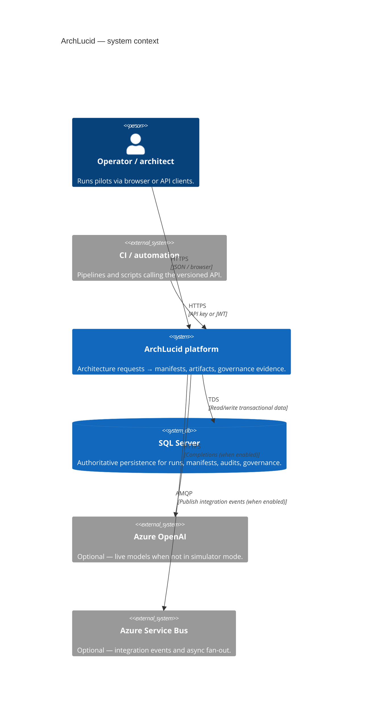
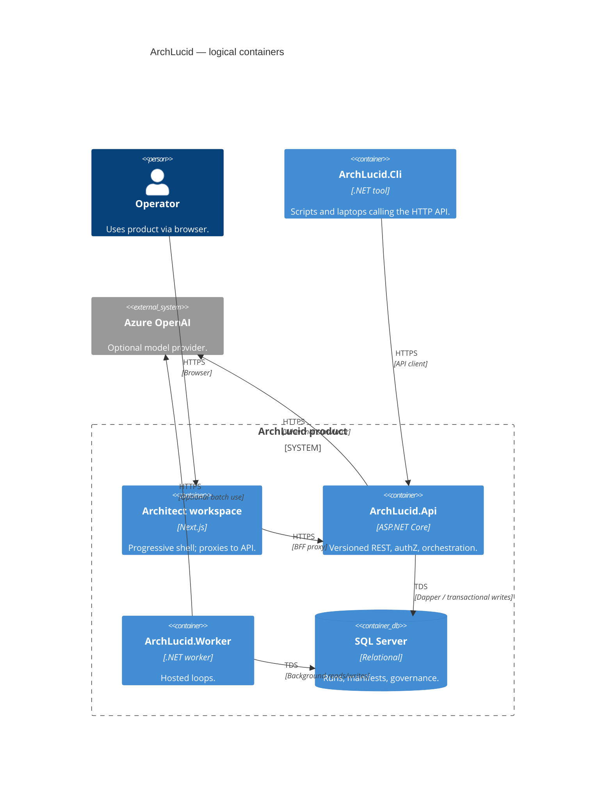

> **Scope:** Canonical architecture index, poster (C4 + ownership), and workspace documentation.
> **Spine doc:** [`START_HERE.md`](../START_HERE.md).

# ArchLucid Architecture

**Purpose:** One screen to redraw **ArchLucid** as C4, know **who owns each box**, and find the **documentation index** for deeper dives.

---

## 1. System context (C4)



### Context nodes → ownership

| Node | Owns runtime / code | Deep dive | Primary tests |
|------|---------------------|-----------|-----------------|
| Operator / architect | `archlucid-ui` (shell) | [operator-shell.md](../library/operator-shell.md) | `archlucid-ui` Vitest + Playwright |
| Automation | External repos / runners | [API_CONTRACTS.md](../library/API_CONTRACTS.md) | Consumer-owned |
| ArchLucid platform | `ArchLucid.Api`, `ArchLucid.Application`, `ArchLucid.Worker` | [ARCHITECTURE_CONTAINERS.md](../library/ARCHITECTURE_CONTAINERS.md) | `ArchLucid.Api.Tests`, release smoke |
| SQL Server | `ArchLucid.Persistence` + migrations | [DATA_MODEL.md](../library/DATA_MODEL.md) | SQL integration suites |
| Azure OpenAI | `ArchLucid.Api` agent execution mode | [BUILD.md](../engineering/BUILD.md) | Simulator-first unit tests |
| Service Bus | `ArchLucid.Worker` publishers | [INTEGRATION_EVENTS_AND_WEBHOOKS.md](../library/INTEGRATION_EVENTS_AND_WEBHOOKS.md) | Worker + contract tests |

---

## 2. Containers (C4)



## 3. C4 workspace (Structurizr DSL)

Use [Structurizr Lite](https://structurizr.com/help/lite) (Docker) or the Structurizr VS Code extension to render the `docs/c4/workspace.dsl` file:

```bash
docker run -it --rm -p 8080:8080 -v "%cd%":/usr/local/structurizr structurizr/lite
```
Open `http://localhost:8080` and load **`workspace.dsl`** from this directory.

---

## 4. Documentation Index

*(Former thin hub `ARCHITECTURE_INDEX.md` redirects here — see [`../redirects.md`](../redirects.md).)*

### Orientation
- **System-gravity Composer prompts (livelihood UX wave 32 — in progress)** — [`SYSTEM_GRAVITY_COMPOSER_PROMPTS.md`](SYSTEM_GRAVITY_COMPOSER_PROMPTS.md) · [`.cursor/prompts/system-gravity-00-index.md`](../../.cursor/prompts/system-gravity-00-index.md) (**SG-001–SG-120**). Residual of issue 2: locator/nesting/spawn-lock/Sketch shipped; instrument-after-spawn lands here. ADR **0098** (Proposed — instrument after spawn is the architecture desk). Split: [`SYSTEM_GRAVITY_ADR_SPLIT.md`](SYSTEM_GRAVITY_ADR_SPLIT.md). Do **not** re-run AO / SY / SN / CE / DW. Do **not** remount the CE Sketch runner.
- **Record-practice Composer prompts (livelihood UX wave 31 — shipped)** — [`RECORD_PRACTICE_COMPOSER_PROMPTS.md`](RECORD_PRACTICE_COMPOSER_PROMPTS.md) · [`.cursor/prompts/record-practice-00-index.md`](../../.cursor/prompts/record-practice-00-index.md) (**RP-001–RP-024**). Close audit: [`RECORD_PRACTICE_ACCEPTANCE_2026-09-12.md`](RECORD_PRACTICE_ACCEPTANCE_2026-09-12.md). ADR **0097** (**Accepted** 2026-09-12). User-facing **Record / Practice** labels; stored tokens stay `"career"` / `"rehearsal"`. Inventory: [`RECORD_PRACTICE_USER_COPY_INVENTORY.md`](RECORD_PRACTICE_USER_COPY_INVENTORY.md). Do **not** re-run CG / AS-076–085.
- **Desk-IA Composer prompts (livelihood UX wave 28 — shipped)** — [`DESK_IA_COMPOSER_PROMPTS.md`](DESK_IA_COMPOSER_PROMPTS.md) · [`.cursor/prompts/desk-ia-00-index.md`](../../.cursor/prompts/desk-ia-00-index.md) (**DI-001–DI-024**). Close audit: [`DESK_IA_ACCEPTANCE_2026-09-11.md`](DESK_IA_ACCEPTANCE_2026-09-11.md). ADR **0095** (**Accepted**). Governance nav home for sealed review records. Inventory: [`DESK_IA_404_ORPHANS_INVENTORY.md`](DESK_IA_404_ORPHANS_INVENTORY.md).
- **Cheap-exploration Composer prompts (livelihood UX wave 29 — shipped)** — [`CHEAP_EXPLORATION_COMPOSER_PROMPTS.md`](CHEAP_EXPLORATION_COMPOSER_PROMPTS.md) · [`.cursor/prompts/cheap-exploration-00-index.md`](../../.cursor/prompts/cheap-exploration-00-index.md) (**CE-001–CE-040**). Close audit: [`CHEAP_EXPLORATION_ACCEPTANCE_2026-09-12.md`](CHEAP_EXPLORATION_ACCEPTANCE_2026-09-12.md). ADR **0092** (**Accepted**). **Sketch a change** desk CTA. Inventory: [`CHEAP_EXPLORATION_INVENTORY.md`](CHEAP_EXPLORATION_INVENTORY.md).
- **Daytime-wait Composer prompts (livelihood UX wave 30 — shipped)** — [`DAYTIME_WAIT_COMPOSER_PROMPTS.md`](DAYTIME_WAIT_COMPOSER_PROMPTS.md) · [`.cursor/prompts/daytime-wait-00-index.md`](../../.cursor/prompts/daytime-wait-00-index.md) (**DW-001–DW-024**). Close audit: [`DAYTIME_WAIT_ACCEPTANCE_2026-09-12.md`](DAYTIME_WAIT_ACCEPTANCE_2026-09-12.md). ADR **0096** (**Accepted**). Inventory: [`DAYTIME_WAIT_EXECUTE_INVENTORY.md`](DAYTIME_WAIT_EXECUTE_INVENTORY.md).
- **Mode-gravity Composer prompts (livelihood UX wave 27 — shipped)** — [`MODE_GRAVITY_COMPOSER_PROMPTS.md`](MODE_GRAVITY_COMPOSER_PROMPTS.md) · [`.cursor/prompts/mode-gravity-00-index.md`](../../.cursor/prompts/mode-gravity-00-index.md) (**MG-001–MG-024**). Close audit: [`MODE_GRAVITY_ACCEPTANCE_2026-09-11.md`](MODE_GRAVITY_ACCEPTANCE_2026-09-11.md). Owner 2026-09-11: one Working execute gravity; operator-experience is density not Mode; Guided/demo/trial remain eval. ADR **0094** (**Accepted** 2026-09-12). Inventories: [`MODE_GRAVITY_EXPERIENCE_FLAGS_INVENTORY.md`](MODE_GRAVITY_EXPERIENCE_FLAGS_INVENTORY.md), [`MODE_GRAVITY_OUT_OF_WAVE_RESIDUALS.md`](MODE_GRAVITY_OUT_OF_WAVE_RESIDUALS.md). Successor: **DI-001–024**. No G-REAL-06; do not delete Guided.
- **Livelihood-gravity Composer prompts (waves 24–31 shipped; wave 32 ready)** — [`LIVELIHOOD_GRAVITY_COMPOSER_PROMPTS.md`](LIVELIHOOD_GRAVITY_COMPOSER_PROMPTS.md) · [`.cursor/prompts/livelihood-gravity-00-index.md`](../../.cursor/prompts/livelihood-gravity-00-index.md). **Issues 1–8** and **RP overlay** are **shipped** (**CG**, **SN**, **LN**, **MG**, **DI**, **CE**, **DW**, **RP**). **Issue 2 residual** is [`SYSTEM_GRAVITY_COMPOSER_PROMPTS.md`](SYSTEM_GRAVITY_COMPOSER_PROMPTS.md) (**SG-001–120**). **Issue 4 (lost-write)** is [`LOST_WRITE_COMPOSER_PROMPTS.md`](LOST_WRITE_COMPOSER_PROMPTS.md) — **do not re-run LW**. No desktop **More** menu; no G-REAL-06; no 40th engine.
- **Livelihood-grade-no Composer prompts (livelihood UX wave 26 — shipped)** — [`LIVELIHOOD_GRADE_NO_COMPOSER_PROMPTS.md`](LIVELIHOOD_GRADE_NO_COMPOSER_PROMPTS.md) · [`.cursor/prompts/livelihood-grade-no-00-index.md`](../../.cursor/prompts/livelihood-grade-no-00-index.md) (**LN-001–LN-040**). Close audit: [`LIVELIHOOD_GRADE_NO_ACCEPTANCE_2026-09-11.md`](LIVELIHOOD_GRADE_NO_ACCEPTANCE_2026-09-11.md). Owner 2026-09-11: uncited hard cannot export as Career-hard; extraction provenance and adversarial bands named. ADR **0093** (false-hard citation). Inventories: [`LIVELIHOOD_GRADE_NO_HARD_INFEASIBLE_INVENTORY.md`](LIVELIHOOD_GRADE_NO_HARD_INFEASIBLE_INVENTORY.md), [`LIVELIHOOD_GRADE_NO_EXTRACTION_PROVENANCE_INVENTORY.md`](LIVELIHOOD_GRADE_NO_EXTRACTION_PROVENANCE_INVENTORY.md), [`LIVELIHOOD_GRADE_NO_OUT_OF_WAVE_RESIDUALS.md`](LIVELIHOOD_GRADE_NO_OUT_OF_WAVE_RESIDUALS.md). Successor: **MG-001–024**. No G-REAL-06; no 40th engine; no LLM judge default-on.
- **System-not-job Composer prompts (livelihood UX wave 25 — shipped)** — [`SYSTEM_NOT_JOB_COMPOSER_PROMPTS.md`](SYSTEM_NOT_JOB_COMPOSER_PROMPTS.md) · [`.cursor/prompts/system-not-job-00-index.md`](../../.cursor/prompts/system-not-job-00-index.md) (**SN-001–SN-040**). Close audit: [`SYSTEM_NOT_JOB_ACCEPTANCE_2026-09-11.md`](SYSTEM_NOT_JOB_ACCEPTANCE_2026-09-11.md). Owner 2026-09-11: the architecture is the object; review is a job. Spawn-locked drafts are not a second Career editor; Compare stays committed-manifest; kernels unmerged. ADR **0092** (labeled cheap envelope without kernel merge). Inventories: [`SYSTEM_NOT_JOB_DUAL_EDITOR_INVENTORY.md`](SYSTEM_NOT_JOB_DUAL_EDITOR_INVENTORY.md), [`SYSTEM_NOT_JOB_COMPARE_GATE_INVENTORY.md`](SYSTEM_NOT_JOB_COMPARE_GATE_INVENTORY.md), [`SYSTEM_NOT_JOB_OUT_OF_WAVE_RESIDUALS.md`](SYSTEM_NOT_JOB_OUT_OF_WAVE_RESIDUALS.md). Successor: **LN-001–040** (shipped). Issue-2 residual: **SG-001–120** (do not re-run SN). No G-REAL-06; no live presence; no draft-diff Compare.
- **Career-gravity Composer prompts (livelihood UX wave 24 — shipped)** — [`CAREER_GRAVITY_COMPOSER_PROMPTS.md`](CAREER_GRAVITY_COMPOSER_PROMPTS.md) · [`.cursor/prompts/career-gravity-00-index.md`](../../.cursor/prompts/career-gravity-00-index.md) (**CG-001–CG-100**). Close audit: [`CAREER_GRAVITY_ACCEPTANCE_2026-09-11.md`](CAREER_GRAVITY_ACCEPTANCE_2026-09-11.md). Owner 2026-09-11: stop unlabeled Simulator borrowing Career authority on Working. ADR **0091** (Career default day; host Mode stays Simulator). Run stamp + door gates on finalize/export/outbound. **Do not re-run** AS-076–085 bodies. Inventories: [`CAREER_GRAVITY_UNLABELED_READY_INVENTORY.md`](CAREER_GRAVITY_UNLABELED_READY_INVENTORY.md), [`CAREER_GRAVITY_EXPORT_WATERMARK_INVENTORY.md`](CAREER_GRAVITY_EXPORT_WATERMARK_INVENTORY.md), [`CAREER_GRAVITY_OUTBOUND_INVENTORY.md`](CAREER_GRAVITY_OUTBOUND_INVENTORY.md), [`CAREER_GRAVITY_AS076_LEFTOVER_MATRIX.md`](CAREER_GRAVITY_AS076_LEFTOVER_MATRIX.md). Successor: **SN-001–040** (shipped). No G-REAL-06; no live presence.
- **Lost-write Composer prompts (livelihood UX wave 23 — shipped on `cursor/lw-recovery-100-cf1e`)** — [`LOST_WRITE_COMPOSER_PROMPTS.md`](LOST_WRITE_COMPOSER_PROMPTS.md) · [`.cursor/prompts/lost-write-00-index.md`](../../.cursor/prompts/lost-write-00-index.md) (**LW-001–LW-100**). Close audit: [`LOST_WRITE_ACCEPTANCE_2026-09-11.md`](LOST_WRITE_ACCEPTANCE_2026-09-11.md). Owner 2026-09-11: fail-close **in-flight writes** so a Working architect cannot silently lose or overwrite work. ADR **0088** (draft PATCH CAS mandatory unless `forceOverwrite`); ADR **0089** (401 resume, `localStorage`, inventoried livelihood mutates); ADR **0090** (work-lease without live presence). Offline queue carries `expectedUpdatedUtc` and 409 into Keep mine. **Do not re-run** AS / FP / LP / V12-01. Distinct from Hasher robustness wave 23 ([`../library/ARCHITECTURE_REVIEW_ROBUSTNESS_WAVE23.md`](../library/ARCHITECTURE_REVIEW_ROBUSTNESS_WAVE23.md) items 221–230). Successor: livelihood-gravity waves **24–30**. No desktop **More** menu; no live presence avatars; no finding-comment chat; no G-REAL-06 host Mode flip.
- **v10 quality-ROI Composer prompts (QR-16 shipped; QR-17–25 ready)** — [`V10_QUALITY_ROI_COMPOSER_PROMPTS.md`](V10_QUALITY_ROI_COMPOSER_PROMPTS.md) · [`.cursor/prompts/v10-quality-roi-00-index.md`](../../.cursor/prompts/v10-quality-roi-00-index.md). **QR-16** close audit: [`V10_QUALITY_ROI_QR16_ACCEPTANCE_2026-09-12.md`](V10_QUALITY_ROI_QR16_ACCEPTANCE_2026-09-12.md). Inventory: [`V10_QUALITY_ROI_INVENTORY.md`](V10_QUALITY_ROI_INVENTORY.md). Ratchets: `v10-quality-roi-inventory.ts`, `v10-quality-roi-qr16-ratchet.test.ts`. **Stop after QR-16 until OpenAPI fail-fast is green** — then QR-17 (ObservedFact merge). **Do not** start DX-77.
- **v8 quality-ROI Composer prompts (wave close — shipped)** — [`V8_QUALITY_ROI_COMPOSER_PROMPTS.md`](V8_QUALITY_ROI_COMPOSER_PROMPTS.md) · [`.cursor/prompts/v8-quality-roi-00-index.md`](../../.cursor/prompts/v8-quality-roi-00-index.md) (**QR-01–QR-05**). Close audit: [`V8_QUALITY_ROI_ACCEPTANCE_2026-09-12.md`](V8_QUALITY_ROI_ACCEPTANCE_2026-09-12.md). Inventory: [`V8_QUALITY_ROI_INVENTORY.md`](V8_QUALITY_ROI_INVENTORY.md). Ratchets: `v8-quality-roi-inventory.ts`, `v8-quality-roi-ratchet.test.ts`. **Do not** start DX-77. **Do not** re-run DX-01–DX-76 or WK-01–WK-22. No G-REAL-06 fake runs; no desktop **More** menu.
- **Architecture-spine Composer prompts (wave 22 — shipped on `cursor/as-prompt-queue-close-97a4`)** — [`ARCHITECTURE_SPINE_COMPOSER_PROMPTS.md`](ARCHITECTURE_SPINE_COMPOSER_PROMPTS.md) · [`.cursor/prompts/architecture-spine-00-index.md`](../../.cursor/prompts/architecture-spine-00-index.md) (**AS-001–AS-100**). Close audit: [`ARCHITECTURE_SPINE_ACCEPTANCE_2026-09-09.md`](ARCHITECTURE_SPINE_ACCEPTANCE_2026-09-09.md). Owner 2026-09-09: diagrams and bound inventory become **review decide inputs** (ADR **0084**); semantic support is a Working **career band** not a sync commit gate (ADR **0085** / TB-1228); Working **Career vs Rehearsal** doors without flipping host `AgentExecution:Mode` (ADR **0086**); optional **RestrictToShares** inside the tenant (ADR **0087**). **Do not re-run** FP / LP / ESI / IE collector bodies. No desktop **More** menu; no live presence; no finding-comment chat; no G-REAL-06 host Mode flip; no second Azure collector; vision default off. Share **API/UI** (AS-089–AS-099) shipped on the AS close audit. Concurrent work-lease + silent overwrite shipped in livelihood UX **wave 23** ([`LOST_WRITE_ACCEPTANCE_2026-09-11.md`](LOST_WRITE_ACCEPTANCE_2026-09-11.md)).
- **Finding-pointer CAS Composer prompts (wave 21 — shipped on this branch after LP persist gates)** — [`FINDING_POINTER_CAS_COMPOSER_PROMPTS.md`](FINDING_POINTER_CAS_COMPOSER_PROMPTS.md) · [`.cursor/prompts/finding-pointer-00-index.md`](../../.cursor/prompts/finding-pointer-00-index.md) (**FP-01–FP-24**). Close audit: [`FINDING_POINTER_CAS_ACCEPTANCE_2026-09-08.md`](FINDING_POINTER_CAS_ACCEPTANCE_2026-09-08.md). Owner 2026-09-08: attach ADR 0076 `expectedCurrentDispositionRowVersionBase64` on every production write that can move the current finding pointer. **Do not re-run LP.** Do **not** implement LP-19 (401 resume) in this set. No desktop **More** menu; no live presence; no new ADR.
- **Livelihood-proof Composer prompts (wave 20 — run after WS chrome shipped)** — [`LIVELIHOOD_PROOF_COMPOSER_PROMPTS.md`](LIVELIHOOD_PROOF_COMPOSER_PROMPTS.md) · [`.cursor/prompts/livelihood-proof-00-index.md`](../../.cursor/prompts/livelihood-proof-00-index.md) (**LP-01–LP-20**). Close audit: [`LIVELIHOOD_PROOF_ACCEPTANCE_2026-09-08.md`](LIVELIHOOD_PROOF_ACCEPTANCE_2026-09-08.md). Owner 2026-09-08: execute leftover fail-closed **persist** gates WS/FC/DR named but did not wire. ADR **0082** (decision-grade provenance at emission/commit); ADR **0083** (promote/activate/submit same-tx Required audit). Dual-stream: no explanation-trace finding synthesis. Simulator is not career-complete without waiver (do **not** flip default `AgentExecution:Mode`). Livelihood-guard / session leftovers; ITSM current pointer follows ADR 0076. **Do not re-run WS/FC/DR bodies.** No desktop **More** menu; no finding-comment chat; no 40th engine; no G-REAL-06.
- **Working-seat Composer prompts (wave 19 — run after SY desk URLs; chrome shipped)** — [`WORKING_SEAT_COMPOSER_PROMPTS.md`](WORKING_SEAT_COMPOSER_PROMPTS.md) · [`.cursor/prompts/working-seat-00-index.md`](../../.cursor/prompts/working-seat-00-index.md) (**WS-01–WS-24**). Close audit: [`WORKING_SEAT_ACCEPTANCE_2026-09-07.md`](WORKING_SEAT_ACCEPTANCE_2026-09-07.md). Owner 2026-09-07: **stop buyer polish on the Working seat.** ADR **0080**; Accept **0078** / **0079**; evict eval chrome and `/al-ui-rate` buyer remediations from Working; expert start; career defaults (show low-confidence; degraded coverage blocks finalize); continuity leftovers. Guided / demo / trial **keep** eval skin. **Wave 20 (LP)** owns persist gates. **Do not re-run SY/FC/DX.** No desktop **More** menu; no finding-comment chat; no 40th engine.
- **Evidence source inspect Composer prompts (shipped)** — [`EVIDENCE_SOURCE_INSPECT_COMPOSER_PROMPTS.md`](EVIDENCE_SOURCE_INSPECT_COMPOSER_PROMPTS.md) · [`.cursor/prompts/evidence-source-inspect-00-index.md`](../../.cursor/prompts/evidence-source-inspect-00-index.md) (**ESI-01–ESI-08**). Close audit: [`EVIDENCE_SOURCE_INSPECT_ACCEPTANCE_2026-09-12.md`](EVIDENCE_SOURCE_INSPECT_ACCEPTANCE_2026-09-12.md). Inventory: [`EVIDENCE_SOURCE_INSPECT_INVENTORY.md`](EVIDENCE_SOURCE_INSPECT_INVENTORY.md). Review-screen open/preview + Download for **stored** attachments. Do **not** make citation-only inventory rows downloadable; do **not** call source files the sealed review record; no desktop **More** menu; no blob SAS URLs.
- **System-desk Composer prompts (wave 18 — run after AO locator exists)** — [`SYSTEM_DESK_COMPOSER_PROMPTS.md`](SYSTEM_DESK_COMPOSER_PROMPTS.md) · [`.cursor/prompts/system-desk-00-index.md`](../../.cursor/prompts/system-desk-00-index.md) (**SY-01–SY-100**). Monday-morning object is still a **job**; this set makes the architecture **desk the work surface** (ADR 0079): nest Ask/Compare/Graph/Findings, remap Alt+R off the inbox, sweep remaining `reviewDetailPath` mints. Close audit: [`SYSTEM_DESK_ACCEPTANCE_2026-09-07.md`](SYSTEM_DESK_ACCEPTANCE_2026-09-07.md). **Wave 19 (WS)** owns dual skin / buyer polish on Working. **Wave 20 (LP)** owns persist gates. **Do not re-run AO.** **Do not merge** `DraftRequests`/`Runs`; no desktop **More** menu; no per-architecture ACL; do not paste to raise insight density or run FC.
- **Architecture-object Composer prompts (wave 17 — locator shipped; do not re-run for work-surface leftovers)** — [`ARCHITECTURE_OBJECT_COMPOSER_PROMPTS.md`](ARCHITECTURE_OBJECT_COMPOSER_PROMPTS.md) · [`.cursor/prompts/architecture-object-00-index.md`](../../.cursor/prompts/architecture-object-00-index.md) (**AO-01–50**). Architecture is the Working locator; review is a nested job (ADR 0077). **Wave 18 (SY)** owns Alt+R / Insights-as-peer leftovers. **Wave 19 (WS)** owns dual skin. Guided may keep peer review URLs. **Do not merge** `DraftRequests`/`Runs`; **do not** paste to raise insight density; no desktop **More** menu; no per-architecture ACL.
- **False-confidence career-artifact Composer prompts (wave FC — run after DR naming, parallel with AO)** — [`FALSE_CONFIDENCE_CAREER_ARTIFACT_COMPOSER_PROMPTS.md`](FALSE_CONFIDENCE_CAREER_ARTIFACT_COMPOSER_PROMPTS.md) · [`.cursor/prompts/false-confidence-career-00-index.md`](../../.cursor/prompts/false-confidence-career-00-index.md) (**FC-01–FC-80**). Systematizes false confidence on career artifacts (stamp, finalize, sponsor PDF, print, ADR export, receipt, audit CSV): ADR **0078** contract, shared TS/C# validators, trail/floor/trust-label/execution-mode gates on every export path. **Wave 19 (WS)** Accepts 0078 and owns Working visibility/finalize defaults. **Wave 20 (LP)** wires persist gates FC named. **Do not re-run** LK-08/09/DR/CD/CR bodies — FC names leftovers only; no 40th engine; no desktop **More** menu.
- **Defensible-record Composer prompts (wave 16 — run after PC close)** — [`DEFENSIBLE_RECORD_COMPOSER_PROMPTS.md`](DEFENSIBLE_RECORD_COMPOSER_PROMPTS.md) · [`.cursor/prompts/defensible-record-00-index.md`](../../.cursor/prompts/defensible-record-00-index.md) (**DR-01–16**). Career-defensibility leftovers after professional-core shipped: fail-closed measurement floor, withheld/engine-failure desk bands, pre-commit and WarnOnly honesty, execute lease, audit echo, disposition 409, board-pack verify, pin-second-review, idle restore, dense lists, durable advisory ops, TB-1196, room handoff without `presenter=1`. **Do not re-run PC-01–13**; no 40th engine; no desktop **More** menu; no live presence. **Wave 17** owns the Working locator (AO). **Wave 20 (LP)** owns DR-04 leftover honesty plus persist gates DR did not execute.
- **Professional-core Composer prompts (wave 15 — shipped #1776–#1893, do not re-run)** — [`PROFESSIONAL_CORE_COMPOSER_PROMPTS.md`](PROFESSIONAL_CORE_COMPOSER_PROMPTS.md) · [`.cursor/prompts/professional-core-00-index.md`](../../.cursor/prompts/professional-core-00-index.md) (**PC-01–13**). Kernel mitigations after CA: measurement floor named, BFF session, eval chrome eviction, architecture portfolio, seal delta, background wait, presenter→trail, grid amend, work-first keyboard, evidence naming, career-export honesty. Close audit: [`PROFESSIONAL_CORE_ACCEPTANCE_2026-09-06.md`](PROFESSIONAL_CORE_ACCEPTANCE_2026-09-06.md). **Wave 16** owns fail-closed leftovers.
- **`/al-bug` quality Composer prompts (wave 6 — run after 01–35)** — [`AL_BUG_QUALITY_COMPOSER_PROMPTS.md`](AL_BUG_QUALITY_COMPOSER_PROMPTS.md) · [`.cursor/prompts/al-bug-quality-00-index.md`](../../.cursor/prompts/al-bug-quality-00-index.md) (**ABQ-36–45** ready; **01–35 shipped** #1969). Leftover honesty: blocking revert sample, CI-escape job map, flake TRX ingest, one known-route authz host probe, high-impact proven lint, seed-only explore, commit replay no-reenter, seeder spam cap, ghost zone paths, uncheckable proven ratchet. Do **not** run `/al-bug` to implement this set; paste one ABQ file per Composer session. Do **not** revert all of `bugsmash`. Do **not** treat 39 as a pen test.
- **Durable-architecture Composer prompts (wave 13 — run after LK)** — [`DURABLE_ARCHITECTURE_COMPOSER_PROMPTS.md`](DURABLE_ARCHITECTURE_COMPOSER_PROMPTS.md) · [`.cursor/prompts/durable-architecture-00-index.md`](../../.cursor/prompts/durable-architecture-00-index.md) (**DA-01–12**). Productize `dbo.Architectures` as the customer-visible durable identity (ADR 0074) without merging `DraftRequests`/`Runs`. Working architecture desk, stop using `DraftId` as `architectureId`, inventory N of M, hidden-filter honesty, eval-chrome leakage, in-flight rehydrate, career export completeness, conservative backfill. Do **not** paste LK-05–07; do not add a 40th engine; do not invent live presence.
- **Livelihood-kernel Composer prompts (wave 12 — run after IS + LS + SD + CR naming)** — [`LIVELIHOOD_KERNEL_COMPOSER_PROMPTS.md`](LIVELIHOOD_KERNEL_COMPOSER_PROMPTS.md) · [`.cursor/prompts/livelihood-kernel-00-index.md`](../../.cursor/prompts/livelihood-kernel-00-index.md) (**LK-01–15**). Owner-authorized ADR changes: working-document undo (0071), canonical work URL without merging tables (0072), transparency trail as finalize gate (0073), ADR 0059 BFF P1/P2 (supersedes IS-15). Do **not** paste IS-15; do not merge `DraftRequests`/`Runs`; do not fork CR-10 harness CI. **Wave 13** owns customer-visible architecture identity (DA-01–12).
- **Career-record Composer prompts (wave 11 — run after IS + LS + SD)** — [`CAREER_RECORD_COMPOSER_PROMPTS.md`](CAREER_RECORD_COMPOSER_PROMPTS.md) · [`.cursor/prompts/career-record-00-index.md`](../../.cursor/prompts/career-record-00-index.md) (**CR-01–12**). Residuals after the 2026-09-05 livelihood restatement and sealed-desk owners: distribution tests vs landed gate, remaining Working two-product copy, historical density prompts in current tense, reverse-with-audit leftover mounts, second-window session honesty, remaining wait heroes, insights call sites, remaining zoom clip, infeasible empty presets, harness/catalog CI denominator, finding-inspect eval chrome, sponsor Ready overclaim. Each file names the IS/LS/SD owner; do not fork. **Wave 12** owns BFF execution (LK-05–07).
- **Hub count parity Composer prompts (shipped PR #1689 — after HOM al-ui-rate)** — [`HUB_COUNT_PARITY_COMPOSER_PROMPTS.md`](HUB_COUNT_PARITY_COMPOSER_PROMPTS.md) · [`.cursor/prompts/hub-count-parity-00-index.md`](../../.cursor/prompts/hub-count-parity-00-index.md) (**HCP-01–05**). Apply Home counting/resume contract to Reviews hub, sponsor KPIs, and remaining metric strips. Do **not** copy Home layout; do not fork LS-08 / CD-11 / AD-07.
- **Sealed-desk Composer prompts (wave 10 — run after IS + LS)** — [`SEALED_DESK_COMPOSER_PROMPTS.md`](SEALED_DESK_COMPOSER_PROMPTS.md) · [`.cursor/prompts/sealed-desk-00-index.md`](../../.cursor/prompts/sealed-desk-00-index.md) (**SD-01–12**). Residuals after the 2026-09-05 livelihood restatement: density contract docs vs landed gate, ADR 0069/0070 status, golden-harness denominator, Working mock identity, spawn-locked draft handoff. Each file names the IS/LS/WA owner; do not fork. **Wave 12** owns BFF execution (LK-05–07).
- **Livelihood-spine Composer prompts (wave 9 — run after IS)** — [`LIVELIHOOD_SPINE_COMPOSER_PROMPTS.md`](LIVELIHOOD_SPINE_COMPOSER_PROMPTS.md) · [`.cursor/prompts/livelihood-spine-00-index.md`](../../.cursor/prompts/livelihood-spine-00-index.md) (**LS-01–12**). Leftovers the 2026-09-05 livelihood diagnosis still finds after the spine set: dual-pane selection, infeasible pending copy, density-string inventory, remaining chooser surfaces, R12 what-if execute. Each file names the IS/RS/WA owner; do not fork.
- **Instrument-spine Composer prompts (wave 8 — run these first)** — [`INSTRUMENT_SPINE_COMPOSER_PROMPTS.md`](INSTRUMENT_SPINE_COMPOSER_PROMPTS.md) · [`.cursor/prompts/instrument-spine-00-index.md`](../../.cursor/prompts/instrument-spine-00-index.md) (**IS-01–15**). Load-bearing bets waves 1–7 left intact: one Working work object (ADR 0069), density as a control (ADR 0070), instrument-first spine. Each file names the FD/CD/AD/WA owner; do not fork.
- **Founding-desk Composer prompts (wave 7 — shipped #1534/#1537, do not re-run)** — [`FOUNDING_DESK_COMPOSER_PROMPTS.md`](FOUNDING_DESK_COMPOSER_PROMPTS.md) · [`.cursor/prompts/founding-desk-00-index.md`](../../.cursor/prompts/founding-desk-00-index.md) (**FD-01–13**). R4/R13 leftovers AD does not own (meeting loop, stamp trail, Decision-grade chrome, wait copy, seal correction).
- **All-day-desk Composer prompts (wave 6 — run after CD, or in parallel except AD-01 vs CD-10)** — [`ALL_DAY_DESK_COMPOSER_PROMPTS.md`](ALL_DAY_DESK_COMPOSER_PROMPTS.md) · [`.cursor/prompts/all-day-desk-00-index.md`](../../.cursor/prompts/all-day-desk-00-index.md) (**AD-01–12**). Livelihood-grade all-day leftovers (dirty finding inspect, cancel confirm, deep-page back links, new-draft offline, last-visit honesty). Each file names the CD/WA/LD/RS owner; do not fork.
- **Career-desk Composer prompts (wave 5 — run before AD if still open)** — [`CAREER_DESK_COMPOSER_PROMPTS.md`](CAREER_DESK_COMPOSER_PROMPTS.md) · [`.cursor/prompts/career-desk-00-index.md`](../../.cursor/prompts/career-desk-00-index.md) (**CD-01–15**). Wave 5 after WA-01–24. Each file names the WA/LD/RS owner; do not fork.
- **Working-architect Composer prompts (wave 4 — shipped #1496, do not re-run)** — [`WORKING_ARCHITECT_COMPOSER_PROMPTS.md`](WORKING_ARCHITECT_COMPOSER_PROMPTS.md) · [`.cursor/prompts/working-architect-00-index.md`](../../.cursor/prompts/working-architect-00-index.md) (**WA-01–24**).
- **Livelihood-desk Composer prompts (shipped — do not re-run)** — [`LIVELIHOOD_DESK_COMPOSER_PROMPTS.md`](LIVELIHOOD_DESK_COMPOSER_PROMPTS.md) · [`.cursor/prompts/livelihood-desk-00-index.md`](../../.cursor/prompts/livelihood-desk-00-index.md) (**LD-01–15**). Each file names the LI/PT/WD owner; do not fork.
- **Repeat-seat Composer prompts (wave 3 after LD — shipped #1457)** — [`REPEAT_SEAT_COMPOSER_PROMPTS.md`](REPEAT_SEAT_COMPOSER_PROMPTS.md) · [`.cursor/prompts/repeat-seat-00-index.md`](../../.cursor/prompts/repeat-seat-00-index.md) (**RS-01–15**). Each file names the LD/LI/PT/WD owner (or notes it is unique); do not fork.
- **Livelihood-instrument predecessors (shipped #1397 — do not re-run)** — [`.cursor/prompts/livelihood-instrument-00-index.md`](../../.cursor/prompts/livelihood-instrument-00-index.md) (**LI-01–15**).
- **Professional-tool / working-desk predecessors** — [`.cursor/prompts/professional-tool-00-index.md`](../../.cursor/prompts/professional-tool-00-index.md) (**PT-01–20**) · [`.cursor/prompts/working-desk-00-index.md`](../../.cursor/prompts/working-desk-00-index.md) (**WD-01–12**). Predecessor DD-01–10: [`DAILY_DRIVER_COMPOSER_PROMPTS.md`](DAILY_DRIVER_COMPOSER_PROMPTS.md) (shipped/partial — do not re-run).
- **Insight-density excellence strategy** — [`INSIGHT_DENSITY_EXCELLENCE_STRATEGY.md`](INSIGHT_DENSITY_EXCELLENCE_STRATEGY.md) (2026-09-06 — generation vs filter analysis; four-workstream program)
- **Insight-density excellence Composer prompts** — [`INSIGHT_DENSITY_EXCELLENCE_COMPOSER_PROMPTS.md`](INSIGHT_DENSITY_EXCELLENCE_COMPOSER_PROMPTS.md) (**DX-01–DX-16 shipped** — do not re-run) · [`INSIGHT_DENSITY_EXCELLENCE_COMPOSER_PROMPTS_DX21.md`](INSIGHT_DENSITY_EXCELLENCE_COMPOSER_PROMPTS_DX21.md) (**DX-17–DX-28 shipped** — do not re-run; DX-18/DX-19 held) · [`INSIGHT_DENSITY_EXCELLENCE_COMPOSER_PROMPTS_DX29.md`](INSIGHT_DENSITY_EXCELLENCE_COMPOSER_PROMPTS_DX29.md) (**DX-29–DX-35 shipped** — do not re-run) · [`INSIGHT_DENSITY_EXCELLENCE_COMPOSER_PROMPTS_DX36.md`](INSIGHT_DENSITY_EXCELLENCE_COMPOSER_PROMPTS_DX36.md) (**DX-36–DX-41 shipped** — do not re-run) · [`INSIGHT_DENSITY_EXCELLENCE_COMPOSER_PROMPTS_DX42.md`](INSIGHT_DENSITY_EXCELLENCE_COMPOSER_PROMPTS_DX42.md) (**DX-42–DX-46 shipped** — do not re-run) · [`INSIGHT_DENSITY_EXCELLENCE_COMPOSER_PROMPTS_DX47.md`](INSIGHT_DENSITY_EXCELLENCE_COMPOSER_PROMPTS_DX47.md) (**DX-47–DX-50 shipped** — do not re-run) · [`INSIGHT_DENSITY_EXCELLENCE_COMPOSER_PROMPTS_DX51.md`](INSIGHT_DENSITY_EXCELLENCE_COMPOSER_PROMPTS_DX51.md) (**DX-51–DX-56 shipped** — do not re-run) · [`INSIGHT_DENSITY_EXCELLENCE_COMPOSER_PROMPTS_DX58.md`](INSIGHT_DENSITY_EXCELLENCE_COMPOSER_PROMPTS_DX58.md) (**DX-58–DX-62 ready**). Index [`.cursor/prompts/insight-density-excellence-00-index.md`](../../.cursor/prompts/insight-density-excellence-00-index.md). Do **not** re-run ID-01–10 / PP-01 map.
- **Insight-density Composer prompts** — [`INSIGHT_DENSITY_COMPOSER_PROMPTS.md`](INSIGHT_DENSITY_COMPOSER_PROMPTS.md) (**shipped 2026-08-26** — archive; do not re-run ID-01–07) · follow-on [`INSIGHT_DENSITY_COMPOSER_PROMPTS_ID08.md`](INSIGHT_DENSITY_COMPOSER_PROMPTS_ID08.md) (ID-08–10 shipped; ID-11 superseded by ADR 0070 + DX-01)
- **Policy-pack moat Composer prompt** — [`POLICY_PACK_MOAT_COMPOSER_PROMPTS.md`](POLICY_PACK_MOAT_COMPOSER_PROMPTS.md) (PP-01 **map shipped**; remaining catalog truncation is **DX-16**)
- **Policy-pack expectation facets** — [`../library/POLICY_PACK_EXPECTATION_FACET.md`](../library/POLICY_PACK_EXPECTATION_FACET.md) (additive coverage/cost parameterization via `advisoryDefaults`; commitment engines stay pack-independent)
- **Policy-pack expectation Composer prompts** — [`POLICY_PACK_EXPECTATION_COMPOSER_PROMPTS.md`](POLICY_PACK_EXPECTATION_COMPOSER_PROMPTS.md) (PP-02–PP-05 shipped on `master`)
- **Infrastructure-evidence Composer prompts (ready to run)** — [`INFRA_EVIDENCE_COMPOSER_PROMPTS.md`](INFRA_EVIDENCE_COMPOSER_PROMPTS.md) (**IE / AE / CW / BR** — one Azure snapshot spine feeding Terraform, drift, remediation, ARC-AMPE evidence, diagrams, lineage, tenant branding). Contract: [`../library/INFRA_EVIDENCE_PLANE.md`](../library/INFRA_EVIDENCE_PLANE.md). Do **not** add a second ARC-AMPE collector; pack #24 remains architecture themes only.
- **Product-line Composer prompts (Architecture vs Security shells)** — [`PRODUCT_LINE_COMPOSER_PROMPTS.md`](PRODUCT_LINE_COMPOSER_PROMPTS.md) (**PL-01–PL-05** — one API, two UI processes; index [`.cursor/prompts/product-line-00-index.md`](../../.cursor/prompts/product-line-00-index.md)). Do **not** add a second host or long-lived git product branches. A later SecureNow API extract is **OP-01–OP-08** (capability cut first) — [`OPTION_PRESERVING_API_SPLIT_COMPOSER_PROMPTS.md`](OPTION_PRESERVING_API_SPLIT_COMPOSER_PROMPTS.md).
- **Option-preserving API split** — [`OPTION_PRESERVING_API_SPLIT_COMPOSER_PROMPTS.md`](OPTION_PRESERVING_API_SPLIT_COMPOSER_PROMPTS.md) (**OP-01–OP-06 Done**; follow-on **TB-2400**/**TB-2401** in [`TECH_BACKLOG_TB2400_INDEX.md`](../library/TECH_BACKLOG_TB2400_INDEX.md)). Index [`.cursor/prompts/option-preserving-api-00-index.md`](../../.cursor/prompts/option-preserving-api-00-index.md). Do **not** add `SecureNow.Api` or a second `ArchLucid.sql` until owner pickup of **TB-2400**/**TB-2401**. **PL-05** stays in force until **TB-2400** ships.
- **SecureNow consumer-brand Composer prompts** — [`SECURENOW_CONSUMER_BRAND_COMPOSER_PROMPTS.md`](SECURENOW_CONSUMER_BRAND_COMPOSER_PROMPTS.md) (**SN-01–SN-08** — Security-shell display name **SecureNow**; Architecture + legal company stay **ArchLucid**; index [`.cursor/prompts/securenow-brand-00-index.md`](../../.cursor/prompts/securenow-brand-00-index.md)). Do **not** globally replace identifiers, domains, or Architecture chrome. SN-01 overrides PL-02 wordmark copy (`ArchLucid Security` → SecureNow).
- **SecureNow help job-match Composer prompts** — [`SECURENOW_HELP_PAGE_COMPOSER_PROMPTS.md`](SECURENOW_HELP_PAGE_COMPOSER_PROMPTS.md) (**SH-01–SH-26** — Category-1 drawers and `/help/{slug}` that still describe Architecture review / Approval pages; index [`.cursor/prompts/securenow-help-00-index.md`](../../.cursor/prompts/securenow-help-00-index.md)). Do **not** implement from the index tables. **SN-04** is brand tokens only.
- **SecureNow architect Composer prompts (ready to run)** — [`SECURENOW_ARCHITECT_COMPOSER_PROMPTS.md`](SECURENOW_ARCHITECT_COMPOSER_PROMPTS.md) (**SA-01–SA-22** — live-inventory privilege / reachability / capability-to-flow paths on the operational stream; index [`.cursor/prompts/securenow-architect-00-index.md`](../../.cursor/prompts/securenow-architect-00-index.md)). Contract: [`../library/SECURENOW_ARCHITECT_PLANE.md`](../library/SECURENOW_ARCHITECT_PLANE.md). Do **not** add `IFindingEngine`, apply customer Azure, or a second collector. **SA-22** hold: [`../library/SECURENOW_ARCHITECT_HOLD.md`](../library/SECURENOW_ARCHITECT_HOLD.md).
- **Weakness-remediation Composer prompts** — [`WEAKNESS_REMEDIATION_COMPOSER_PROMPTS.md`](WEAKNESS_REMEDIATION_COMPOSER_PROMPTS.md) (WK-01–WK-22 — **historical, do not re-run**; v8 ROI is [`V8_QUALITY_ROI_COMPOSER_PROMPTS.md`](V8_QUALITY_ROI_COMPOSER_PROMPTS.md))
- **Finding stream product of record** — [`../library/FINDING_STREAM_PRODUCT_OF_RECORD.md`](../library/FINDING_STREAM_PRODUCT_OF_RECORD.md) (sealed snapshot vs agent stream vs operational/SecureNow architect paths; WK-09 / WK-19)
- **Insight density miss clause** — [`../quality/INSIGHT_DENSITY_MISS_CLAUSE.md`](../quality/INSIGHT_DENSITY_MISS_CLAUSE.md) (WK-15 advisory honesty)
- **Hold: no new coverage engines** — [`../quality/HOLD_NO_COVERAGE_ENGINES.md`](../quality/HOLD_NO_COVERAGE_ENGINES.md) (WK-20; path engines **DX-06–DX-09** authorized by excellence set; **SA-01–SA-21** operational inventory paths authorized, not `IFindingEngine`)
- **Ingestion fit-gap Composer prompts** — [`INGESTION_FIT_GAP_COMPOSER_PROMPTS.md`](INGESTION_FIT_GAP_COMPOSER_PROMPTS.md) (**shipped 2026-08-26** — archive; do not re-run FIT-01–05)
- **Saved Mermaid + SVG diagrams** — [`architecture_diagrams/README.md`](architecture_diagrams/README.md) (system overview + zoom-ins)
- **Platform architecture handbook** — [`architecture_handbook/README.md`](architecture_handbook/README.md) (Markdown spine → regenerable DOCX; buyer pack under `architecture_handbook/buyer/`)
- **Architecture and review engines (formal spec + Word pack)** — [`architecture_handbook/75-architecture-and-review-engines.md`](architecture_handbook/75-architecture-and-review-engines.md) · [`ARCHITECTURE_AND_REVIEW_ENGINES.docx`](ARCHITECTURE_AND_REVIEW_ENGINES.docx) · prompts [`ENGINE_KERNEL_REMEDIATION_PROMPTS.md`](ENGINE_KERNEL_REMEDIATION_PROMPTS.md)
- **Diagram gallery (static)** — [`architecture_handbook/site/index.html`](architecture_handbook/site/index.html)
- **Handbook vs product capabilities** — [`PLATFORM_HANDBOOK_VS_PRODUCT_CAPABILITIES.md`](PLATFORM_HANDBOOK_VS_PRODUCT_CAPABILITIES.md) (what ArchLucid exports vs repo meta-docs)
- **Platform self-description bridge** — [`PLATFORM_SELF_DESCRIPTION_BRIDGE.md`](PLATFORM_SELF_DESCRIPTION_BRIDGE.md) (product surfaces vs in-repo platform docs)
- **Diagram ↔ ADR overlay** — [`DIAGRAM_ADR_OVERLAY.md`](DIAGRAM_ADR_OVERLAY.md)
- **C4 ↔ Mermaid sync** — [`C4_MERMAID_SYNC.md`](C4_MERMAID_SYNC.md) (with [`../c4/workspace.dsl`](../c4/workspace.dsl))
- **V1 scope contract** — `../library/V1_SCOPE.md`
- **Developer Day-1** — `../onboarding/day-one-developer.md`
- **SRE / Platform Day-1** — `../onboarding/day-one-sre.md`
- **Security Day-1** — `../onboarding/day-one-security.md`

### Operator shell (front end)
- **Operator shell guide** — `../library/operator-shell.md`
- **UI Architecture** — `../../archlucid-ui/docs/ARCHITECTURE.md`

### Decisions and onboarding
- **Glossary** — `../GLOSSARY.md`
- **ADRs** — [`adrs/README.md`](adrs/README.md)
- **Onboarding narrative vs. platform mission (2026-06-15)** — evidence-first first-run realignment; **TB-337–344** in [`TECH_BACKLOG.md`](../library/TECH_BACKLOG.md) (archived snapshot removed; see [`docs/redirects.md`](../redirects.md))
- **UX implementation leakage audit (2026-06-15)** — [`PRODUCT_UX_IMPLEMENTATION_LEAKAGE_AUDIT_2026_06_15.md`](PRODUCT_UX_IMPLEMENTATION_LEAKAGE_AUDIT_2026_06_15.md) — product narrative, AI budget, ops chrome, and V1 correction priorities
- **Pilot UX backlog (2026-06-15)** — absorbed into [`TECH_BACKLOG.md`](../library/TECH_BACKLOG.md) (archived snapshot removed; see [`docs/redirects.md`](../redirects.md))
- **Overview page first-use IA audit (2026-07-05)** — [`OVERVIEW_PAGE_FIRST_USE_IA_AUDIT_2026_07_05.md`](OVERVIEW_PAGE_FIRST_USE_IA_AUDIT_2026_07_05.md) — decision memo on streamlining the Overview page's overlapping "first review" / onboarding elements to one dominant path; recommended IA, naming cleanup, and phased implementation plan (one-shot Composer prompts retired; see [`docs/redirects.md`](../redirects.md))
- **Grok top-20 external-skeptic Q&A + backlog (2026-07-27)** — [`GROK_TOP20_QUESTIONS_QA_BACKLOG_2026_07_27.md`](GROK_TOP20_QUESTIONS_QA_BACKLOG_2026_07_27.md) — 20 adversarial questions with grounded answers, existing-row dispositions, and proposed items **GQ-01**–**GQ-07** pending TB/M transcription
- **Grok Q21–40 external-skeptic Q&A + backlog (2026-07-27)** — [`GROK_Q21_40_QUESTIONS_QA_BACKLOG_2026_07_27.md`](GROK_Q21_40_QUESTIONS_QA_BACKLOG_2026_07_27.md) — second batch: unit economics, hyperscaler dependency, liability/IP, channels, agentic future, solo-vendor ops; proposed items **GQ-09**–**GQ-18** pending TB/M transcription

### API and contracts
- **HTTP contracts** — `../library/API_CONTRACTS.md`

### Build, CLI, and operations
- **Build and run** — `../engineering/BUILD.md`
- **CLI usage** — `../library/CLI_USAGE.md`

### Contributing and process
- **Test execution model** — `../library/TEST_EXECUTION_MODEL.md`
