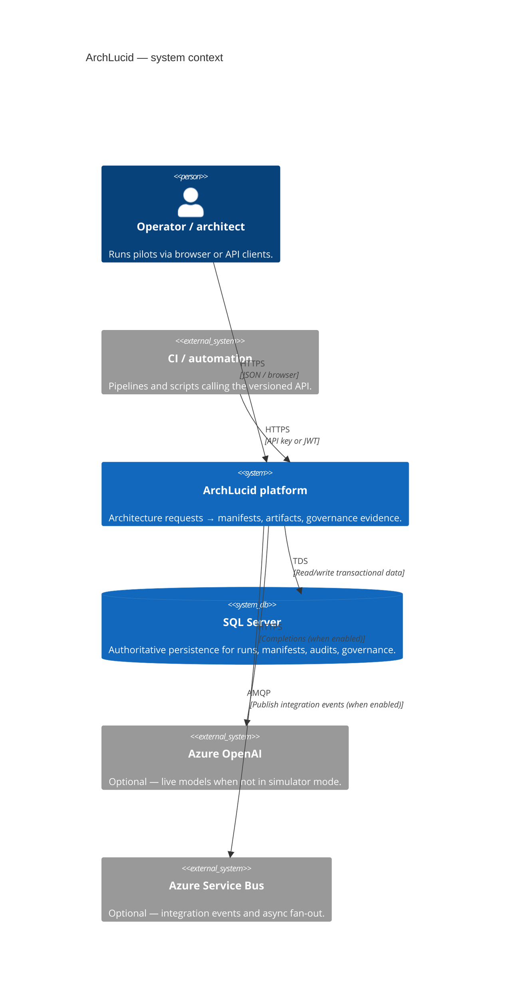
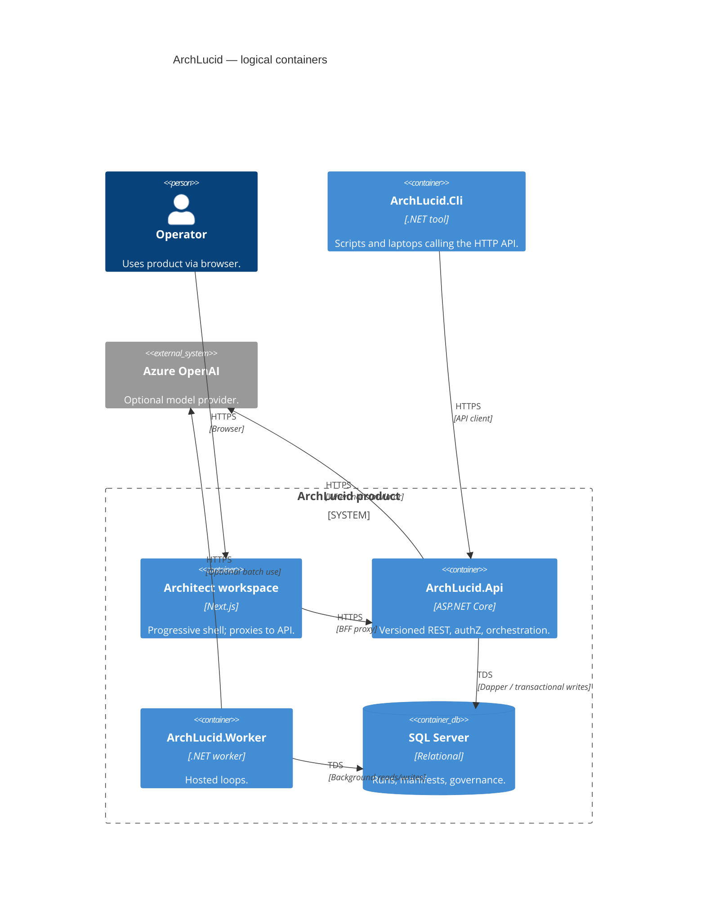

> **Scope:** Canonical architecture index, poster (C4 + ownership), and workspace documentation.
> **Spine doc:** [`START_HERE.md`](../START_HERE.md).

# ArchLucid Architecture

**Purpose:** One screen to redraw **ArchLucid** as C4, know **who owns each box**, and find the **documentation index** for deeper dives.

---

## 1. System context (C4)



### Context nodes → ownership

| Node | Owns runtime / code | Deep dive | Primary tests |
|------|---------------------|-----------|-----------------|
| Operator / architect | `archlucid-ui` (shell) | [operator-shell.md](../library/operator-shell.md) | `archlucid-ui` Vitest + Playwright |
| Automation | External repos / runners | [API_CONTRACTS.md](../library/API_CONTRACTS.md) | Consumer-owned |
| ArchLucid platform | `ArchLucid.Api`, `ArchLucid.Application`, `ArchLucid.Worker` | [ARCHITECTURE_CONTAINERS.md](../library/ARCHITECTURE_CONTAINERS.md) | `ArchLucid.Api.Tests`, release smoke |
| SQL Server | `ArchLucid.Persistence` + migrations | [DATA_MODEL.md](../library/DATA_MODEL.md) | SQL integration suites |
| Azure OpenAI | `ArchLucid.Api` agent execution mode | [BUILD.md](../engineering/BUILD.md) | Simulator-first unit tests |
| Service Bus | `ArchLucid.Worker` publishers | [INTEGRATION_EVENTS_AND_WEBHOOKS.md](../library/INTEGRATION_EVENTS_AND_WEBHOOKS.md) | Worker + contract tests |

---

## 2. Containers (C4)



## 3. C4 workspace (Structurizr DSL)

Use [Structurizr Lite](https://structurizr.com/help/lite) (Docker) or the Structurizr VS Code extension to render the `docs/c4/workspace.dsl` file:

```bash
docker run -it --rm -p 8080:8080 -v "%cd%":/usr/local/structurizr structurizr/lite
```
Open `http://localhost:8080` and load **`workspace.dsl`** from this directory.

---

## 4. Documentation Index

*(Former thin hub `ARCHITECTURE_INDEX.md` redirects here — see [`../redirects.md`](../redirects.md).)*

### Orientation
- **Defensible-record Composer prompts (wave 16 — run after PC close)** — [`DEFENSIBLE_RECORD_COMPOSER_PROMPTS.md`](DEFENSIBLE_RECORD_COMPOSER_PROMPTS.md) · [`.cursor/prompts/defensible-record-00-index.md`](../../.cursor/prompts/defensible-record-00-index.md) (**DR-01–16**). Career-defensibility leftovers after professional-core shipped: fail-closed measurement floor, withheld/engine-failure desk bands, pre-commit and WarnOnly honesty, execute lease, audit echo, disposition 409, board-pack verify, pin-second-review, idle restore, dense lists, durable advisory ops, TB-1196, room handoff without `presenter=1`. **Do not re-run PC-01–13**; no 40th engine; no desktop **More** menu; no live presence.
- **Professional-core Composer prompts (wave 15 — shipped #1776–#1893, do not re-run)** — [`PROFESSIONAL_CORE_COMPOSER_PROMPTS.md`](PROFESSIONAL_CORE_COMPOSER_PROMPTS.md) · [`.cursor/prompts/professional-core-00-index.md`](../../.cursor/prompts/professional-core-00-index.md) (**PC-01–13**). Kernel mitigations after CA: measurement floor named, BFF session, eval chrome eviction, architecture portfolio, seal delta, background wait, presenter→trail, grid amend, work-first keyboard, evidence naming, career-export honesty. Close audit: [`PROFESSIONAL_CORE_ACCEPTANCE_2026-09-06.md`](PROFESSIONAL_CORE_ACCEPTANCE_2026-09-06.md). **Wave 16** owns fail-closed leftovers.
- **`/al-bug` quality Composer prompts (ready to run)** — [`AL_BUG_QUALITY_COMPOSER_PROMPTS.md`](AL_BUG_QUALITY_COMPOSER_PROMPTS.md) · [`.cursor/prompts/al-bug-quality-00-index.md`](../../.cursor/prompts/al-bug-quality-00-index.md) (**ABQ-01–10**). Stop synthetic hunt treadmills (redaction allowlists, schemaVersion leniency, negation phrase lists), raise the hunt-ready bar, cap picker speed, split mega-zones, and nominate unzoned churn. Do **not** run `/al-bug` to implement this set; paste one ABQ file per Composer session. Do **not** revert all of `bugsmash`.
- **Durable-architecture Composer prompts (wave 13 — run after LK)** — [`DURABLE_ARCHITECTURE_COMPOSER_PROMPTS.md`](DURABLE_ARCHITECTURE_COMPOSER_PROMPTS.md) · [`.cursor/prompts/durable-architecture-00-index.md`](../../.cursor/prompts/durable-architecture-00-index.md) (**DA-01–12**). Productize `dbo.Architectures` as the customer-visible durable identity (ADR 0074) without merging `DraftRequests`/`Runs`. Working architecture desk, stop using `DraftId` as `architectureId`, inventory N of M, hidden-filter honesty, eval-chrome leakage, in-flight rehydrate, career export completeness, conservative backfill. Do **not** paste LK-05–07; do not add a 40th engine; do not invent live presence.
- **Livelihood-kernel Composer prompts (wave 12 — run after IS + LS + SD + CR naming)** — [`LIVELIHOOD_KERNEL_COMPOSER_PROMPTS.md`](LIVELIHOOD_KERNEL_COMPOSER_PROMPTS.md) · [`.cursor/prompts/livelihood-kernel-00-index.md`](../../.cursor/prompts/livelihood-kernel-00-index.md) (**LK-01–15**). Owner-authorized ADR changes: working-document undo (0071), canonical work URL without merging tables (0072), transparency trail as finalize gate (0073), ADR 0059 BFF P1/P2 (supersedes IS-15). Do **not** paste IS-15; do not merge `DraftRequests`/`Runs`; do not fork CR-10 harness CI. **Wave 13** owns customer-visible architecture identity (DA-01–12).
- **Career-record Composer prompts (wave 11 — run after IS + LS + SD)** — [`CAREER_RECORD_COMPOSER_PROMPTS.md`](CAREER_RECORD_COMPOSER_PROMPTS.md) · [`.cursor/prompts/career-record-00-index.md`](../../.cursor/prompts/career-record-00-index.md) (**CR-01–12**). Residuals after the 2026-09-05 livelihood restatement and sealed-desk owners: distribution tests vs landed gate, remaining Working two-product copy, historical density prompts in current tense, reverse-with-audit leftover mounts, second-window session honesty, remaining wait heroes, insights call sites, remaining zoom clip, infeasible empty presets, harness/catalog CI denominator, finding-inspect eval chrome, sponsor Ready overclaim. Each file names the IS/LS/SD owner; do not fork. **Wave 12** owns BFF execution (LK-05–07).
- **Hub count parity Composer prompts (shipped PR #1689 — after HOM al-ui-rate)** — [`HUB_COUNT_PARITY_COMPOSER_PROMPTS.md`](HUB_COUNT_PARITY_COMPOSER_PROMPTS.md) · [`.cursor/prompts/hub-count-parity-00-index.md`](../../.cursor/prompts/hub-count-parity-00-index.md) (**HCP-01–05**). Apply Home counting/resume contract to Reviews hub, sponsor KPIs, and remaining metric strips. Do **not** copy Home layout; do not fork LS-08 / CD-11 / AD-07.
- **Sealed-desk Composer prompts (wave 10 — run after IS + LS)** — [`SEALED_DESK_COMPOSER_PROMPTS.md`](SEALED_DESK_COMPOSER_PROMPTS.md) · [`.cursor/prompts/sealed-desk-00-index.md`](../../.cursor/prompts/sealed-desk-00-index.md) (**SD-01–12**). Residuals after the 2026-09-05 livelihood restatement: density contract docs vs landed gate, ADR 0069/0070 status, golden-harness denominator, Working mock identity, spawn-locked draft handoff. Each file names the IS/LS/WA owner; do not fork. **Wave 12** owns BFF execution (LK-05–07).
- **Livelihood-spine Composer prompts (wave 9 — run after IS)** — [`LIVELIHOOD_SPINE_COMPOSER_PROMPTS.md`](LIVELIHOOD_SPINE_COMPOSER_PROMPTS.md) · [`.cursor/prompts/livelihood-spine-00-index.md`](../../.cursor/prompts/livelihood-spine-00-index.md) (**LS-01–12**). Leftovers the 2026-09-05 livelihood diagnosis still finds after the spine set: dual-pane selection, infeasible pending copy, density-string inventory, remaining chooser surfaces, R12 what-if execute. Each file names the IS/RS/WA owner; do not fork.
- **Instrument-spine Composer prompts (wave 8 — run these first)** — [`INSTRUMENT_SPINE_COMPOSER_PROMPTS.md`](INSTRUMENT_SPINE_COMPOSER_PROMPTS.md) · [`.cursor/prompts/instrument-spine-00-index.md`](../../.cursor/prompts/instrument-spine-00-index.md) (**IS-01–15**). Load-bearing bets waves 1–7 left intact: one Working work object (ADR 0069), density as a control (ADR 0070), instrument-first spine. Each file names the FD/CD/AD/WA owner; do not fork.
- **Founding-desk Composer prompts (wave 7 — shipped #1534/#1537, do not re-run)** — [`FOUNDING_DESK_COMPOSER_PROMPTS.md`](FOUNDING_DESK_COMPOSER_PROMPTS.md) · [`.cursor/prompts/founding-desk-00-index.md`](../../.cursor/prompts/founding-desk-00-index.md) (**FD-01–13**). R4/R13 leftovers AD does not own (meeting loop, stamp trail, Decision-grade chrome, wait copy, seal correction).
- **All-day-desk Composer prompts (wave 6 — run after CD, or in parallel except AD-01 vs CD-10)** — [`ALL_DAY_DESK_COMPOSER_PROMPTS.md`](ALL_DAY_DESK_COMPOSER_PROMPTS.md) · [`.cursor/prompts/all-day-desk-00-index.md`](../../.cursor/prompts/all-day-desk-00-index.md) (**AD-01–12**). Livelihood-grade all-day leftovers (dirty finding inspect, cancel confirm, deep-page back links, new-draft offline, last-visit honesty). Each file names the CD/WA/LD/RS owner; do not fork.
- **Career-desk Composer prompts (wave 5 — run before AD if still open)** — [`CAREER_DESK_COMPOSER_PROMPTS.md`](CAREER_DESK_COMPOSER_PROMPTS.md) · [`.cursor/prompts/career-desk-00-index.md`](../../.cursor/prompts/career-desk-00-index.md) (**CD-01–15**). Wave 5 after WA-01–24. Each file names the WA/LD/RS owner; do not fork.
- **Working-architect Composer prompts (wave 4 — shipped #1496, do not re-run)** — [`WORKING_ARCHITECT_COMPOSER_PROMPTS.md`](WORKING_ARCHITECT_COMPOSER_PROMPTS.md) · [`.cursor/prompts/working-architect-00-index.md`](../../.cursor/prompts/working-architect-00-index.md) (**WA-01–24**).
- **Livelihood-desk Composer prompts (shipped — do not re-run)** — [`LIVELIHOOD_DESK_COMPOSER_PROMPTS.md`](LIVELIHOOD_DESK_COMPOSER_PROMPTS.md) · [`.cursor/prompts/livelihood-desk-00-index.md`](../../.cursor/prompts/livelihood-desk-00-index.md) (**LD-01–15**). Each file names the LI/PT/WD owner; do not fork.
- **Repeat-seat Composer prompts (wave 3 after LD — shipped #1457)** — [`REPEAT_SEAT_COMPOSER_PROMPTS.md`](REPEAT_SEAT_COMPOSER_PROMPTS.md) · [`.cursor/prompts/repeat-seat-00-index.md`](../../.cursor/prompts/repeat-seat-00-index.md) (**RS-01–15**). Each file names the LD/LI/PT/WD owner (or notes it is unique); do not fork.
- **Livelihood-instrument predecessors (shipped #1397 — do not re-run)** — [`.cursor/prompts/livelihood-instrument-00-index.md`](../../.cursor/prompts/livelihood-instrument-00-index.md) (**LI-01–15**).
- **Professional-tool / working-desk predecessors** — [`.cursor/prompts/professional-tool-00-index.md`](../../.cursor/prompts/professional-tool-00-index.md) (**PT-01–20**) · [`.cursor/prompts/working-desk-00-index.md`](../../.cursor/prompts/working-desk-00-index.md) (**WD-01–12**). Predecessor DD-01–10: [`DAILY_DRIVER_COMPOSER_PROMPTS.md`](DAILY_DRIVER_COMPOSER_PROMPTS.md) (shipped/partial — do not re-run).
- **Insight-density excellence strategy** — [`INSIGHT_DENSITY_EXCELLENCE_STRATEGY.md`](INSIGHT_DENSITY_EXCELLENCE_STRATEGY.md) (2026-09-06 — generation vs filter analysis; four-workstream program; not a Composer prompt batch)
- **Insight-density Composer prompts** — [`INSIGHT_DENSITY_COMPOSER_PROMPTS.md`](INSIGHT_DENSITY_COMPOSER_PROMPTS.md) (**shipped 2026-08-26** — archive; do not re-run ID-01–07) · follow-on [`INSIGHT_DENSITY_COMPOSER_PROMPTS_ID08.md`](INSIGHT_DENSITY_COMPOSER_PROMPTS_ID08.md) (ID-08–10 shipped; ID-11 may still be open)
- **Policy-pack moat Composer prompt** — [`POLICY_PACK_MOAT_COMPOSER_PROMPTS.md`](POLICY_PACK_MOAT_COMPOSER_PROMPTS.md) (**ready to run** — PP-01: map SOC 2 / HIPAA / ISO / PCI / CIS AWS-GCP / AKS onto declaration engines)
- **Policy-pack expectation facets** — [`../library/POLICY_PACK_EXPECTATION_FACET.md`](../library/POLICY_PACK_EXPECTATION_FACET.md) (additive coverage/cost parameterization via `advisoryDefaults`; commitment engines stay pack-independent)
- **Policy-pack expectation Composer prompts** — [`POLICY_PACK_EXPECTATION_COMPOSER_PROMPTS.md`](POLICY_PACK_EXPECTATION_COMPOSER_PROMPTS.md) (PP-02–PP-05 shipped on `master`)
- **Infrastructure-evidence Composer prompts (ready to run)** — [`INFRA_EVIDENCE_COMPOSER_PROMPTS.md`](INFRA_EVIDENCE_COMPOSER_PROMPTS.md) (**IE / AE / CW / BR** — one Azure snapshot spine feeding Terraform, drift, remediation, ARC-AMPE evidence, diagrams, lineage, tenant branding). Contract: [`../library/INFRA_EVIDENCE_PLANE.md`](../library/INFRA_EVIDENCE_PLANE.md). Do **not** add a second ARC-AMPE collector; pack #24 remains architecture themes only.
- **Weakness-remediation Composer prompts** — [`WEAKNESS_REMEDIATION_COMPOSER_PROMPTS.md`](WEAKNESS_REMEDIATION_COMPOSER_PROMPTS.md) (WK-01–WK-22 — Gate 5, CodeQL, alert-rules, bundled extras, golden harness, Actor UX, G-REAL-06 prep; do not re-run PP/ID/FIT)
- **Finding stream product of record** — [`../library/FINDING_STREAM_PRODUCT_OF_RECORD.md`](../library/FINDING_STREAM_PRODUCT_OF_RECORD.md) (sealed snapshot vs agent stream; WK-09 / WK-19)
- **Insight density miss clause** — [`../quality/INSIGHT_DENSITY_MISS_CLAUSE.md`](../quality/INSIGHT_DENSITY_MISS_CLAUSE.md) (WK-15 advisory honesty)
- **Hold: no new coverage engines** — [`../quality/HOLD_NO_COVERAGE_ENGINES.md`](../quality/HOLD_NO_COVERAGE_ENGINES.md) (WK-20 until G-REAL-06)
- **Ingestion fit-gap Composer prompts** — [`INGESTION_FIT_GAP_COMPOSER_PROMPTS.md`](INGESTION_FIT_GAP_COMPOSER_PROMPTS.md) (**shipped 2026-08-26** — archive; do not re-run FIT-01–05)
- **Saved Mermaid + SVG diagrams** — [`architecture_diagrams/README.md`](architecture_diagrams/README.md) (system overview + zoom-ins)
- **Platform architecture handbook** — [`architecture_handbook/README.md`](architecture_handbook/README.md) (Markdown spine → regenerable DOCX; buyer pack under `architecture_handbook/buyer/`)
- **Architecture and review engines (formal spec + Word pack)** — [`architecture_handbook/75-architecture-and-review-engines.md`](architecture_handbook/75-architecture-and-review-engines.md) · [`ARCHITECTURE_AND_REVIEW_ENGINES.docx`](ARCHITECTURE_AND_REVIEW_ENGINES.docx) · prompts [`ENGINE_KERNEL_REMEDIATION_PROMPTS.md`](ENGINE_KERNEL_REMEDIATION_PROMPTS.md)
- **Diagram gallery (static)** — [`architecture_handbook/site/index.html`](architecture_handbook/site/index.html)
- **Handbook vs product capabilities** — [`PLATFORM_HANDBOOK_VS_PRODUCT_CAPABILITIES.md`](PLATFORM_HANDBOOK_VS_PRODUCT_CAPABILITIES.md) (what ArchLucid exports vs repo meta-docs)
- **Platform self-description bridge** — [`PLATFORM_SELF_DESCRIPTION_BRIDGE.md`](PLATFORM_SELF_DESCRIPTION_BRIDGE.md) (product surfaces vs in-repo platform docs)
- **Diagram ↔ ADR overlay** — [`DIAGRAM_ADR_OVERLAY.md`](DIAGRAM_ADR_OVERLAY.md)
- **C4 ↔ Mermaid sync** — [`C4_MERMAID_SYNC.md`](C4_MERMAID_SYNC.md) (with [`../c4/workspace.dsl`](../c4/workspace.dsl))
- **V1 scope contract** — `../library/V1_SCOPE.md`
- **Developer Day-1** — `../onboarding/day-one-developer.md`
- **SRE / Platform Day-1** — `../onboarding/day-one-sre.md`
- **Security Day-1** — `../onboarding/day-one-security.md`

### Operator shell (front end)
- **Operator shell guide** — `../library/operator-shell.md`
- **UI Architecture** — `../../archlucid-ui/docs/ARCHITECTURE.md`

### Decisions and onboarding
- **Glossary** — `../GLOSSARY.md`
- **ADRs** — [`adrs/README.md`](adrs/README.md)
- **Onboarding narrative vs. platform mission (2026-06-15)** — evidence-first first-run realignment; **TB-337–344** in [`TECH_BACKLOG.md`](../library/TECH_BACKLOG.md) (archived snapshot removed; see [`docs/redirects.md`](../redirects.md))
- **UX implementation leakage audit (2026-06-15)** — [`PRODUCT_UX_IMPLEMENTATION_LEAKAGE_AUDIT_2026_06_15.md`](PRODUCT_UX_IMPLEMENTATION_LEAKAGE_AUDIT_2026_06_15.md) — product narrative, AI budget, ops chrome, and V1 correction priorities
- **Pilot UX backlog (2026-06-15)** — absorbed into [`TECH_BACKLOG.md`](../library/TECH_BACKLOG.md) (archived snapshot removed; see [`docs/redirects.md`](../redirects.md))
- **Overview page first-use IA audit (2026-07-05)** — [`OVERVIEW_PAGE_FIRST_USE_IA_AUDIT_2026_07_05.md`](OVERVIEW_PAGE_FIRST_USE_IA_AUDIT_2026_07_05.md) — decision memo on streamlining the Overview page's overlapping "first review" / onboarding elements to one dominant path; recommended IA, naming cleanup, and phased implementation plan (one-shot Composer prompts retired; see [`docs/redirects.md`](../redirects.md))
- **Grok top-20 external-skeptic Q&A + backlog (2026-07-27)** — [`GROK_TOP20_QUESTIONS_QA_BACKLOG_2026_07_27.md`](GROK_TOP20_QUESTIONS_QA_BACKLOG_2026_07_27.md) — 20 adversarial questions with grounded answers, existing-row dispositions, and proposed items **GQ-01**–**GQ-07** pending TB/M transcription
- **Grok Q21–40 external-skeptic Q&A + backlog (2026-07-27)** — [`GROK_Q21_40_QUESTIONS_QA_BACKLOG_2026_07_27.md`](GROK_Q21_40_QUESTIONS_QA_BACKLOG_2026_07_27.md) — second batch: unit economics, hyperscaler dependency, liability/IP, channels, agentic future, solo-vendor ops; proposed items **GQ-09**–**GQ-18** pending TB/M transcription

### API and contracts
- **HTTP contracts** — `../library/API_CONTRACTS.md`

### Build, CLI, and operations
- **Build and run** — `../engineering/BUILD.md`
- **CLI usage** — `../library/CLI_USAGE.md`

### Contributing and process
- **Test execution model** — `../library/TEST_EXECUTION_MODEL.md`
