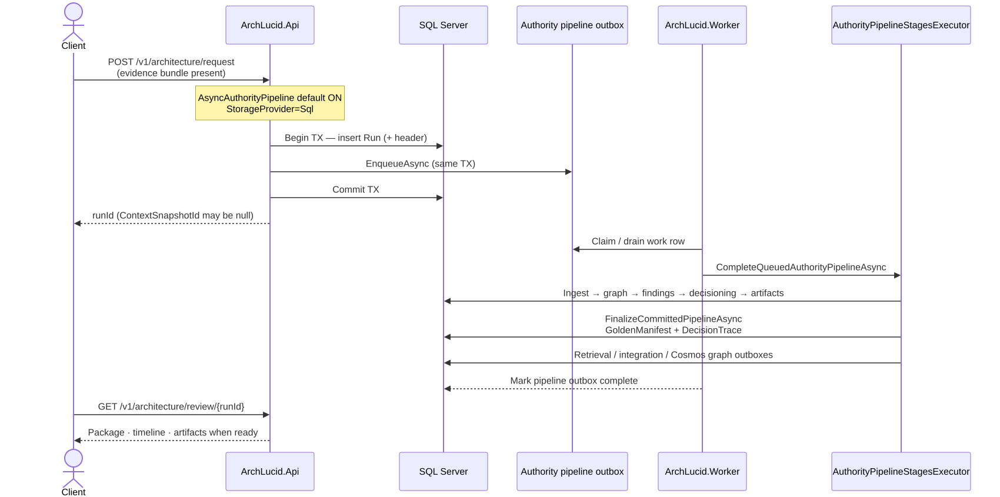
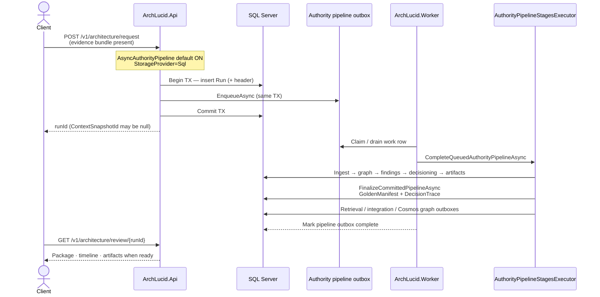

> **Scope:** Zoom-in — Async authority pipeline + transactional outbox (SQL queue mode).
> **Spine doc:** [`../../START_HERE.md`](../../START_HERE.md) · **ADR:** [`../adrs/0038-run-durability-multi-store-outbox-production-secrets.md`](../adrs/0038-run-durability-multi-store-outbox-production-secrets.md) · **Related:** [`../adrs/0004-transactional-outbox-retrieval-indexing.md`](../adrs/0004-transactional-outbox-retrieval-indexing.md)

# ArchLucid — async / outbox path

On **SQL** storage, when **`AsyncAuthorityPipeline`** is unset or enabled (default **on**) and an evidence-bundle id is present, pipeline work is **enqueued in the same transaction** as run create. The Worker drains the outbox and completes stages via **`CompleteQueuedAuthorityPipelineAsync`**. **InMemory** never queues.

## Rendered

Editable source: [`archlucid-async-outbox-path.mmd`](archlucid-async-outbox-path.mmd)

## Mermaid source

## Notes

| Concern | Behavior |
|---------|----------|
| Local inline runs | Set `AsyncAuthorityPipeline: false` in `appsettings.Advanced.json` |
| Reliability | Run insert + outbox row share one SQL transaction (ADR 0038) |
| Operator symptom | Temporary missing `ContextSnapshotId` until worker finishes |
| Related outboxes | Retrieval indexing (ADR 0004), Cosmos graph snapshot, integration events |

## Further reading

- [`../adrs/0038-run-durability-multi-store-outbox-production-secrets.md`](../adrs/0038-run-durability-multi-store-outbox-production-secrets.md)
- [`../../library/ORCHESTRATOR_RETRIES.md`](../../library/ORCHESTRATOR_RETRIES.md)
- [`../../library/BACKGROUND_JOB_CORRELATION.md`](../../library/BACKGROUND_JOB_CORRELATION.md)
- [`archlucid-authority-pipeline.md`](archlucid-authority-pipeline.md)
