> **Scope:** Zoom-in — Authority pipeline (request → stages → finalize → artifacts).
> **Spine doc:** [`../../START_HERE.md`](../../START_HERE.md) · **Flows:** [`../../library/ARCHITECTURE_FLOWS.md`](../../library/ARCHITECTURE_FLOWS.md) · **Canonical:** [`../../library/CANONICAL_PIPELINE.md`](../../library/CANONICAL_PIPELINE.md)

# ArchLucid — authority pipeline

Canonical path after `POST /v1/architecture/request`: persist the run, run (or queue) **AuthorityPipelineStagesExecutor** stages, then transactional finalize into a golden manifest, decision trace, and outboxes.

## Rendered

Editable source: [`archlucid-authority-pipeline.mmd`](archlucid-authority-pipeline.mmd)

## Mermaid source

```mermaid
flowchart LR
  subgraph create["1. Create"]
    REQ["POST /v1/architecture/request<br/>ArchitectureRequest + evidence"]
    RUN["Persist dbo.Runs<br/>runId"]
  end

  subgraph queue["2. Schedule optional"]
    FLAG{"AsyncAuthorityPipeline<br/>+ evidence bundle<br/>SQL storage?"}
    ENQ["Enqueue pipeline work<br/>same TX as run create"]
    INLINE["Run stages inline<br/>in API host"]
  end

  subgraph stages["3. AuthorityPipelineStagesExecutor"]
    CTX["Context ingestion<br/>authority.context_ingestion"]
    GRAPH["Knowledge graph<br/>authority.graph"]
    FIND["Findings<br/>authority.findings"]
    DEC["Decisioning<br/>authority.decisioning"]
    ART["Artifact synthesis<br/>authority.artifacts"]
  end

  subgraph finalize["4. Finalize"]
    COMMIT["AuthorityRunOrchestrator<br/>FinalizeCommittedPipelineAsync"]
    GM["Golden manifest<br/>+ decision trace"]
    OUT["Retrieval indexing outbox<br/>+ integration-event outbox"]
  end

  subgraph consume["5. Consume"]
    DETAIL["Review detail<br/>timeline · package"]
    EXPORT["Artifacts · exports<br/>DOCX / ZIP / explain"]
  end

  REQ --> RUN
  RUN --> FLAG
  FLAG -->|Yes| ENQ
  FLAG -->|No / InMemory| INLINE
  ENQ --> CTX
  INLINE --> CTX
  CTX --> GRAPH --> FIND --> DEC --> ART
  ART --> COMMIT
  COMMIT --> GM
  COMMIT --> OUT
  GM --> DETAIL
  DETAIL --> EXPORT
```

## Notes

| Stage OTel span | Tag |
|-----------------|-----|
| Context ingestion | `authority.context_ingestion` (`archlucid.stage.name`) |
| Knowledge graph | `authority.graph` |
| Findings | `authority.findings` |
| Decisioning | `authority.decisioning` |
| Artifacts | `authority.artifacts` |

- **Default on SQL:** async queue when evidence-bundle id present and `AsyncAuthorityPipeline` unset/enabled (ADR 0038).
- **InMemory:** never queues; stages run inline.
- **Do not** drive legacy `execute`/`result` on an authority-finalized run — see diagram 2 (authority vs coordinator).

## Further reading

- [`../../library/ARCHITECTURE_FLOWS.md`](../../library/ARCHITECTURE_FLOWS.md) — Flow A0
- [`../../library/CANONICAL_PIPELINE.md`](../../library/CANONICAL_PIPELINE.md)
- [`../../library/ORCHESTRATOR_RETRIES.md`](../../library/ORCHESTRATOR_RETRIES.md)
- [`../adrs/0038-run-durability-multi-store-outbox-production-secrets.md`](../adrs/0038-run-durability-multi-store-outbox-production-secrets.md)
