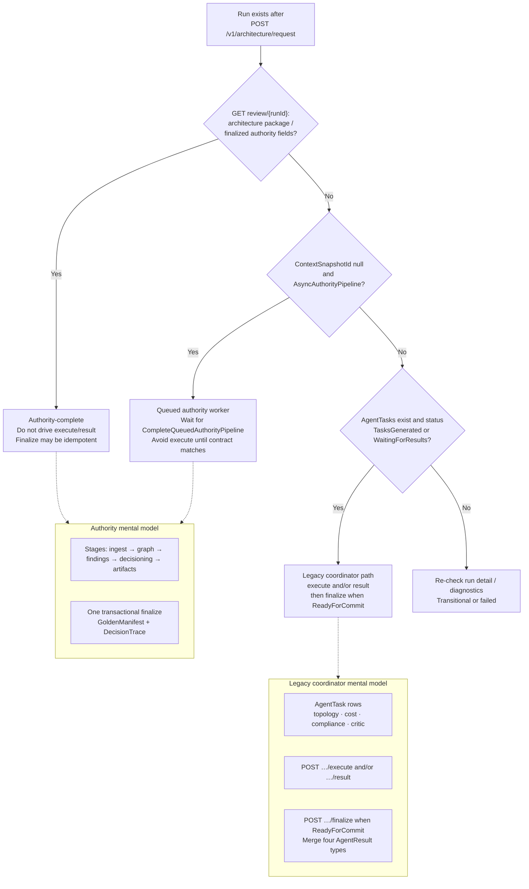

> **Scope:** Zoom-in — Authority pipeline vs legacy coordinator path (decision tree).
> **Spine doc:** [`../../START_HERE.md`](../../START_HERE.md) · **Flows:** [`../../library/ARCHITECTURE_FLOWS.md`](../../library/ARCHITECTURE_FLOWS.md) Flow A1 · **Contract:** [`../../library/AUTHORITY_VS_AGENTTASK_LOOP_CANONICAL_PATH_CONTRACT.md`](../../library/AUTHORITY_VS_AGENTTASK_LOOP_CANONICAL_PATH_CONTRACT.md)

# ArchLucid — authority vs legacy coordinator

Two mental models can reach a golden manifest. **Always `GET /v1/architecture/review/{runId}` first** and pick one path — do not mix `execute`/`result` onto an authority-finalized run.

## Rendered

Editable source: [`archlucid-authority-vs-coordinator.mmd`](archlucid-authority-vs-coordinator.mmd)

## Mermaid source

## Anti-pattern

Calling `POST …/execute` or `POST …/result` to “finish” a run that **already completed the Authority pipeline** causes 409/400 confusion or idempotent finalize that does **not** re-run decisioning. Authority finalize and coordinator finalize have **different preconditions**.

## Further reading

- [`../../library/ARCHITECTURE_FLOWS.md`](../../library/ARCHITECTURE_FLOWS.md) — Flow A0 / A0b / A1
- [`../../library/AUTHORITY_VS_AGENTTASK_LOOP_CANONICAL_PATH_CONTRACT.md`](../../library/AUTHORITY_VS_AGENTTASK_LOOP_CANONICAL_PATH_CONTRACT.md) (TB-1007)
- [`archlucid-authority-pipeline.md`](archlucid-authority-pipeline.md) — diagram 1
