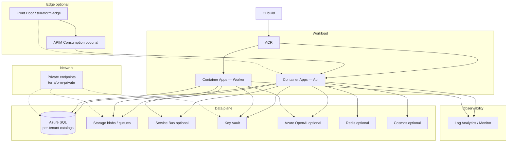

> **Scope:** Zoom-in — Azure deployment topology (Terraform roots).
> **Map:** [`../../library/DEPLOYMENT_TERRAFORM.md`](../../library/DEPLOYMENT_TERRAFORM.md)

# ArchLucid — Azure topology

Editable source: [`archlucid-azure-topology.mmd`](archlucid-azure-topology.mmd)

