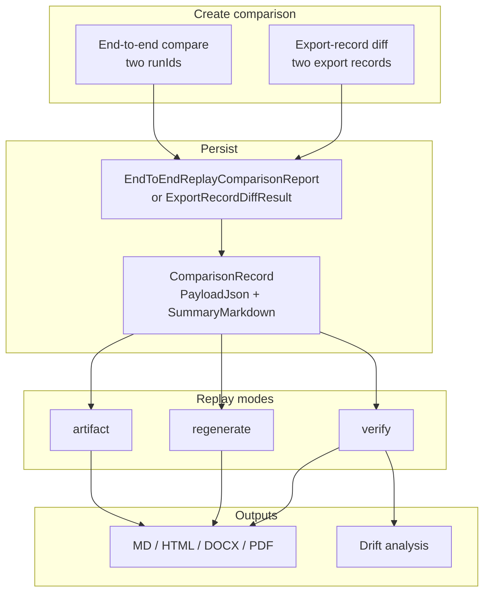

> **Scope:** Zoom-in — Comparison persist → replay → drift (Flow C).
> **Flows:** [`../../library/ARCHITECTURE_FLOWS.md`](../../library/ARCHITECTURE_FLOWS.md) · [`../../library/COMPARISON_REPLAY.md`](../../library/COMPARISON_REPLAY.md)

# ArchLucid — comparison and drift

Editable source: [`archlucid-comparison-drift.mmd`](archlucid-comparison-drift.mmd)

