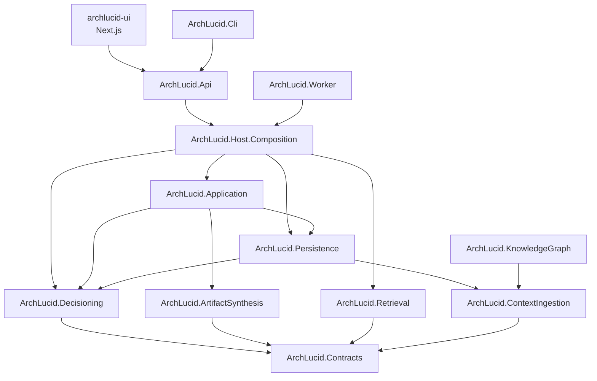

> **Scope:** Zoom-in — .NET project / library dependency graph.
> **Containers:** [`../../library/ARCHITECTURE_CONTAINERS.md`](../../library/ARCHITECTURE_CONTAINERS.md)

# ArchLucid — .NET project graph

Editable source: [`archlucid-dotnet-project-graph.mmd`](archlucid-dotnet-project-graph.mmd)

