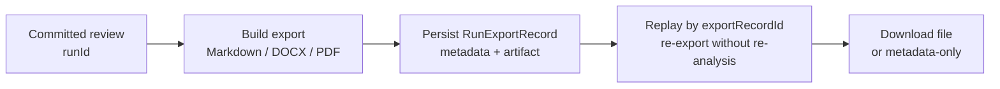

> **Scope:** Zoom-in — Export build → persist → replay (Flow B).
> **Flows:** [`../../library/ARCHITECTURE_FLOWS.md`](../../library/ARCHITECTURE_FLOWS.md)

# ArchLucid — export and replay

Editable source: [`archlucid-export-replay.mmd`](archlucid-export-replay.mmd)

