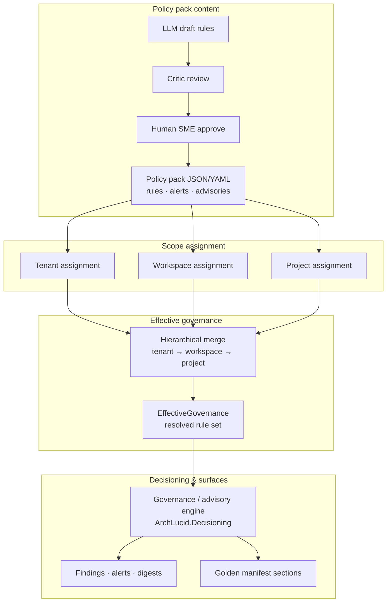

> **Scope:** Zoom-in — Governance engine and hierarchical policy packs.
> **Poster:** [`../../ARCHITECTURE_ON_ONE_PAGE.md`](../../ARCHITECTURE_ON_ONE_PAGE.md) §4.3

# ArchLucid — governance and policy packs

Editable source: [`archlucid-governance-policy-packs.mmd`](archlucid-governance-policy-packs.mmd)

