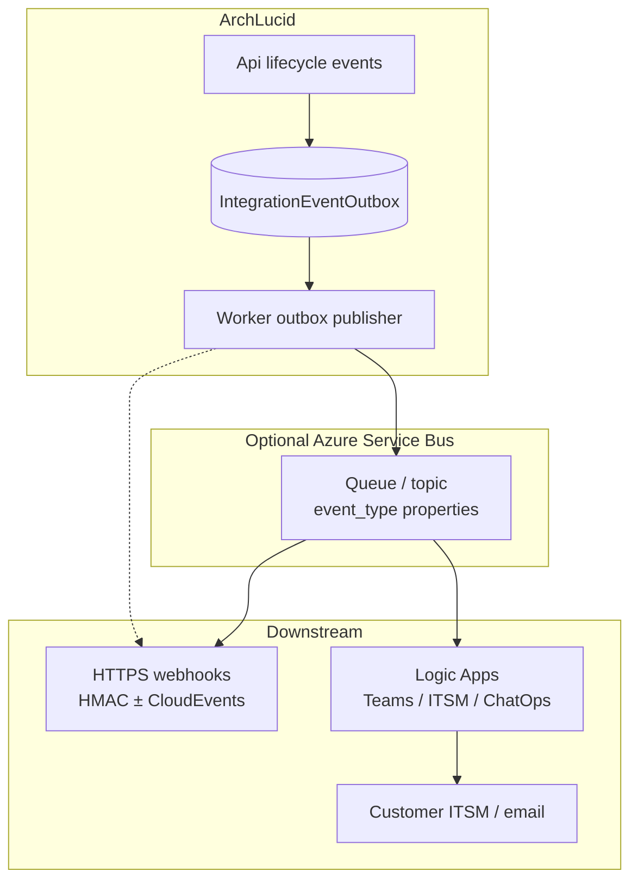

> **Scope:** Zoom-in — Integration events, webhooks, Logic Apps / ITSM fan-out.
> **Docs:** [`../../library/INTEGRATION_EVENTS_AND_WEBHOOKS.md`](../../library/INTEGRATION_EVENTS_AND_WEBHOOKS.md)

# ArchLucid — integrations and ITSM

Editable source: [`archlucid-integrations-itsm.mmd`](archlucid-integrations-itsm.mmd)

