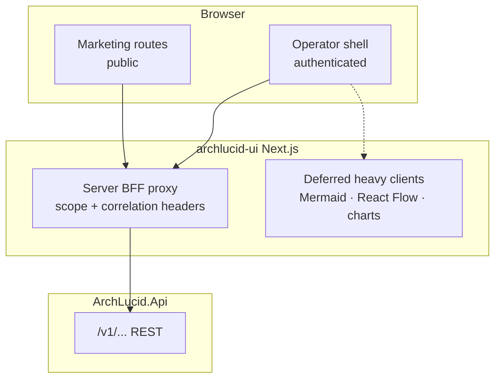

> **Scope:** Zoom-in — Operator UI shell and BFF proxy.
> **UI:** [`../../../archlucid-ui/docs/ARCHITECTURE.md`](../../../archlucid-ui/docs/ARCHITECTURE.md)

# ArchLucid — operator UI shell

Editable source: [`archlucid-operator-ui-shell.mmd`](archlucid-operator-ui-shell.mmd)

