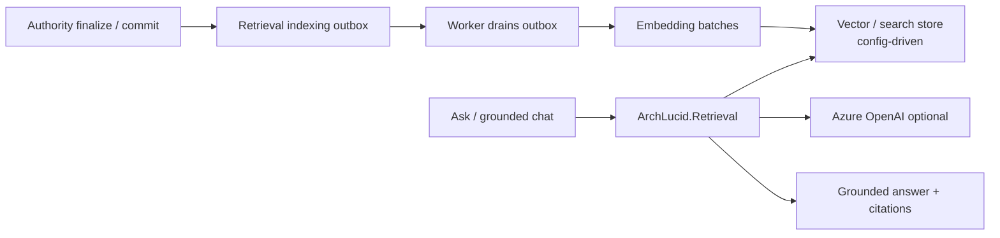

> **Scope:** Zoom-in — Retrieval indexing outbox and Ask RAG path.
> **ADR:** [`../adrs/0004-transactional-outbox-retrieval-indexing.md`](../adrs/0004-transactional-outbox-retrieval-indexing.md)

# ArchLucid — retrieval / RAG

Editable source: [`archlucid-retrieval-rag.mmd`](archlucid-retrieval-rag.mmd)

