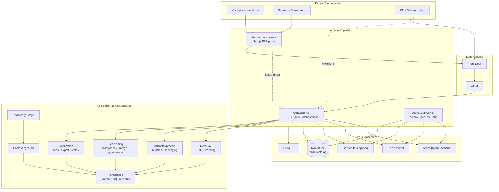
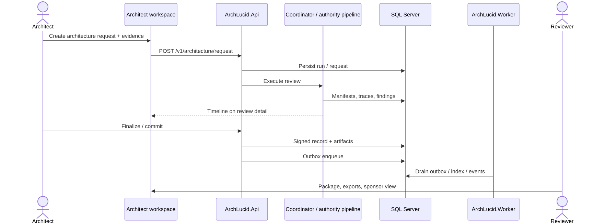
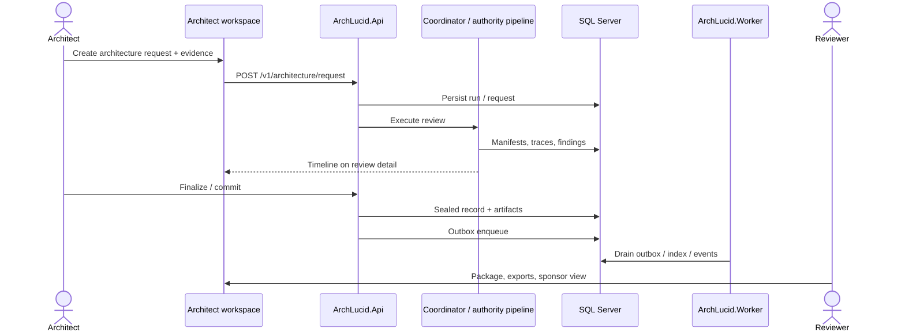

> **Scope:** ArchLucid system-context and review happy-path diagrams (Mermaid source + SVG).
> **Spine doc:** [`../../START_HERE.md`](../../START_HERE.md) · **Poster:** [`../../ARCHITECTURE_ON_ONE_PAGE.md`](../../ARCHITECTURE_ON_ONE_PAGE.md)

# ArchLucid — system overview

Browsers and CLI hit the API (optionally via Front Door/APIM); the API orchestrates reviews, governance, and exports against SQL; the Worker drains async outboxes; Azure OpenAI, Service Bus, and Blob are optional.

## System overview (rendered)

Editable source: [`archlucid-system-overview.mmd`](archlucid-system-overview.mmd)

### Mermaid source

## Review happy path (rendered)

Editable source: [`archlucid-review-happy-path.mmd`](archlucid-review-happy-path.mmd)

### Mermaid source

## Further reading

| Need | Doc |
|------|-----|
| Architecture poster | [`../../ARCHITECTURE_ON_ONE_PAGE.md`](../../ARCHITECTURE_ON_ONE_PAGE.md) |
| C4 context / containers | [`../README.md`](../README.md) |
| Containers detail | [`../../library/ARCHITECTURE_CONTAINERS.md`](../../library/ARCHITECTURE_CONTAINERS.md) |
| Flows | [`../../library/ARCHITECTURE_FLOWS.md`](../../library/ARCHITECTURE_FLOWS.md) |
| Re-render SVG | [`README.md`](README.md) |
