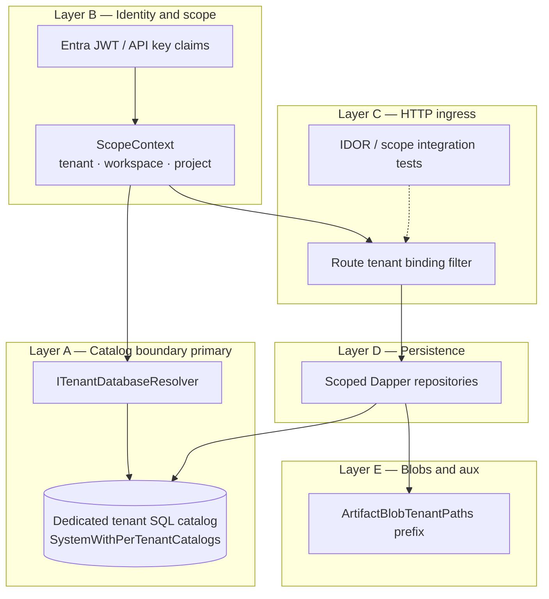

> **Scope:** Zoom-in — Tenant isolation defense in depth (ADR 0037 — no SQL RLS).
> **Normative:** [`../../security/TENANT_ISOLATION_DEFENSE_IN_DEPTH.md`](../../security/TENANT_ISOLATION_DEFENSE_IN_DEPTH.md)

# ArchLucid — tenant isolation

Primary boundary is **database-per-tenant catalogs**. Workspace/project are organizational dimensions, not paying-client security boundaries. SQL RLS is **not** used in production.

Editable source: [`archlucid-tenant-isolation.mmd`](archlucid-tenant-isolation.mmd)

