# 10. Data and persistence

Workflow Dapper repositories (`Persistence.Data.*`) and authority persistence (manifests, traces, UoW, outboxes) share SQL catalogs routed per tenant. One DDL source per database; forward-only migrations.

## .NET project graph

See `docs/library/DATA_MODEL.md`, `docs/library/ARCHITECTURE_COMPONENTS.md`.
