# 12. Exports, comparisons, synthesis, retrieval, and integrations

## Export and replay

## Comparison and drift

## Artifact synthesis

## Retrieval / RAG

## Integrations / ITSM

## First-run pilot path

Deep dives: `docs/library/ARCHITECTURE_FLOWS.md`, `COMPARISON_REPLAY.md`, `INTEGRATION_EVENTS_AND_WEBHOOKS.md`, `CANONICAL_FIRST_RUN_PATH.md`, [`CURSOR_DESIGN_TO_IMPLEMENTATION_HANDOFF.md`](../CURSOR_DESIGN_TO_IMPLEMENTATION_HANDOFF.md).
