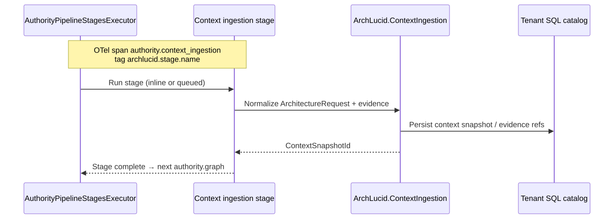
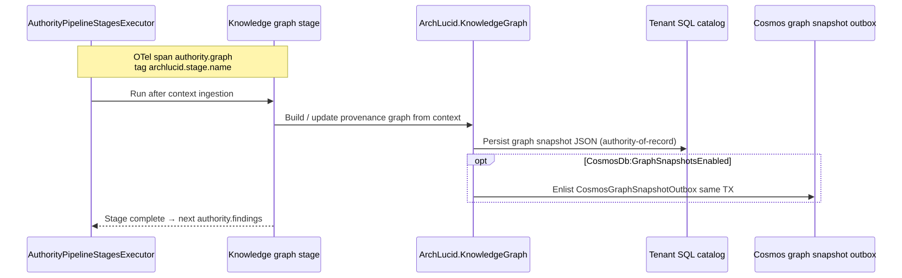
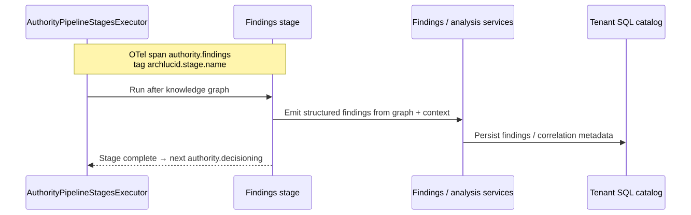
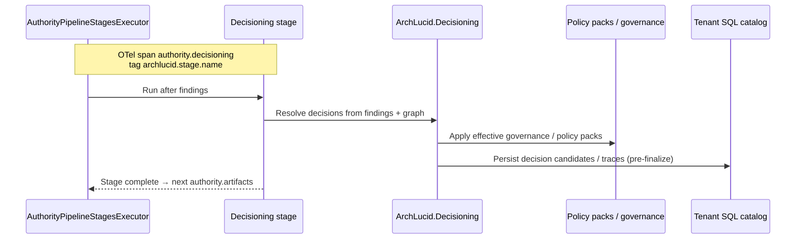
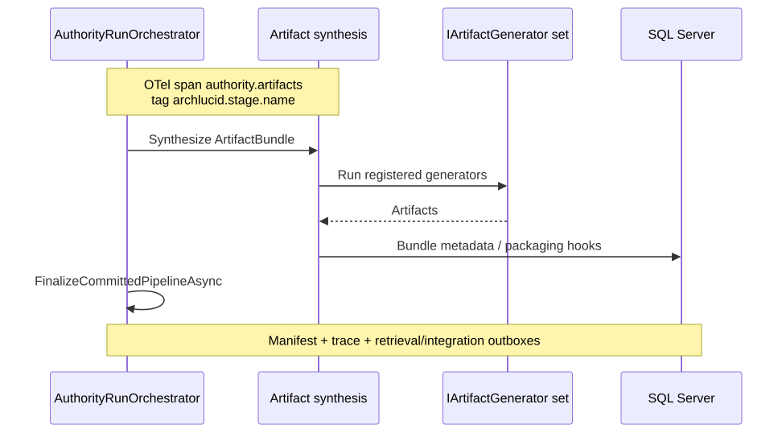

# 13. Authority pipeline stage zoom-ins

Each authority stage emits an OpenTelemetry span with tag `archlucid.stage.name`. Queued and inline paths share the same stage executor.

## Context ingestion

## Knowledge graph

## Findings

## Decisioning

## Artifacts and finalize

## Detail

See `docs/library/CANONICAL_PIPELINE.md`, `docs/library/BACKGROUND_JOB_CORRELATION.md`, and diagram companions under `docs/architecture/architecture_diagrams/`.
