# 14. Failure resilience and failover continuity

## Failure resilience

Authority create enlists pipeline outbox work in the **same SQL transaction** as the run header (ADR 0038). Worker completion retries follow orchestrator and hosted-service lease semantics; Cosmos graph snapshots are eventually consistent projections of SQL authority.

## Failover continuity

Primary posture is Azure Container Apps + per-tenant Azure SQL catalogs, managed identity, Key Vault, health/outbox probes, and per-catalog backup. Failover is redeploy + SQL continuity controls documented in operations runbooks—not an active-active multi-region product claim unless a pilot SoW states otherwise.

## Detail

- `docs/library/ORCHESTRATOR_RETRIES.md`
- `docs/architecture/adrs/0038-run-durability-multi-store-outbox-production-secrets.md`
- `docs/operations/TENANT_SQL_TOPOLOGY_RUNBOOK.md`
