# 15. Threat models (Ask / RAG and webhooks)

Focused threat sketches for two high-traffic attack surfaces. Full security model remains chapter 9 and ADR 0037.

## Ask / RAG

Threats: cross-tenant retrieval probes, prompt injection, unbounded spend. Controls: identity-derived scope, tenant-filtered retrieval corpus, grounded citations, quotas.

## Inbound webhooks

Threats: unsigned, replayed, or oversized posts. Controls follow INV-015 spine: rate → bounded size → verify → parse → fast ack, with fail-closed secrets and tenant correlation into the correct catalog.

## Detail

- `docs/security/TENANT_ISOLATION_DEFENSE_IN_DEPTH.md`
- `docs/library/INTEGRATION_EVENTS_AND_WEBHOOKS.md`
- `docs/library/ARCHITECTURE_INVARIANTS.md` (INV-015)
