# 16. Data model (pragmatic ER)

Core authority tables hang off **`dbo.Runs`**. Comparison left/right run ids may omit FKs so historical rows stay referenceable. Full narrative: `docs/library/DATA_MODEL.md`.

DDL source of truth: `ArchLucid.Persistence/Scripts/ArchLucid.sql` (one script per database).
