# 17. Configuration precedence and fail-closed rules

Layered `IConfiguration`: appsettings → Advanced/SaaS overlays → **environment wins** → in-memory bridges. Only **`ArchLucid*`** / **`ARCHLUCID_*`** are authoritative; legacy `ArchiForge*` keys warn and are ignored.

See `docs/library/CONFIGURATION_REFERENCE.md`, `CONFIGURATION_ARCHITECTURE_PRECEDENCE_VALIDATION_DRIFT_CLAIM_MAP.md`, `CONFIG_BRIDGE_SUNSET.md`.
