# 18. Authentication by route tier

Anonymous health/version, unscoped marketing/webhook routes, and scoped operator `/v1/*` with JWT or API keys. Production-like hosts reject header-only scope and development bypass.

See tenant isolation chapter and `docs/security/TENANT_ISOLATION_DEFENSE_IN_DEPTH.md`.
