# 20. FinOps and capacity drivers

Dominant spend: Azure OpenAI (completions + embeddings), Azure SQL (especially per-tenant catalogs), Container Apps replicas. Optional bus/blob/edge add marginal cost.

Playbook: `docs/library/CAPACITY_AND_COST_PLAYBOOK.md`.
