# 21. Observability map

Authority stages emit OpenTelemetry spans (`authority.*`, tag `archlucid.stage.name`). Outbox depth and pipeline timeouts surface as meters; support correlates logs via correlation id + `runId`.

Alerts: `infra/prometheus/archlucid-alerts.yml`. Background correlation: `docs/library/BACKGROUND_JOB_CORRELATION.md`.
