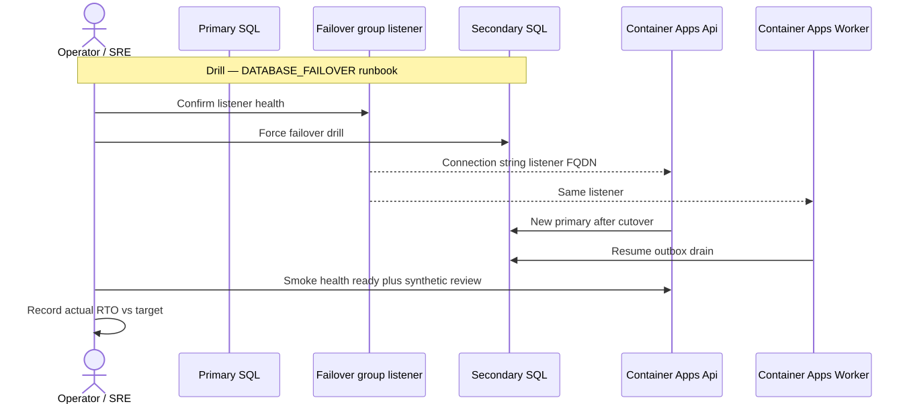

# 22. DR / failover drill storyboard

SQL geo failover group listener is the app connection target. Drill: confirm listener → force failover → Api/Worker follow listener → smoke `/health/ready` + synthetic review → record actual RTO vs targets.

See `docs/runbooks/DATABASE_FAILOVER.md` and `docs/RTO_RPO_TARGETS.md` (when present in tree).
