# 24. API surface heat map

Public/demo routes stay lightly authenticated; operator architecture APIs use fixed/expensive rate limits; comparisons, Ask, and reports are heavier; governance/admin are authority-gated.

Contracts: `docs/library/API_CONTRACTS.md`. Atlas: `docs/library/OPERATOR_ATLAS.md`.
