# 25. Evidence intake to context snapshot

Evidence (brief, documents, images, cloud ZIP) is validated in the intake wizard or API, assigned an evidence-bundle id, then consumed by authority **context ingestion** into a `ContextSnapshot` linked from `dbo.Runs`.

See `docs/library/customer-facing/EVIDENCE_INTAKE_OPERATOR_GUIDE.md`.
