# 26. Golden manifest anatomy

The committed architecture package (API: golden manifest) carries topology, cost, compliance, and critic-oriented sections plus version/scope metadata. UI panels and consulting exports read from this shape; a decision trace is the companion audit trail.

