# 30. Digest and alert subscriptions

Schedules drive advisory scans → digest payloads → tenant channel preferences (email / Teams / webhook) and optional Service Bus / Logic Apps fan-out via the integration outbox.

