# 33. Compliance claim honesty board

Trust-center copy may describe owner pen-test posture, SOC self-assessment honesty, ADR 0037 isolation, and default-deny API. It must **not** imply a CPA SOC 2 report or a published third-party pen test until those exist (GTM **G-REAL-05**, **G-ASSURANCE-02**). Tech TB-135/TB-136 tracking is closed; owner execution remains open.

