# 34. Agent-task / simulator matrix

Authority-complete runs must not be driven with `execute`/`result`. Legacy coordinator expects four `AgentResult` types (topology, cost, compliance, critic) before finalize. Executor may be the deterministic simulator (`DeterministicReviewEngine` → `DeterministicAgentSimulator`) or a live completion client resolved from the **model catalog** (ADR 0065) — not Azure OpenAI exclusively. This loop is also how **architecture generation** is implemented today (origin `Created`); that reuse is a kernel entanglement, not a third product (chapter 75; prompt EK-09/EK-10).

See `AUTHORITY_VS_AGENTTASK_LOOP_CANONICAL_PATH_CONTRACT.md` (TB-1007).
