# 35. Cloud extractors and context ingestion

Per-tenant cloud connections feed Azure/AWS/GCP extractors (ZIP/inventory layouts). ContextIngestion normalizes objects and delta summaries into a `ContextSnapshot`.

