# 37. Findings taxonomy

Findings carry severity, category/theme, source stage (`EngineType`), and optional policy rule ids linking into decision traces, digest rollups, and exports.

Orchestration, equality keys, and the registered engine family are specified in chapter 75 §3.3. Contributor table: `docs/library/FINDING_ENGINE_OUTPUT_REFERENCE.md`. Cross-run correlation uses a *different* key than snapshot dedup (ADR 0063).

