# 44. Terraform root apply order

`terraform-pilot` is the operator entry profile; nested roots cover Container Apps, private networking, edge, monitoring, Entra, storage, optional ACR/SQL failover/OpenAI/Logic Apps. See `REFERENCE_SAAS_STACK_ORDER`.

