# 45. LLM provider adapters

**Embeddings** remain ArchLucid-managed Azure OpenAI (ADR 0065 D8). **Completions** are catalog-selected: Azure OpenAI is no longer the sole allowed provider (ADR 0065 D1′). Engines are operator-maintained catalog rows; measured quality is attached, not gating; fail-closed controls are structured-output capability and data-boundary disclosure. `DefaultLlmProviderFactory` plus the decorator stack (cache, circuit breaker, same-family fallback, content safety) still wrap every call. Silent cross-engine failover is forbidden. Catalog choice must not alter authority outcomes (chapter 75 §6).

