# 47. Kill switches and circuit breakers

Operational levers are config-driven circuit breakers and GA/budget gates—not a general feature-flag plane. AOAI and content-safety breakers, Marketplace `GaEnabled`, and the golden-cohort spend kill band are the primary controls.


