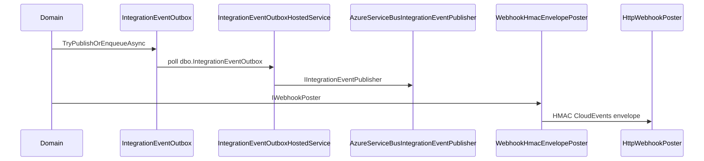

# 48. Outbound webhook delivery

Outbound customer delivery is dual-path: transactional integration-event outbox to Service Bus, and direct HMAC/CloudEvents HTTP posts via `IWebhookPoster`. Distinct from inbound webhook threat modeling.


