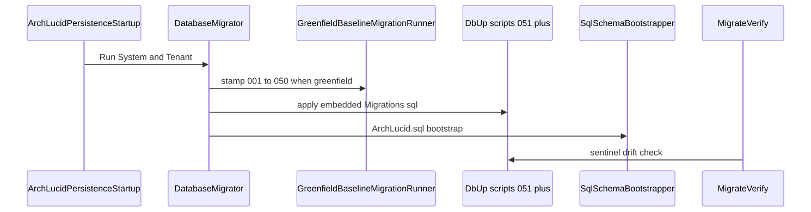

# 50. DbUp schema migration

SQL evolution is DbUp-first (system vs tenant planes, greenfield baseline stamp, then embedded scripts), followed by consolidated `ArchLucid.sql` bootstrap. `MigrateVerify` sentinel checks close the verification loop.


