# 51. Cache layers

Caching is multi-plane: process `IMemoryCache`, optional Redis hot-path reads, LLM completion reuse, and graph snapshot projection caches—distinct from the hot-path *performance* chapter.


